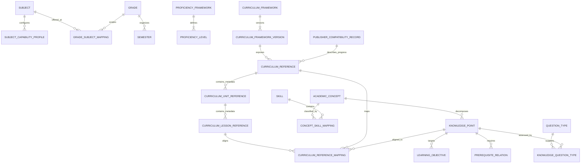
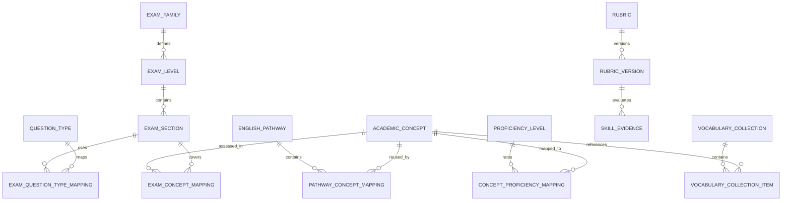
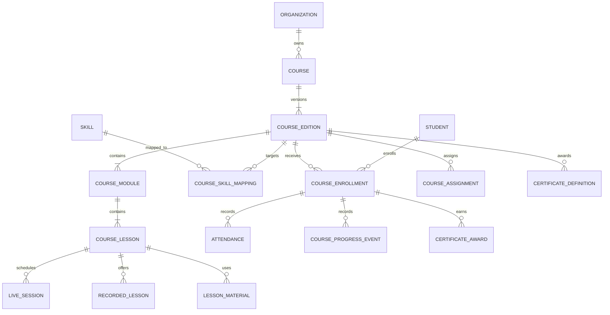
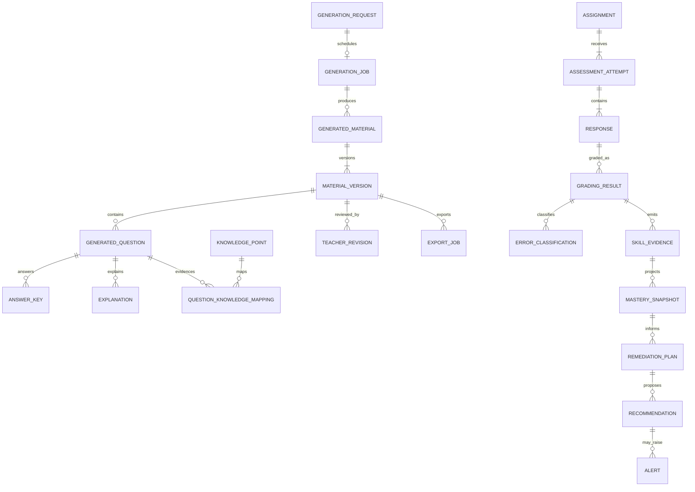
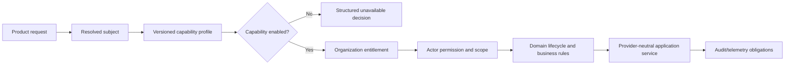
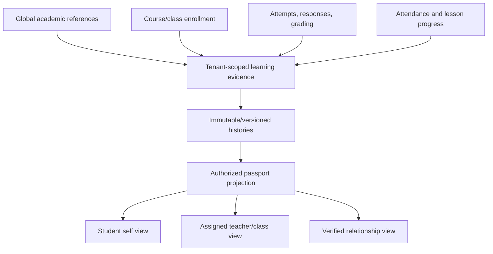

# Educrat-AI Product Architecture Rebaseline Review

- Status: **Proposed — Awaiting Architecture Approval**
- Date: 2026-08-10
- Change class: Rebaseline review plus CAP-001 runtime foundation
- Runtime, database, migration, and Production status: CAP-001 registry/guards implemented; database, migration, and Production unchanged

## A. Executive product alignment

The current modular monolith can support the three target product levels without deleting working modules, but it cannot do so unchanged.

| Product direction        | Current support                                                                                                                                                                                                                                                                                                                 | Decision                                                                                    |
| ------------------------ | ------------------------------------------------------------------------------------------------------------------------------------------------------------------------------------------------------------------------------------------------------------------------------------------------------------------------------- | ------------------------------------------------------------------------------------------- |
| English Intelligence     | Authentication, tenant scope, courses-adjacent classes, assignments, learning events, reporting, dashboards, AI provider boundary, and content versioning are reusable. Current generation and class contracts are elementary/grade-centric and there is no CEFR, pathway, exam, course-delivery, rubric, or proficiency model. | **Feasible by extension; not implementation-ready.**                                        |
| Math Intelligence        | Existing curriculum/version, original generation, assignment, learning event, mastery, remediation, and reporting slices provide a useful vertical foundation. Knowledge points are still string references; publisher rows remain legacy; misconception and governed math mappings are absent.                                 | **Feasible by extension plus an academic reference spine.**                                 |
| Generation-Only Subjects | Existing original generation, structured validation, teacher editing, publish lifecycle, PDF export, and CAP-001 subject gating are reusable. Word export and canonical academic references remain absent.                                                                                                                      | **Current generation/export boundary established; broader intelligence remains forbidden.** |

No intelligence engine should be implemented until subject capability, canonical learner/enrollment, and academic reference contracts are approved.

## B. Current architecture inventory

Repository inventory at review time: 82 App Router route handlers, 26 route-level test files, 90 library test files, 27 database contract tests, 5 Playwright specs, and 26 local migrations. Migration SQL contains 39 `ENABLE RLS` and 39 `FORCE RLS` declarations, 92 policies, and 60 function/RPC definitions. Counts include the dirty Sprint 8 workspace and are not a database inventory.

### Module classification

| Major module                                                         | Classification         | Evidence and rebaseline action                                                                                                                                                                                                                         |
| -------------------------------------------------------------------- | ---------------------- | ------------------------------------------------------------------------------------------------------------------------------------------------------------------------------------------------------------------------------------------------------ |
| Supabase SSR auth/proxy/session                                      | Reuse unchanged        | Request-cookie server client and server user validation are established. Preserve provider-neutral application boundaries and fix defects only in separate tasks.                                                                                      |
| `profiles`                                                           | Compatibility boundary | It is account-linked (`profiles.id = auth.users.id`), while the approved identity architecture separates Account, Person, Profile, and managed Student. Keep until additive identity cutover.                                                          |
| `organizations`, `user_preferences`                                  | Reuse unchanged        | Active organization is server-resolved and independent of Profile. It is workspace context, not authority.                                                                                                                                             |
| `organization_members`                                               | Compatibility boundary | Tenant relationship and current authority are useful, but a single role cannot represent multi-persona/multi-role English and school operations.                                                                                                       |
| Person/Persona/platform-role/service-principal model                 | Replace later          | Approved architecture exists only in documentation; no canonical runtime or table exists. Preserve current Account/Profile/Membership keys until an additive identity bridge is proven.                                                                |
| Access-control services/RPCs                                         | Extend                 | Owner/admin management and last-owner protection are reusable. Migrate gradually to versioned role assignments and canonical permission decisions.                                                                                                     |
| Framework-neutral authorization core                                 | Extend                 | Permission/scope/policy primitives and trusted-provider interfaces are strong reuse points; concrete product authority adapters are incomplete.                                                                                                        |
| Audit/lifecycle/dependency/retention/re-auth/recycle-bin foundations | Extend                 | Reusable fail-closed foundations exist, while persistence and consistent product integration remain fragmented.                                                                                                                                        |
| Curriculum/version/chapter/lesson                                    | Compatibility boundary | Versioning and tenant ownership are reusable. Required grade/publisher-era fields and chapter/lesson shape cannot model adult English, courses, exams, or reusable academic concepts directly.                                                         |
| Curriculum Reference anti-corruption layer                           | Reuse unchanged        | It is the required boundary for progress metadata and prevents Publisher identity from entering core Domain/AI context.                                                                                                                                |
| AI curriculum/generation modules                                     | Extend                 | Provider interface, structured output, copyright validation, prompt versioning, teacher-edit flow, and server-resolved `content_generation` gate are reusable. `grade` remains numeric/elementary-oriented and pathway context is absent.              |
| Curriculum publish/export                                            | Extend                 | Stored-version-only export, lifecycle, PDF renderer, human review, and server-resolved `pdf_export` gate are reusable. Add full quality gate and Word renderer later.                                                                                  |
| `classes`                                                            | Extend                 | Organization scope and primary teacher are reusable. Mandatory school year, semester, subject, grade, and one-teacher shape are insufficient for adult English and live/recorded courses.                                                              |
| Sprint 8 `students`                                                  | Extend                 | Organization-scoped roster identity is preferable to treating every learner as an Auth Profile, but it lacks Person/Account linking and course enrollment authority.                                                                                   |
| `student_class_members`                                              | Compatibility boundary | It correctly uses composite tenant FKs but currently competes with `class_enrollments`. It cannot become canonical until a controlled parity/backfill cutover.                                                                                         |
| Legacy `class_enrollments`                                           | Deprecate later        | Assignment, learning analytics, dashboard, and RLS still consume it and its `student_id` references `profiles`. Do not remove until every consumer has migrated.                                                                                       |
| Assignments/submissions                                              | Extend                 | Fixed published curriculum version and tenant checks are reusable. Student IDs currently reference Profiles and assessment attempts/responses/grading evidence need separation.                                                                        |
| Learning analytics                                                   | Extend                 | Append-only learning events and rebuildable projections are correct patterns. Knowledge/objective IDs and subject/grade are strings, and current evidence assumes class/assignment/profile-based learners.                                             |
| Adaptive learning                                                    | Extend                 | Evidence-based recommendation functions are reusable. Current rules are generic, grade-oriented, and lack subject capability/prerequisite/rubric contracts.                                                                                            |
| Reporting/teacher dashboard                                          | Extend                 | Reporting-service boundary and summary-to-action dashboard are reusable. Projections need course/proficiency/skill dimensions and capability-aware availability.                                                                                       |
| Parent portal/guardian verification                                  | Extend                 | Verified relationship, consent, revocation, and minimal disclosure are reusable. Passport access must remain relationship- and tenant-scoped.                                                                                                          |
| App Router API + service + Zod + structured errors                   | Reuse unchanged        | This is the canonical request pattern: untrusted input → server identity/tenant → service rule → RLS → safe response/audit.                                                                                                                            |
| Subject capability runtime                                           | Reuse/extend           | CAP-001 provides the code-owned `cap-001.v1` registry, canonical aliases, approved/available separation, UI projection, typed 422 error, and fail-closed guard. Assignment/Analytics legacy subject contracts still require later trusted integration. |
| RLS and forward-only migrations                                      | Reuse unchanged        | New tenant tables must enable/force RLS and use minimum grants. Existing applied migration history must never be edited.                                                                                                                               |
| Navigation and dashboard UI                                          | Extend                 | Current role-aware navigation and card dashboard are useful. Course/proficiency/student task IA and capability-driven navigation are missing.                                                                                                          |
| Existing tests                                                       | Extend                 | Unit, architecture, migration-contract, API, component, and E2E layers exist. Add capability matrix, academic mapping, learner convergence, course, and subject-negative tests.                                                                        |

## C. Reusable components

1. Server-resolved authenticated account and active organization boundary.
2. Organization membership and tenant-isolated RLS helpers.
3. Framework-neutral authorization decision contracts.
4. Immutable/fail-closed architecture foundations for Audit, Lifecycle, Dependency, Retention, Re-authentication, and Recycle Bin.
5. Curriculum and Curriculum Version immutability, publish workflow, and teacher review.
6. Provider-neutral AI interface, structured output, prompt/schema versioning, and copyright safety validation.
7. Stored-version PDF export and safe filename/runtime generation.
8. Assignment, submission, append-only learning event, rebuildable analytics, adaptive recommendation, and Reporting Service patterns.
9. Guardian verification, consent, revocation, and minimal parent projection.
10. Zod validation, structured domain errors, App Router API conventions, and layered tests.
11. CAP-001 immutable Subject Capability Registry, compatibility mapping, server-safe UI state, and `requireSubjectCapability()` boundary.

## D. Architecture gaps

1. Subject capability registry now exists, but Assignment/Analytics/Reporting cannot yet enforce it because their legacy subject fields are free-text and their learner/enrollment authority is unresolved.
2. No normalized academic reference spine for subjects, frameworks, skills, knowledge points, objectives, prerequisites, question types, or rubrics.
3. No English pathway, CEFR, exam, skill-dimension, placement, proficiency evidence, or course mapping model.
4. No governed Math curriculum-reference mapping from grade/semester/reference/unit/lesson to canonical knowledge.
5. No course delivery aggregate, edition, module, lesson, live/recorded session, course enrollment, attendance, or certificate boundary.
6. Two learner/enrollment authorities: Profile-linked legacy enrollment versus canonical organization-scoped Student roster.
7. Assessment evidence is not normalized into attempt, response, grading result, error classification, and rubric evidence.
8. Learning Passport projection and ownership/retention rules are not implemented.
9. Learning/Recommendation data uses string IDs and free-text subject/grade dimensions instead of governed references.
10. AI generation is elementary-grade-shaped and does not accept proficiency/pathway/course/skill context.
11. AI job orchestration, usage persistence, retries, safety review, and model/prompt rollout controls are incomplete.
12. Generation-only restrictions are centralized in CAP-001 and enforced for generation/export; generic Assignment/Analytics services remain compatibility boundaries and must not be interpreted as subject availability.
13. Word export is not implemented.
14. Current navigation lacks capability-aware course/student workflows.
15. Canonical Person, Persona, Account-link, platform-role, and service-principal authorities are not implemented; product services still compare legacy role strings.
16. Profile RLS is own-row only, while some member/guardian overview paths need another person's display name. A tenant-validated minimal projection is missing; broad Profile reads are not an acceptable fix.
17. AI Draft persistence does not retain a complete original-versus-teacher-revision lineage with prompt/schema/model/usage provenance.
18. Publish review integrity is incomplete: the current review transition records state but does not prove an independent human review, and placeholder lesson content can satisfy parts of publish validation.
19. Output validation checks structure, total question count, and temporary knowledge mappings, but there is no deterministic Math answer/unit validator or English CEFR/speaking/writing rubric evaluator.
20. API and documentation contracts have drifted: most Curriculum routes use `/api/curriculums`, Export uses `/api/curricula`, and several older design documents still describe capabilities that now exist or remain disabled differently.
21. CAP-001 now covers the capability matrix, aliases, approved-versus-available behavior, and generation-only negative gates. CEFR/pathway/course mapping, Math correctness, durable review-before-publish, and an AI → publish → assignment end-to-end path remain absent.

## E. Compatibility risks

### E.1 Learner identity split — high

Sprint 8 `students.id` is a standalone organization-scoped UUID. Existing `class_enrollments`, `assignment_students`, `assignment_submissions`, `learning_events`, mastery projections, and recommendations reference `profiles.id`. Writing both models without an explicit linkage would split one learner's history.

Required response: preserve both, define canonical learner linkage, measure parity, add dual-read/backfill under a forward-only migration package, then migrate consumers one at a time. Unknown or ambiguous links fail closed.

### E.2 Enrollment split — high

`student_class_members` and `class_enrollments` both describe class membership with different student authorities and status vocabularies. Neither may be silently treated as the other.

Required response: define one future Enrollment aggregate capable of `CLASS` and `COURSE` contexts, retain compatibility views/adapters, and prohibit uncoordinated dual writes.

### E.3 Elementary assumptions — high for English

`GenerationContext.grade` is a required number; Class requires school year, semester, subject, and grade; analytics group by subject/grade strings. Adult/professional English and CEFR cannot be represented safely as fake grades.

Required response: add optional, typed audience/learning-stage, proficiency, pathway, exam, and course contexts. Grade remains a school-pathway mapping, not universal learner proficiency.

### E.4 Publisher/reference tension — high legal/product risk

The target product names Nan-I, Kang Hsuan, and Han Lin as progress selections, while accepted repository policy prohibits Publisher identity in new UI, Domain, and AI context. The stricter repository policy remains controlling for implementation.

Required response: ingest only lawful, minimal progress metadata into an admin/governance compatibility boundary; expose neutral Curriculum References and canonical knowledge mappings to products and AI. Any future branded display requires separate legal approval and policy amendment, not an engine change.

### E.5 String academic identifiers — medium/high

Knowledge point, learning objective, subject, grade, and question IDs are often text. This supports prototypes but not versioned mappings, multilingual labels, merges/supersession, CEFR evidence, or durable passport history.

Required response: introduce immutable reference IDs and versions; keep legacy strings as snapshots/display compatibility during migration.

### E.6 Fragmented audit projections — medium

Domain-specific audit tables are useful but do not yet form the AP-002B immutable audit persistence baseline. High-risk writes need consistent receipt/correlation/retention semantics.

### E.7 Multi-persona and guardian compatibility — high

The current single `organization_members.role` cannot express one Person who is both Teacher and Parent in one organization. Guardian acceptance currently fails closed when an Account already has a conflicting non-guardian membership role. Preserve that safe behavior until versioned multi-role assignments and Persona linkage are implemented; do not weaken it with role overwrites.

### E.8 Student PII scope — high

The Sprint 8 SQL allows active staff, including Teacher, to manage organization-wide Student rows, while the product rule requires assigned-class/course scope. Birthday, gender, school, and roster identifiers are minor data. Development verification must treat this as a known policy gap and a future forward-only RLS hardening item, not as evidence that broad access is approved.

### E.9 Publication and AI provenance — high

Current publication state alone is insufficient evidence of an independent teacher/reviewer decision, and generated drafts do not yet preserve all original output, teacher revision, model, prompt, schema, usage, and validation lineage as separately governed records. These gaps block automated intelligence and Passport provenance claims.

## F. Proposed normalized domain model

The following is a logical proposal, not a table or migration commitment.

### F.1 Reusable academic reference data

- `ACADEMIC_CONCEPT` is reusable across pathways.
- `KNOWLEDGE_POINT` is a versioned assessable concept node, not a free-text label.
- `CURRICULUM_REFERENCE` is neutral; source/provenance and legacy Publisher identity remain in restricted governance records.
- `PUBLISHER_COMPATIBILITY_RECORD` satisfies lawful progress/source mapping only. It is not a core learning concept, general UI authority, or AI prompt field.
- `GRADE`, `SEMESTER`, unit, and lesson references are optional school/progress mappings. They are not copied textbook content and do not apply to adult English by default.
- Grade and Semester are optional mappings, not universal properties of every concept.

### F.2 English-specific reusable structures

School grade, CEFR level, exam target, course, module, lesson, skill, knowledge point, and objective are simultaneous mappings, never a single overloaded level field.

### F.3 Course delivery

Course templates may later be global, but delivered Course Editions, enrollments, sessions, attendance, assignments, and certificates are tenant-scoped.

### F.4 Content generation, assessment, and learning

Generation provenance, teacher revisions, assessment evidence, and learning projections are separate. A generated question cannot itself be treated as mastery evidence until it is assigned, attempted, and graded under valid policy.

## G. Subject capability architecture

The registry is centrally constructed, immutable at runtime, validated against an allowlisted capability vocabulary, versioned, and covered by matrix tests. Unknown subject/capability/profile version fails closed. UI consumes a server projection only for experience; server services enforce the same decision.

## H. English platform architecture

English requires three independent but composable contexts:

1. **Academic concept context** — concept, skill dimension, knowledge point, objective, prerequisite.
2. **Placement/proficiency context** — framework, level, evidence, estimator version, confidence, effective time.
3. **Delivery context** — pathway, course edition, module, lesson, enrollment, attendance, assignment, session.

Placement results are evidence, not permanent labels. Proficiency estimates must retain estimator/rubric version and be superseded rather than overwritten. Speaking/pronunciation/writing inputs are sensitive learner data and require explicit purpose, retention, access, and provider redaction policies before implementation.

## I. Math platform architecture

Math uses canonical concepts and prerequisite edges as its source of truth. Grade/semester/progress reference maps to concepts but does not own them. Question types and difficulty are governed mappings with validator versions. Misconception evidence is created from specific graded responses and error classifications, never inferred solely from an aggregate score.

The first implementation scope is elementary grades 1–6; schema identifiers must not encode elementary-only assumptions so junior/senior high can be added by reference data later.

## J. Generation-only subject architecture

Generation-only services use the shared request, material version, teacher revision, quality, and export contracts. Capability policy rejects online attempts, grading, mastery, diagnosis, and remediation for these subjects even if matching API routes exist. Enabling a later capability requires a versioned profile rollout, domain validator, authorization, evidence model, and tests.

## K. Learning Passport boundary

The Passport is a projection, not a second system of record. It stores source references, versions, scope, and lineage. No cross-organization sharing, public identifier lookup, or guardian access without active verified relationship is introduced.

Its future inputs include course/lesson and attendance history, assignment and assessment history, skill/Math mastery history, CEFR evidence, certificate awards, teacher feedback, AI recommendation history, and remediation history. Globally reusable references remain platform-governed; delivery records remain organization- or enrollment-scoped; attempts, evidence, feedback, and history remain student-scoped within their tenant.

## L. UI/UX information architecture

- Teacher: summary → trend → alert → affected learner → evidence-backed recommendation → permitted action.
- Student: today → course/assignment progress → skill/mastery progress → weakness → recommendation → next action.
- Parent: child selector → plain-language progress → assignments → strengths/support areas → recommended support; never expose raw response or internal model reasoning.
- Drill-down replaces table-first dashboards. Tables remain for bulk administration.
- Capability-unavailable, entitlement-unavailable, insufficient-evidence, permission-denied, and system-error states are distinct.
- Mobile prioritizes next action and alert; tablet supports comparison; desktop adds multi-panel drill-down.

Detailed UX contracts are in `docs/ui-ux-specification.md`.

## M. Security and tenant boundaries

| Data class                               | Ownership and access                                                                              |
| ---------------------------------------- | ------------------------------------------------------------------------------------------------- |
| Global academic reference                | Platform-governed, versioned, read through approved projections; no tenant writes.                |
| Organization content/course/class/report | Direct `organization_id`, server-resolved tenant, ENABLE/FORCE RLS, least grants.                 |
| Enrollment/session/assignment            | Tenant plus learner/course/class relationship; teachers only within assigned scope.               |
| Student evidence/passport                | Tenant and student scoped; student self, assigned educator, or verified guardian projection only. |
| Provider payload/media                   | Server-only, purpose-limited, redacted, time-bounded, never public storage by default.            |

Every write follows authenticated account → active organization → active membership/persona → permission/scope → capability/entitlement → domain rules → RLS → audit obligation. UI claims, client roles, client organization IDs, and AI output are never authority.

Known hardening requirements from the current repository review:

- Teacher access to Student PII must converge from organization-wide staff scope to assigned class/course scope.
- Cross-member display data must use a tenant-validated minimal projection; never grant authenticated users broad `profiles` or `auth.users` reads.
- Access/API structured logs must use allowlisted, redacted fields and must not record raw bodies, invitation tokens, email, reasons, or minor PII by default.
- Product mutation and immutable audit receipt need one transaction/outbox boundary; a successful write followed by a failed audit insert is not acceptable for high-risk actions.
- Account hard deletion remains disabled until Person linkage, ownership reassignment, retention, tombstone, and audit dependencies are complete.

## N. Copyright safety boundaries

Five content classes are distinct:

1. **Curriculum metadata** — minimal factual indices and reviewed mappings.
2. **Teacher-entered reference** — organization-owned, rights-attested, quarantined from shared knowledge and model context until reviewed.
3. **Licensed content** — governed by explicit license scope, visibility, expiry, and provenance.
4. **Original AI-generated content** — structured, safety-validated, reviewed, versioned, and never presumed automatically copyright-safe.
5. **Copyrighted textbook content** — prohibited unless a verified license explicitly permits the exact processing and output.

No textbook OCR, full-text storage, embedding, prompt injection, near-copy rewrite, teacher-manual use, question-bank import, brand imitation, or official publisher affiliation claim is allowed. Only neutral Curriculum Reference and approved factual Knowledge mappings reach AI.

## O. Recommended development phases

1. **Verification gate** — finish Sprint 8 Development migration/application/runtime verification without changing historical migrations.
2. **Capability and identity convergence** — central subject profiles; canonical learner/person/account and enrollment contracts; compatibility adapters.
3. **Academic reference spine** — governed subjects, frameworks, levels, concepts, skills, knowledge points, objectives, prerequisites, question types, and mappings.
4. **English foundation** — pathway/CEFR/exam mappings and course delivery contracts before assessment intelligence.
5. **Math foundation** — elementary mapping coverage, validators, misconception vocabulary, and evidence contracts.
6. **Generation-only enforcement** — capability gates, subject validators, and Word export after quality review contract.
7. **Assessment and Passport** — attempts/responses/grading/evidence, mastery lineage, Passport projection.
8. **Decision intelligence** — recommendations, alerts, speaking/writing providers, and dashboards under staged rollout.

## P. Exact next three implementation tasks

1. **S8V-001 — completed**: Development migration, catalog, rollback-only security checks, real authenticated API/UI E2E, and audit evidence were verified without Production changes.
2. **CAP-001 — approved and closed, foundation verified**: `cap-001.v1` profiles, approved/available separation, fail-closed guard, generation/export integration, and matrix/import-boundary tests are present without a database table.
3. **LE-001 — recommended next, not started**: define Student↔Person/Account linkage and Class/Course Enrollment authority, inventory all Profile-based consumers, implement read-only parity/adapters first, and propose (not silently execute) a forward-only backfill/cutover package.

The Academic Reference Spine becomes the following package after these three gates.

## Q. Sprint 8 migration/runtime status

`supabase/migrations/20260806100000_s08_extend_classes_students_foundation.sql` is additive and preserves existing `classes` and `class_enrollments`. It adds `classes.school`, `students`, `student_class_members`, `class_student_audit_events`, tenant composite FKs, indexes, RLS/FORCE RLS, policies, and a scoped helper.

Compatibility findings:

- supports organization-scoped elementary Math classes and multi-class roster membership;
- gives `students` an organization-scoped unique student number and uses composite tenant FKs for both Class and Student membership references;
- enables and forces RLS on new tables and does not grant authenticated hard delete, but static SQL evidence is not runtime proof;
- does not model English course editions, modules, live/recorded lessons, proficiency, attendance, or course enrollment;
- permits a student to join multiple classes, but only in the new roster model;
- does not connect new Student IDs to existing Profile-based assignment/mastery/passport history;
- retains `class_enrollments` for existing Assignment/Analytics/Dashboard consumers; class assignment expansion still materializes learners from that legacy source;
- existing Analytics requires Profile-linked Student, Class, Assignment, Submission, and grade context and uses text knowledge identifiers, so it cannot represent managed learners, adult/self-paced English, or durable Passport evidence without additive convergence;
- current Student policies give active Teacher/staff organization-wide roster access rather than assigned-class/course scope; this is a known security gap requiring a later additive policy correction and cross-scope tests.

S8V-001 subsequently verified the approved Development project, applied the forward-only hardening correction, matched local/remote history, inspected catalog/RLS/grants/triggers, ran rollback-only owner/admin/teacher/cross-tenant checks, and completed real authenticated Classes/Students API/UI E2E. Production was not queried, migrated, or deployed. Teacher organization-wide Student PII scope remains a documented future hardening gap rather than an approved least-privilege endpoint.

## R. Files inspected

- Governance/baseline: `README.md`, `AGENTS.md`, `docs/product-spec.md`, `docs/system-design.md`, `docs/database.md`, `docs/changelog.md`.
- Reference/copyright: ADR-003, Capability Map, AI Reference Policy, Legal Reference Policy, Copyright Policy.
- Identity/security: auth, Supabase SSR/proxy, profile, organization, access-control, authorization foundations, guardian verification, parent portal.
- Product domains: curriculum, AI curriculum/generation, export, publish, assignment, classroom, student, learning analytics, adaptive learning, reporting, teacher dashboard.
- Delivery surfaces: App Router pages/routes, navigation, service/error/validation conventions.
- Persistence: all local migration names; focused review of Sprint 7/8 curriculum, assignment, class/enrollment, analytics, reporting, dashboard, guardian, access-control, and Sprint 8 classes/students migrations.
- Verification assets: library, API, database-contract, component, and E2E test inventories.

## S. Files modified

This rebaseline creates or updates only the allowed architecture documentation. It does not intentionally modify application code, tests, migration SQL, environment files, or generated types. The repository already contained unrelated uncommitted Sprint 8/access work before this review; those changes are preserved and remain outside this documentation package.
