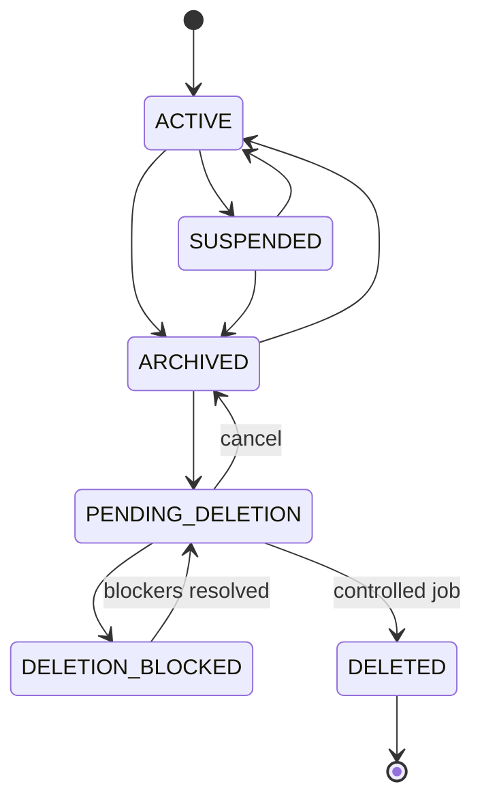
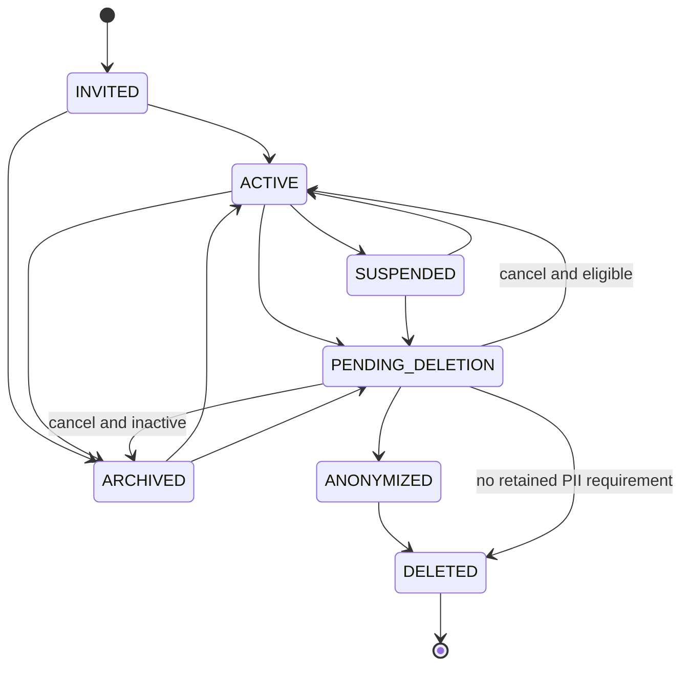

# AP-002：Platform Governance Foundation

- 狀態：**Accepted — Architecture Approved**
- 類型：Architecture Package（文件與契約；未實作）
- 日期：2026-07-16
- 基線：Sprint 1～8、AR-001
- 非範圍：Migration、API、UI、Identity Framework、RBAC、Event Bus、Queue、背景工作、通知、Billing、AI、Knowledge Graph、AP-003、Sprint 9

## 1. 目的與治理不變量

AP-002 定義 EduCraft AI 的平台治理、資料生命週期、刪除、保留與不可變稽核契約。後續實作不得違反下列不變量：

1. Platform 管理權與 Organization 所有權分離。
2. 跨租戶資料存取必須有案件、理由、最小範圍、時效與 Audit；Platform 角色不能日常瀏覽教育內容。
3. 永久刪除是受控例外，不是一般 CRUD。
4. Account、Profile、Membership、Domain Identity、Platform Role 必須分離處理。
5. Organization-owned content 不因建立者帳號刪除而消失。
6. Teaching／Learning history、Audit Event 與已發布版本不能由一般使用者硬刪除。
7. 所有生命週期操作先做 permission、state、dependency、retention、legal hold 與 re-auth 檢查。
8. AI Agent 不是人員角色，不能取得管理權限或核准高風險操作。
9. 現有 ID、RLS、last-owner 保護與歷史 Migration 必須保留。
10. 本文件只建立未來契約，不代表任何功能已上線。

## 2. 現況盤點

| Entity             | 現有狀態／刪除能力                                                | 現有保護                                                         | AP-002 缺口                                                      |
| ------------------ | ----------------------------------------------------------------- | ---------------------------------------------------------------- | ---------------------------------------------------------------- |
| Organization       | `active/suspended/archived`；有 `deleted_at`，無 lifecycle API    | RLS、`created_by RESTRICT`、active owner、active preference 清除 | 等待期、blocked、tombstone、依賴盤點、Audit                      |
| Account／Profile   | Profile 無狀態、無 DELETE grant；Auth user 刪除會 cascade Profile | own-row RLS；Organization creator 為 RESTRICT                    | Account review、匿名化、actor tombstone、跨機構解析              |
| Membership         | `active/invited/suspended/removed`；無 client mutation            | last active owner Trigger、無 direct write                       | archive、owner transfer、完整 action workflow、Audit             |
| Curriculum         | `draft/active/archived`；無 delete API                            | Tenant RLS、Owner/Admin update                                   | restore、trash、dependency protection、Audit                     |
| Curriculum Version | `draft/published/archived`；唯讀                                  | Tenant RLS、FK RESTRICT                                          | retired/superseded、不可變發布契約                               |
| Chapter／Lesson    | `draft/active/archived`；Owner/Admin 可直接呼叫 delete RPC        | active tenant、role、version 1、hierarchy 驗證                   | 現有硬刪除缺少 retention／history dependency／Audit／recycle bin |
| Avatar             | 本人可刪除 Storage object                                         | Private bucket、owner path RLS                                   | 帳號刪除與匿名化編排                                             |

目前下游鏈為 `Organization → Curriculum → Curriculum Version → Chapter → Lesson`。Student、Knowledge、Teaching、Learning、Assessment、Billing 與 AI 領域尚未實作；只能定義 future dependency，不能建立假資料表。

現有 Sprint 8 `delete_chapter()` 會刪除該章全部 Lesson，`delete_lesson()` 會永久刪除 Lesson。這些函式是既有相容介面，不修改其歷史 Migration。未來治理實作必須先推出 lifecycle v2、切換 UI／server、通過依賴檢查，再以新的 forward-only Migration 撤銷一般 authenticated execute；不得在下游歷程出現後繼續使用既有硬刪除流程。

## 3. 四層治理模型

### 3.1 Platform Layer

EduCraft AI 官方營運、合規、安全與平台政策。只管理平台狀態、支援案件、刪除核准、Retention Hold、Audit 與系統風險，不自然取得租戶教材內容所有權。

### 3.2 Organization Layer

補習班、學校與教育機構的租戶治理。Owner／Admin 管理成員、教材與本機構設定，但無法存取其他租戶，也不能直接完成永久刪除。

### 3.3 Workspace Layer

Teacher、Reviewer、Student、Parent 的日常工作區。權限來自 active Membership、未來 Branch scope 與 Domain permission，不承擔平台治理職權。

### 3.4 Data／AI Layer

Curriculum、Knowledge、Teaching、Learning、Assessment、Analytics 與 AI。資料依 Organization 與 Domain policy 隔離；AI Agent 只能以受控 service identity 執行明列工作，不能成為 Owner、Admin、核准者或 Audit actor 的替身。

### 3.5 Identity Concept Model

AP-002 採五個不可合併的 Identity 概念：

```text
Authentication Account
  └─ Person Profile
      ├─ Organization Membership（每個 Organization 各自存在）
      │   └─ Teacher／Student／Parent／Reviewer Persona（可多個）
      └─ Platform Role Assignment（獨立 platform governance scope）
```

- Authentication Account 只處理 credential、session 與 assurance，不保存 Organization／Persona／Platform 權限。
- Person Profile 保存最小化個人資料，不是租戶角色或學習／教學身分。
- Membership 表達 Account／Person 與單一 Organization 的關係；active organization 只是一個 request context。
- Persona 是特定 Organization 與 Domain 的業務身分；同一人可跨機構、多角色，並在同一機構同時具有多個 Persona。
- Platform Role Assignment 與 Membership 完全分離，只能透過受控 policy/capability 使用。
- Account deletion、Profile anonymization、Membership removal、Persona retirement 與 Platform role revocation 是不同 lifecycle transition。

完整 authority、RACI、contract 與 forbidden dependency 見 `docs/architecture/adr-007-domain-boundaries.md`。完整 Identity／RBAC 實作屬 AP-003，本 Package 不建立相關 table、policy engine 或 UI。

### 3.6 Domain Boundary

每項能力必須指定唯一 owning Domain 與 authority data。Domain 可以消費其他 Domain 的版本化 contract／event，不得直接修改其他 Domain table，也不得把 Analytics projection、AI output、Notification delivery 或 Billing entitlement 當作教育資料的 authority。

核心限制：

1. Knowledge 不依賴 Curriculum／Lesson 實例；Curriculum 只能消費 Knowledge contract。
2. AI 只能回傳 proposal，由 requesting Domain 驗證並決定是否寫入 canonical data。
3. Analytics 只建立可追溯 projection，不回寫 Learning、Assessment、Membership 或 lifecycle state。
4. Communication 不決定 permission、consent、retention 或 business outcome。
5. Platform Console 不 impersonate active Organization，也不使用 Service Role 作日常管理 session。
6. Event consumer 不得只依 payload 執行永久刪除；必須回到 authority 重新驗證。

Product capability 全景見 `docs/product/capability-map.md`；事件 ownership、payload allowlist、PII、ordering 與 failure semantics 見 `docs/architecture/event-catalog.md`。兩份文件都是設計契約，不表示 Analytics、AI、Event Bus 或 Queue 已實作。

## 4. Platform Roles 規格

| 角色                   | 可查看範圍                                 | Lifecycle action                             | PII                             | 永久刪除                     | 二次授權／Re-auth   | 理由／通知                                        |
| ---------------------- | ------------------------------------------ | -------------------------------------------- | ------------------------------- | ---------------------------- | ------------------- | ------------------------------------------------- |
| `PLATFORM_SUPER_ADMIN` | 平台摘要、核准佇列；跨租戶內容只限核准案件 | 核准高風險處置、緊急安全停權、Retention Hold | CONDITIONAL；最小欄位、遮罩優先 | 僅可核准；實際刪除由受控 job | 必須；不可自我核准  | 必填理由；通知 Owner、安全／法務角色              |
| `PLATFORM_ADMIN`       | 機構／帳號摘要、授權案件 Audit             | suspend/restore、啟動或取消 deletion review  | CONDITIONAL；案件範圍           | 不可執行                     | 高風險必須          | 必填理由；依事件通知                              |
| `PLATFORM_SUPPORT`     | 指派案件、遮罩後摘要與技術狀態             | 不可 permanent delete；僅可提出 escalation   | 預設否；臨時授權且遮罩          | 否                           | PII 解鎖時必須      | 每次存取理由與 Audit；通知依政策                  |
| `PLATFORM_AUDITOR`     | 唯讀 Audit、policy、合規報表               | 無業務 mutation                              | 預設遮罩；合規必要時條件式      | 否                           | Audit export 時必須 | Export 理由與 Audit；不得通知業務對象除非政策要求 |

`PLATFORM_SUPER_ADMIN` 是 break-glass／治理角色，不是日常客服角色。平台角色指派、使用、re-auth、有效期與撤銷本身都必須產生 Audit。

## 5. Organization Lifecycle

### 5.1 狀態機



| 狀態               | 業務行為                                    | 可見性與寫入                                                       |
| ------------------ | ------------------------------------------- | ------------------------------------------------------------------ |
| `ACTIVE`           | 正常營運                                    | active members 依權限讀寫                                          |
| `SUSPENDED`        | 暫停營運或平台停權，可申訴／恢復            | 一般業務寫入封鎖；Owner 只可看必要帳務、匯出與申訴資訊             |
| `ARCHIVED`         | 主動停止使用                                | 主要資料唯讀；禁止新教學、學生、教材與 AI job                      |
| `PENDING_DELETION` | 永久刪除等待期，可取消                      | 禁止新業務資料；顯示申請、原因、影響與預計日期                     |
| `DELETION_BLOCKED` | 有依賴、保留、付款、爭議、匯出或 legal hold | 唯讀顯示 blocker 與下一步，不可繼續執行                            |
| `DELETED`          | 邏輯完成永久刪除                            | 正常 UI 隱藏；只保留最小 tombstone、依法保留紀錄與 immutable Audit |

### 5.2 合法轉換與責任

| 轉換                                | 發起者                                    | 核准者                                         | 等待／取消                        | 核心 checks                                                                  | Audit                |
| ----------------------------------- | ----------------------------------------- | ---------------------------------------------- | --------------------------------- | ---------------------------------------------------------------------------- | -------------------- |
| ACTIVE → SUSPENDED                  | Owner 可申請；Platform Admin 可因風險發起 | 自願暫停由 Owner；平台停權由 Platform Admin    | 無固定等待；可申請恢復            | active jobs、付款、使用者影響、原因                                          | REQUESTED、SUSPENDED |
| SUSPENDED → ACTIVE                  | Owner 或 Platform Admin                   | 原停權治理層；平台停權不得由 Owner 自解        | 可撤回申請                        | blocker 已解除、方案狀態、安全事件                                           | RESTORED             |
| ACTIVE → ARCHIVED                   | Owner                                     | Owner re-auth；必要時 Admin 協作但不可單獨完成 | 即時或政策排程；可恢復            | active owner、pending jobs/exports、資料摘要                                 | ARCHIVED             |
| SUSPENDED → ARCHIVED                | Owner／Platform Admin                     | 依原停權原因決定                               | 可恢復                            | legal/support hold、付款、匯出                                               | ARCHIVED             |
| ARCHIVED → ACTIVE                   | Owner                                     | Owner；平台限制存在時需 Platform review        | 可取消                            | entitlement、active owner、slug/配置衝突                                     | RESTORED             |
| ARCHIVED → PENDING_DELETION         | Owner                                     | Owner re-auth；平台收件                        | configurable grace period；可取消 | ownership、export、subscription、retention、legal hold、dependency inventory | DELETION_REQUESTED   |
| PENDING_DELETION → ARCHIVED         | 申請 Owner／Platform Admin                | 同 scope 的授權治理者                          | 執行前可取消                      | 尚未開始不可逆 job                                                           | DELETION_CANCELLED   |
| PENDING_DELETION → DELETION_BLOCKED | dependency scanner／Platform Admin        | 系統或 Platform policy                         | blocker 解決前不可取消為執行      | legal hold、invoice、export、歷程、job                                       | DELETION_BLOCKED     |
| DELETION_BLOCKED → PENDING_DELETION | Platform Admin／system                    | policy engine                                  | 重新計算等待期；仍可取消          | 全部 blocker 已解除，policy version 重算                                     | REQUEST_REOPENED     |
| PENDING_DELETION → DELETED          | deletion job                              | Platform Super Admin 雙人或等效二次授權        | grace 到期後不可取消              | re-auth、雙人原則、export、retention、legal hold、dependency final scan      | PERMANENTLY_DELETED  |

Organization Owner 只能提出申請，不能直接執行 `DELETED`。`DELETED` 不提供一般 Restore。

每個 transition 的 UI 契約：SUSPENDED 顯示全頁唯讀狀態、原因類型與申訴／恢復入口；ARCHIVED 顯示唯讀 banner 與 restore action；PENDING_DELETION 顯示 countdown、policy version、申請者、預計日期與 cancel action；DELETION_BLOCKED 顯示逐項 blocker 與負責方；DELETED 只顯示最小 tombstone／支援 reference，不顯示原內容。所有 transition 先顯示 server impact summary，完成後導向持久狀態頁。

### 5.3 未來 API／RPC 契約

- `request_organization_transition(organization_id, target_state, reason_code, reason_text, expected_version)`：只建立 request，不直接永久刪除。
- `evaluate_lifecycle_request(request_id)`：回傳標準 dependency decision 與 impact summary。
- `approve_lifecycle_request(request_id, approval_context)`：只允許明列 platform role；不得由原申請人自我完成最高風險核准。
- `cancel_lifecycle_request(request_id, reason)`：等待期內且 job 未進入不可逆階段才可執行。
- `execute_organization_deletion(request_id)`：只供受控 background principal，不對 client role grant。

所有 RPC 固定 `search_path`、只取受驗證 actor、使用 optimistic version／row lock、最小 grant，並在同一 transaction 寫入狀態與 Audit outbox reference。

## 6. Organization Closing Wizard

詳細 UX 規格與 wireframe 見 `docs/product/lifecycle-ux-guidelines.md`。固定流程：

1. **目的選擇**：暫停、封存、申請永久刪除是三個分離選項。
2. **影響摘要**：active owners/members、Curriculum/Chapter/Lesson、未來 class/student/guardian/homework/assessment/history、pending AI/export、subscription/invoice、retention/legal/support hold。
3. **替代方案**：封存、匯出、Owner transfer、暫停方案、聯絡支援。
4. **確認**：完整機構名稱、原因、理解聲明、re-auth；最高風險確認文字由 server challenge 產生。
5. **等待期**：由 policy 決定，不寫死；顯示可取消截止與預計處理日期。
6. **結果**：狀態、申請人、申請時間、blocker、取消或支援入口。

Desktop 使用固定影響摘要側欄；Mobile 使用單欄 stepper，底部操作區不可遮蔽內容。各步都須支援 loading、empty、error、blocked、success、forbidden、expired re-auth、取消與安全返回。

## 7. User Account Lifecycle

### 7.1 身分分離

```text
Authentication Account
  ├── Profile (user-owned PII/preferences)
  ├── Organization Memberships (many)
  ├── Domain Identities (Teacher/Student/Parent)
  └── Platform Role Assignments (optional, governed)
```

刪除其中一層不代表刪除其他層。老師離職通常停用 Membership；學生退班／畢業通常修改 Enrollment 或 Student 狀態；不直接刪除 Account 或歷程。

### 7.2 狀態機



Platform Admin 可 suspend、restore、archive、start/cancel review；PII 匿名化與 eligible auth data permanent delete 必須經 Platform Super Admin 核准與受控 job。下列情況一律阻擋：唯一 active owner、ownership transfer 未完成、legal hold、付款／退款爭議、安全調查、Audit 完整性受損、匯出／通知未完成、仍有其他 Organization Membership。

永久刪除 Account 不得 cascade 刪除 Curriculum、Teaching/Learning History、Assessment Record、Audit 或 Organization-owned content。必須先完成 ownership reassignment、actor anonymization、tombstone actor、不可逆 PII redaction，並保留不可反推原人的 Audit reference/hash（不得以 email 當穩定識別）。

### 7.3 Account Deletion Wizard

1. 驗證 Account scope 與本人／平台案件。
2. 顯示 Authentication、Profile、Membership、Domain identities、Ownership、歷程與保留摘要。
3. 要求下載／匯出選擇，完成所有 Owner transfer。
4. 顯示「移除 Membership」與「刪除 Account」的差異。
5. 蒐集原因、聲明、re-auth；未成年人流程預留 Guardian／法定代理契約。
6. 建立 review request，套用 grace period 與 policy version。
7. 執行 PII redaction/anonymization；依法保留的歷程改用 tombstone actor。
8. 合格時移除 authentication data，顯示完成或 blocked 結果。

## 8. Membership Lifecycle

Canonical 狀態：`INVITED`、`ACTIVE`、`SUSPENDED`、`ARCHIVED`、`REMOVED`。現有 DB status 不含 `ARCHIVED`；未來採 additive companion lifecycle／新欄位與 dual-read，不修改舊 check constraint。

| Action             | From → To                   | Organization actor                    | Platform actor     | 核心條件                                | Audit                    |
| ------------------ | --------------------------- | ------------------------------------- | ------------------ | --------------------------------------- | ------------------------ |
| Invite             | none → INVITED              | Owner/Admin                           | 無日常操作         | email/identity scope、seat、role        | invite requested         |
| Accept             | INVITED → ACTIVE            | 被邀請者                              | 無                 | token、組織狀態、條款                   | membership activated     |
| Suspend            | ACTIVE → SUSPENDED          | Owner/Admin；Owner 受 last-owner 限制 | Admin 僅案件式     | 不得停用最後 owner                      | `MEMBERSHIP_SUSPENDED`   |
| Reactivate         | SUSPENDED → ACTIVE          | Owner/Admin                           | Admin 條件式       | Account、Organization active            | `MEMBERSHIP_REACTIVATED` |
| Archive            | ACTIVE/SUSPENDED → ARCHIVED | Owner/Admin                           | 條件式             | 歷史保留、非最後 owner                  | membership archived      |
| Change role        | ACTIVE → ACTIVE             | Owner；Admin 不可管理 owner           | 不直接改 row       | role policy、separation of duties       | role changed             |
| Transfer ownership | Owner A → member B          | 目前 Owner 發起、雙方確認             | 平台 review 可介入 | 同一 transaction；至少一位 active owner | `OWNERSHIP_TRANSFERRED`  |
| Remove             | non-last-owner → REMOVED    | Owner/Admin                           | 條件式             | 保留內容歸 Organization                 | `MEMBERSHIP_REMOVED`     |
| Leave              | ACTIVE → REMOVED            | 本人                                  | 無                 | 最後 owner 禁止；先 transfer            | membership left          |

被停用或移除後立即失去 Organization data 存取；其歷史內容與 actor reference 保留，顯示可依隱私政策匿名化。未來 Branch assignment 是 Membership 的從屬 scope，不取代 Organization membership，也不能放寬 tenant boundary。Platform Admin 不得直接更新 Membership row 繞過 transaction、last-owner 與 Audit。

## 9. Entity Lifecycle Matrix

本節提供摘要；逐 Entity、逐動作的完整矩陣見 `docs/data/entity-lifecycle-matrix.md`。

縮寫：`A` 允許、`C` 條件式、`N` 不支援、`P` Platform review/job、`I` immutable。角色縮寫：`PSA` Platform Super Admin、`PA` Platform Admin、`OO` Organization Owner、`OA` Organization Admin、`T` Teacher、`R` Reviewer、`Self` 本人。所有 mutation 都需要 Audit；表格的 Audit 欄說明強度。

| Entity               | Create/Edit                              | Suspend/Archive/Restore               | Recycle Bin             | Permanent Delete               | Anonymize/Retention               | Dependency／角色／Audit                               |
| -------------------- | ---------------------------------------- | ------------------------------------- | ----------------------- | ------------------------------ | --------------------------------- | ----------------------------------------------------- |
| Organization         | OO 建立；OO/OA 編輯                      | OO request；PA enforcement；restore C | N                       | PSA approval + job             | tombstone；policy                 | last owner、billing、holds、all domains；高風險 Audit |
| User Account         | signup/invite；Self profile              | PA C                                  | N                       | PSA C + job                    | A；依 policy 保留 actor tombstone | owner/memberships/holds/security；高風險 Audit        |
| Profile              | Self edit                                | 隨 Account archive                    | N                       | 隨 Account eligible data       | PII redaction A                   | 與 Auth 分離；所有隱私 action Audit                   |
| Membership           | OO/OA invite/edit C                      | OO/OA；last owner 限制                | N                       | N；只 REMOVED                  | 顯示匿名化 C                      | content remains Organization-owned；role Audit        |
| Curriculum           | OO/OA create/edit                        | A/A/A                                 | A                       | C；無下游才可，否則 P/deny     | organization retention            | Version/Chapter/Lesson/history；每次 Audit            |
| Curriculum Version   | 系統建立；draft edit                     | publish 後 retired/superseded         | N                       | I（published）；draft C        | 長期保留                          | 下游與版本引用；發布/退役 Audit                       |
| Chapter              | OO/OA                                    | A/A/A                                 | C；無 protected history | C；只未發布且無依賴            | curriculum policy                 | Lesson/history；trash/delete Audit                    |
| Lesson               | OO/OA                                    | A/A/A                                 | C；無 protected history | C；只未發布且無依賴            | curriculum/education policy       | teaching/learning/assessment；trash/delete Audit      |
| Curriculum Reference | Platform governance；CUSTOM 由 OO/OA     | disable/archive/restore C             | N                       | N；supersede                   | mapping policy                    | Knowledge mapping；治理 Audit                         |
| Knowledge Source     | 授權治理角色                             | disable/archive C                     | N                       | C；未被引用且合法              | license/來源 policy               | mappings、license、hold；治理 Audit                   |
| Knowledge Point      | Knowledge governance                     | disable/merge/supersede/version       | N                       | N                              | 長期版本化                        | Graph、Lesson、Assessment；不可變變更 Audit           |
| Teacher              | Organization 管理                        | suspend/archive/restore               | N                       | N                              | PII anonymize C                   | Membership、Teaching History；Audit                   |
| Student              | Organization 授權角色                    | status/graduate/archive/restore       | N                       | N；Account PII 另案            | anonymize C、minor policy         | enrollment/history/guardian；高風險 Audit             |
| Parent/Guardian      | Organization 授權角色／本人              | suspend/archive/restore C             | N                       | Account 流程                   | PII anonymize C                   | guardian links/minor rights；Audit                    |
| Class                | OA/T C                                   | archive/restore                       | C（無 history）         | C（空 draft）                  | education policy                  | enrollment/session/history；Audit                     |
| Enrollment           | OA/T C                                   | withdraw/graduate/reactivate          | N                       | N                              | education policy                  | history、assessment；Audit                            |
| Teaching Session     | T create/edit before close               | cancel/close/retire                   | N                       | N after activity               | education policy                  | histories/attendance/content；Audit                   |
| Teaching History     | system append；更正註記                  | revoke marker only                    | N                       | N                              | legal anonymize C                 | immutable chain；append-only Audit                    |
| Learning Event       | system append                            | invalidate marker only                | N                       | N                              | legal anonymize C                 | learning history/analytics；append-only Audit         |
| Learning History     | derived/versioned                        | correction/retire view                | N                       | N                              | legal anonymize C                 | events/assessment；append-only Audit                  |
| Question             | OO/OA/T create/edit draft                | archive/restore                       | A（draft/unreferenced） | C                              | content/license policy            | worksheets/attempts/history；Audit                    |
| Worksheet            | OO/OA/T                                  | archive/restore                       | A（draft/unassigned）   | C                              | education/content policy          | assignments/attempts/exports；Audit                   |
| Assessment           | authorized educator                      | close/archive; restore C              | N                       | N after assigned               | education policy                  | attempt/response/history；Audit                       |
| Attempt              | system/student                           | void marker C                         | N                       | N                              | minor/privacy policy              | responses/grading/history；Audit                      |
| Response             | student/system append/edit before submit | void/correct marker                   | N                       | N                              | minor/privacy policy              | attempt/grading/history；Audit                        |
| Homework             | T create/edit draft                      | close/archive/restore                 | C（unassigned draft）   | C                              | education policy                  | submissions/history；Audit                            |
| Submission           | student edit before submit               | withdraw marker C                     | N                       | N after submit                 | minor/privacy policy              | grading/history；Audit                                |
| Notification         | system/user preference                   | archive/read state                    | C（非合規訊息）         | C by retention job             | short policy by channel           | delivery/audit/legal notice；minimal Audit            |
| AI Job               | service create                           | cancel/archive                        | N                       | C after retention              | prompt/output policy              | generations/cost/quality；Audit                       |
| AI Generation        | service append                           | reject/archive                        | N                       | C after retention/legal checks | redact inputs/outputs C           | downstream content/provenance；Audit                  |
| Subscription         | Billing system                           | suspend/cancel/reactivate             | N                       | N                              | billing retention                 | invoice/refund/org deletion；Audit                    |
| Invoice              | Billing system append                    | void/credit note only                 | N                       | I                              | billing/legal retention           | payment/refund/tax；immutable Audit                   |
| Audit Event          | system append                            | N                                     | N                       | I；只依法外部 retention        | metadata redaction marker C       | append-only、export governed                          |

## 10. Dependency Protection

每個 archive/delete/anonymize action 的固定順序：

1. 驗證 actor 與 re-auth freshness。
2. 驗證 tenant/platform scope。
3. 驗證 permission 與 separation of duties。
4. 驗證目前 state 與 optimistic version。
5. 查詢 direct dependencies。
6. 查詢 downstream protected records。
7. 套用 retention、legal/support hold、billing 與 export policy。
8. 回傳 impact summary 與決策。
9. 寫入失敗或成功的 Audit request event。
10. 以 transaction 執行可同步操作；長任務交由未來受控 job。

標準結果：

`ALLOWED`、`ALLOWED_WITH_WARNING`、`REQUIRES_REASSIGNMENT`、`REQUIRES_EXPORT`、`REQUIRES_REAUTH`、`REQUIRES_PLATFORM_APPROVAL`、`BLOCKED_BY_DEPENDENCY`、`BLOCKED_BY_RETENTION`、`BLOCKED_BY_LEGAL_HOLD`、`BLOCKED_BY_LAST_OWNER`、`BLOCKED_BY_ACTIVE_SUBSCRIPTION`。

未來 service contract：

```text
evaluateLifecycleAction(input) -> {
  decision,
  requestId,
  resource: { type, id, organizationId },
  currentState,
  targetState,
  impactCounts[],
  blockers[],
  warnings[],
  requiredActions[],
  policyVersion,
  reauthRequired,
  expiresAt
}
```

Client 不得自行計算 impact 或送入角色；完整內容與學生資料不應進入 summary，只回傳類型、數量與安全描述。

## 11. Recycle Bin

Recycle Bin 是受控恢復流程，不是單純列出 `deleted_at`。每筆需記錄 entity type/id、organization、original parent/location、trashed by/reason/time、restore deadline、permanent-delete eligibility、dependency decision、policy version。

| 分類                           | Entity                                                                                                                                                                                                        |
| ------------------------------ | ------------------------------------------------------------------------------------------------------------------------------------------------------------------------------------------------------------- |
| 支援 Recycle Bin               | 未發布且無 protected history 的 Curriculum、Chapter、Lesson、Question、Worksheet、Class draft、Homework draft；一般 Notification 可依政策                                                                     |
| 只支援 Archive／Retire／Status | Organization、Account、Profile、Membership、Curriculum Version、Curriculum Reference、Knowledge Source、Teacher、Student、Guardian、Enrollment、Teaching Session、Assessment、AI Job/Generation、Subscription |
| 不可一般刪除                   | Knowledge Point、Published Curriculum Version、Teaching/Learning History、Learning Event、Attempt、submitted Response、Submission、Invoice、Audit Event                                                       |

Restore 必須重新驗證唯一名稱、父層狀態、active organization、權限、retention、dependency 與 parent existence。父層不存在時回傳 `BLOCKED_BY_DEPENDENCY` 或提供受控 reassignment，不能盲目還原。Teacher 不可 permanent delete。

## 12. Retention Architecture

Retention policy 必須可配置、版本化且不宣稱法定期限。最低模型：policy key、entity type、jurisdiction、organization plan/type、duration、deletion grace、anonymization rule、legal hold override、export requirement、version、effective date。

政策分類：Business、Security、Billing、Education record、Minor/guardian privacy、AI input/output、Notification、Audit。決策順序為「legal/platform minimum → organization extension → legal hold override」；Organization 不得縮短 Platform/legal minimum。每次判定保存 policy version snapshot，政策更新不回溯破壞既有紀錄。

## 13. Immutable Audit Architecture

Audit Event 最低欄位：`id`、`occurred_at`、`actor_type`、`actor_id/actor_reference`、`acting_role`、`organization_id`、`platform_scope`、`action`、`entity_type`、`entity_id`、`lifecycle_before/after`、`result`、`reason_code/text`、`correlation_id`、`request_id`、IP/user-agent metadata、`source`、`policy_version`、allowlisted `metadata`、`redaction_status`。

Audit append-only；一般 API 不提供 update/delete。metadata 採 allowlist，禁止 Secret、Token、密碼、完整 PII、完整學生作答、教材全文。跨租戶支援存取與失敗的高風險操作也要記錄。Export 需授權、理由、re-auth 與 export Audit。未來可外部歸檔，但本 Package 不實作。

事件 catalog：

- `ORGANIZATION_SUSPEND_REQUESTED`
- `ORGANIZATION_SUSPENDED`
- `ORGANIZATION_ARCHIVED`
- `ORGANIZATION_RESTORED`
- `ORGANIZATION_DELETION_REQUESTED`
- `ORGANIZATION_DELETION_CANCELLED`
- `ORGANIZATION_DELETION_BLOCKED`
- `ORGANIZATION_PERMANENTLY_DELETED`
- `ACCOUNT_SUSPENDED`
- `ACCOUNT_RESTORED`
- `ACCOUNT_DELETION_REQUESTED`
- `ACCOUNT_ANONYMIZED`
- `ACCOUNT_DELETED`
- `MEMBERSHIP_SUSPENDED`
- `MEMBERSHIP_REACTIVATED`
- `MEMBERSHIP_REMOVED`
- `OWNERSHIP_TRANSFERRED`
- `ENTITY_ARCHIVED`
- `ENTITY_RESTORED`
- `ENTITY_TRASHED`
- `ENTITY_PERMANENT_DELETE_REQUESTED`
- `ENTITY_PERMANENTLY_DELETED`
- `RETENTION_HOLD_APPLIED`
- `RETENTION_HOLD_RELEASED`

## 14. Danger Zone UX Governance

Level 1 可逆：Suspend、Archive、Move to recycle bin。Level 2 高風險可撤銷：Remove member、start deletion wait、transfer ownership。Level 3 不可逆：Permanent delete、不可逆 PII anonymization、force close。

Danger Zone 固定放 Settings 最後一區，與一般 Save 分離；不能只用顏色傳達。動詞必須說清楚 entity/action，顯示影響數量與較安全替代方案。中高風險要求理由與 entity name；Level 3 要 server challenge、re-auth、二次授權。禁止單擊永久刪除；成功後需持久狀態頁，不只 toast。完整 wireframe 與 accessibility 見 lifecycle UX 指南。

## 15. Platform Admin Console IA

只定義未來路由，不建立頁面：

```text
/platform
├── organizations
│   └── [id]
├── users
│   └── [id]
├── deletion-requests
├── audit
├── retention-holds
└── system
```

Navigation：Overview、Organizations、Users、Deletion Requests、Audit、Retention Holds、System。Global platform UI 不得與 Organization Settings 共用導航或 organization active-context helper。

Organization detail：Overview、Status、Members/Usage/Subscription/Data summary、Audit、Danger Zone。User detail：Overview、Account status、Memberships、Platform roles、Security summary、Audit、Privacy/Deletion、Danger Zone。Deletion Requests 分 Pending、Blocked、Ready、Cancelled、Completed。

List filter：status、request type、risk level、assigned case、created range、policy version、hold、organization plan；搜尋只允許 exact ID、slug、遮罩 email/phone 的受控欄位。Support 看到遮罩資訊。Permanent delete、role elevation、hold release、force close 與跨租戶 export 禁止 bulk；低風險指派／標記可 bulk 但仍 Audit。Mobile 使用摘要卡與 filter drawer，高風險審核不得縮成單鍵。

Status badge 同時使用文字與非純色圖示：Active、Suspended、Archived、Pending deletion、Blocked、Ready、Cancelled、Completed；不得只顯示紅／綠圓點。Empty state 說明目前沒有符合條件的 request；Loading 使用骨架且不顯示假數量；Error 顯示安全 request ID、重試與支援入口；Forbidden 不暴露存在性；Mobile 保留理由、impact、re-auth 與 second-approval，不因空間縮減安全步驟。

## 16. Permission Responsibility Matrix

代碼：`A`=ALLOW、`D`=DENY、`C`=CONDITIONAL、`P`=PLATFORM_REVIEW、`O`=OWNER_ONLY、`N`=NOT_APPLICABLE。平台角色：PSA/PA/PS/PU；Organization：OO/OA/T/R/S/P（Student/Parent）。

| Action                          | PSA | PA  | PS  | PU  | OO  | OA  | T   | R   | S   | P   |
| ------------------------------- | --- | --- | --- | --- | --- | --- | --- | --- | --- | --- |
| View organization summary       | C   | A   | C   | C   | A   | A   | C   | C   | C   | C   |
| View organization content       | C   | C   | C   | D   | A   | A   | C   | C   | C   | C   |
| Suspend organization            | C   | A   | D   | D   | C   | D   | D   | D   | D   | D   |
| Archive organization            | P   | C   | D   | D   | O   | D   | D   | D   | D   | D   |
| Restore organization            | P   | C   | D   | D   | O   | D   | D   | D   | D   | D   |
| Request organization deletion   | N   | C   | D   | D   | O   | D   | D   | D   | D   | D   |
| Cancel organization deletion    | C   | C   | D   | D   | O   | D   | D   | D   | D   | D   |
| Permanently delete organization | P   | D   | D   | D   | P   | D   | D   | D   | D   | D   |
| View user profile               | C   | C   | C   | C   | C   | C   | C   | C   | C   | C   |
| Suspend account                 | C   | A   | D   | D   | D   | D   | D   | D   | D   | D   |
| Restore account                 | C   | A   | D   | D   | D   | D   | D   | D   | D   | D   |
| Request account deletion        | C   | C   | D   | D   | C   | D   | D   | D   | C   | C   |
| Anonymize account               | P   | D   | D   | D   | P   | D   | D   | D   | P   | P   |
| Permanently delete account      | P   | D   | D   | D   | P   | D   | D   | D   | P   | P   |
| Invite member                   | N   | D   | D   | D   | A   | A   | D   | D   | D   | D   |
| Suspend membership              | C   | C   | D   | D   | A   | A   | D   | D   | D   | D   |
| Restore membership              | C   | C   | D   | D   | A   | A   | D   | D   | D   | D   |
| Remove membership               | C   | C   | D   | D   | A   | C   | D   | D   | D   | D   |
| Transfer ownership              | P   | D   | D   | D   | O   | D   | D   | D   | D   | D   |
| Archive curriculum              | N   | D   | D   | D   | A   | A   | D   | D   | D   | D   |
| Restore curriculum              | N   | D   | D   | D   | A   | A   | D   | D   | D   | D   |
| Trash curriculum                | N   | D   | D   | D   | A   | A   | D   | D   | D   | D   |
| Permanently delete curriculum   | P   | D   | D   | D   | P   | P   | D   | D   | D   | D   |
| Archive lesson                  | N   | D   | D   | D   | A   | A   | D   | D   | D   | D   |
| Restore lesson                  | N   | D   | D   | D   | A   | A   | D   | D   | D   | D   |
| Delete protected history        | P   | D   | D   | D   | D   | D   | D   | D   | D   | D   |
| View audit                      | A   | A   | C   | A   | C   | C   | D   | C   | D   | D   |
| Export audit                    | C   | C   | D   | C   | C   | D   | D   | D   | D   | D   |
| Apply retention hold            | A   | C   | D   | C   | D   | D   | D   | D   | D   | D   |
| Release retention hold          | A   | C   | D   | C   | D   | D   | D   | D   | D   | D   |

Conditions：所有 `C/P` 均需 scope、purpose、reason、minimum fields、case/ownership、re-auth（高風險）、policy、Audit；PSA 不能日常瀏覽內容，也不能自我核准 Level 3。Student/Parent 只能查看自己的範圍，不能查看 Organization summary 全貌。

## 17. Future Integration Contracts

### 17.1 Event／Job hook 名稱

`lifecycle.transition.requested/completed/failed`、`deletion.blocked/scheduled/cancelled`、`retention_hold.applied/released`、`ownership_transfer.required`。

允許 payload：event/request/correlation ID、resource type/id、organization ID、from/to state、result/reason code、actor reference、policy version、occurred/scheduled time、allowlisted impact counts。禁止 email、phone、token、secret、教材全文、學生作答與任意 DB row。

以上 hook 已由 `docs/architecture/event-catalog.md` 擴充為 Organization、Membership、Curriculum、Knowledge、Teaching、Assessment、Learning、AI、Communication 與 Billing 的版本化事件契約。Catalog 定義 owning Domain、publisher/consumer、payload allowlist、organization scope、correlation、idempotency、PII、Audit、retry、ordering 與 failure semantics；Event Bus、Outbox、Queue、Consumer 或 replay infrastructure 仍未實作。

### 17.2 Notification hook

未來責任邊界：Organization owner email、in-app、Platform admin alert、LINE channel、legal/support escalation。Lifecycle domain 只發出中性事件；Notification domain 決定模板、偏好、重試與 channel，不可反向核准 lifecycle。

### 17.3 Feature flags

`platform_admin_console`、`organization_closing`、`recycle_bin`、`account_deletion`、`permanent_deletion`、`audit_center`。Flag 只控制 rollout，不能取代 server authorization 或 dependency checks。

### 17.4 Background jobs

`organization_data_inventory`、`export_preparation`、`deletion_execution`、`pii_anonymization`、`dependency_scan`、`retention_cleanup`。Job principal 不具有 Platform role；每個 job 使用單次、最小範圍 capability，支援冪等、checkpoint、cancel boundary、重試與 Audit。

## 18. Migration Design（未執行）

### 18.1 方案比較

| 方案                            | 優點                                                                           | 缺點                                                          | 結論                   |
| ------------------------------- | ------------------------------------------------------------------------------ | ------------------------------------------------------------- | ---------------------- |
| A. 全域 generic lifecycle table | 快速涵蓋多 Entity                                                              | 弱 FK、狀態語意混雜、RLS 容易錯、難保護 Domain invariant      | 不作 canonical state   |
| B. 每 Domain 自有欄位           | 強 FK、查詢快、語意清楚                                                        | workflow、request、Audit 重複；現有 check constraint 遷移複雜 | 適合保存 current state |
| C. Hybrid                       | Domain/typed companion 保存狀態；共用 request/retention/audit/recycle workflow | 初期表較多、需 adapter                                        | **推薦**               |

### 18.2 建議新增物件

- `platform_roles`、`platform_role_assignments`：平台角色 catalog、scope、有效期與核准 reference；最終 authority 與 schema ownership 必須由 AP-003 Identity／RBAC 核准，AP-002 不得先行實作。
- `organization_lifecycle`：organization 1:1 canonical state、version、state timestamps；保留 legacy `organizations.status/deleted_at`。
- `account_governance`：auth user reference、canonical state、PII redaction/deletion metadata；不得複製密碼或 token。
- `membership_lifecycle`：membership 1:1 canonical state，補足 `ARCHIVED`，保留 legacy status。
- `lifecycle_requests`：requested transition、actor、reason、state、impact/policy snapshot、approval state。
- `deletion_requests`：lifecycle request 1:1 subtype，grace、scheduled time、export、execution、tombstone reference。
- `retention_policies`、`retention_holds`：版本化 policy 與 resource/org/account scoped hold。
- `recycle_bin_entries`：只作 restore workflow metadata；Domain row 仍為真實資料來源。
- `audit_events`：append-only、partition-ready、allowlisted metadata。
- 未來 Curriculum/Chapter/Lesson lifecycle 可採 typed companion table 或新 additive canonical 欄位；須由實作 Package 再比較。

| Table proposal              | Column proposal（最低）                                                                                                                                                                                                                                                                                             |
| --------------------------- | ------------------------------------------------------------------------------------------------------------------------------------------------------------------------------------------------------------------------------------------------------------------------------------------------------------------- |
| `platform_roles`            | `id, code, display_name, status, created_at, updated_at`                                                                                                                                                                                                                                                            |
| `platform_role_assignments` | `id, user_id, platform_role_id, scope, status, valid_from, valid_until, approved_by, approval_reference, created_at, updated_at`                                                                                                                                                                                    |
| `organization_lifecycle`    | `organization_id PK/FK, state, state_version, suspended_at, archived_at, pending_deletion_at, deleted_at, last_request_id, updated_at`                                                                                                                                                                              |
| `account_governance`        | `user_id PK/FK, state, state_version, suspended_at, archived_at, pending_deletion_at, anonymized_at, deleted_at, tombstone_reference, updated_at`                                                                                                                                                                   |
| `membership_lifecycle`      | `membership_id PK/FK, state, state_version, suspended_at, archived_at, removed_at, updated_at`                                                                                                                                                                                                                      |
| `lifecycle_requests`        | `id, organization_id, resource_type, resource_id, from_state, target_state, request_state, requested_by, reason_code, reason_text, impact_snapshot, policy_version, state_version, created_at, updated_at`                                                                                                          |
| `deletion_requests`         | `lifecycle_request_id PK/FK, grace_ends_at, scheduled_at, export_status, approval_status, approved_by, execution_status, executed_at, tombstone_reference`                                                                                                                                                          |
| `retention_policies`        | `id, policy_key, entity_type, jurisdiction, organization_type, plan_code, retention_duration, deletion_grace_period, anonymization_rule, legal_hold_override, export_requirement, version, effective_at, expires_at, status`                                                                                        |
| `retention_holds`           | `id, organization_id, resource_type, resource_id, account_id, hold_type, reason_code, case_reference, status, applied_by, applied_at, released_by, released_at, policy_version`                                                                                                                                     |
| `recycle_bin_entries`       | `id, organization_id, entity_type, entity_id, original_parent_type, original_parent_id, original_location, trashed_by, reason_code, trashed_at, restore_deadline, dependency_state, permanent_delete_eligible, policy_version`                                                                                      |
| `audit_events`              | `id, occurred_at, actor_type, actor_reference, acting_role, organization_id, platform_scope, action, entity_type, entity_id, lifecycle_before, lifecycle_after, result, reason_code, reason_text, correlation_id, request_id, ip_metadata, user_agent_metadata, source, policy_version, metadata, redaction_status` |

### 18.3 欄位、約束與索引原則

- 狀態使用 text + named check constraint；避免 PostgreSQL enum 阻礙 forward expansion。
- 所有 request/state 表具有 UUID PK、`organization_id`（可 nullable platform scope）、resource ID/type、`state_version`、created/updated/occurred timestamps。
- FK 預設 `ON DELETE RESTRICT`；Account actor 使用 nullable internal reference + immutable tombstone，不使用 email FK。
- 唯一索引防止同一 resource 同時存在多個 open deletion request。
- 查詢索引：organization/state/created、resource type/id、scheduled time、correlation/request ID、hold scope/effective、audit occurred/organization/action。
- PII 與 reason text 不進索引；Audit metadata 採 JSON size/check/allowlist validation。
- Companion tables 對 Domain FK 採 `ON DELETE RESTRICT`；`requested_by/approved_by` 不用 email，Account 移除後改以 actor tombstone 維持 Audit chain。

### 18.4 RLS、RPC、Trigger 與權限

- 所有新 public table `ENABLE` + `FORCE RLS`。
- Organization 使用 active membership + lifecycle read policy；Platform console 使用獨立 platform authorization helper，不沿用 active organization context。
- Client 不直接 insert/update/delete governance tables；只 grant select 必要欄位與受控 RPC execute。
- SECURITY DEFINER 固定空 `search_path`，使用 `auth.uid()`，驗證 re-auth/case/role/scope，revoke public/anon/service_role client exposure。
- append-only Audit 只允許內部受控 writer；一般 authenticated 無 direct insert/update/delete。
- last-owner Trigger 保留；owner transfer 新 RPC 必須在同一 transaction 新增／提升接任者後才停用前 owner。

### 18.5 Backfill 與相容

1. 建立空表、RLS、helper 與 policies；feature flags 關閉。
2. Organization：legacy active/suspended/archived backfill canonical state；`deleted_at != null` 只記為 legacy archived，不推論已永久刪除。
3. Membership：active/invited/suspended/removed 直接 backfill；不擅自產生 archived。
4. Account：有 auth user 時預設 active，但需排除已封鎖 provider 狀態；以校驗報告確認。
5. Curriculum 階層：保留現有 status；建立 lifecycle adapter，不把 archived 當 trash。
6. 每批記錄 count/checksum；unknown value 立即停止，不猜測。
7. 先 dual-read（canonical 優先、legacy fallback），再 dual-write compatible states。
8. 新狀態如 pending/blocked 只寫 canonical；legacy organization status 保持 archived，避免舊 client 取得寫入能力。

### 18.6 Sprint 8 delete 相容策略

1. 新 lifecycle v2 上線前保持行為不變，文件標示風險。
2. 新 server/UI 只呼叫 archive/trash v2，並執行 dependency scan。
3. 先在 Development 驗證所有既有無歷程 fixture。
4. 客戶端切換完成後，以新的 Migration `REVOKE EXECUTE` 現有 delete RPC 對 authenticated；函式與歷史 Migration 不刪除。
5. 只有受控 deletion executor 可在合格 resource 上呼叫新 permanent-delete internal function。

### 18.7 Rollout 與 rollback

順序：Local isolated → Development → Staging → Production dry-run/manual approval。每階段先 schema，再 backfill，再 dual-read/write，再 UI flag，再 delete execution flag。Production 禁止自動 migration。

Rollback 採 forward-only：關閉 flags、切回 legacy reads、停止新 request/job、保留已新增資料，以 correction Migration 修正；不得 Drop、Truncate、重寫 ID 或恢復不安全的 direct delete。既有 last-owner、active preference 與 tenant RLS 全程有效。

## 19. Security and Privacy Risks

| 風險                             | 影響                  | 控制                                                             |
| -------------------------------- | --------------------- | ---------------------------------------------------------------- |
| Platform role 變成萬用跨租戶角色 | 教材／學生隱私外洩    | case-scoped JIT access、遮罩、理由、TTL、Audit、雙人原則         |
| Generic lifecycle 弱 FK          | 刪錯 Entity、孤兒資料 | Hybrid typed state、domain adapter、transaction dependency scan  |
| Audit 保存過多 PII               | 二次資料外洩          | allowlist metadata、redaction、獨立 retention、export governance |
| 現有 Chapter/Lesson 硬刪除       | 未來歷程斷鏈          | lifecycle v2、dependency guard、撤銷舊 RPC execute               |
| Account cascade                  | 組織內容／actor 斷裂  | creator RESTRICT、ownership reassignment、tombstone actor        |
| Retention 期限寫死               | 法規或客戶政策不符    | versioned policy、jurisdiction、legal minimum、hold override     |
| Job 重試重複刪除                 | 不可逆資料損毀        | idempotency、checkpoint、final scan、capability、Audit           |

## 20. Architecture Decisions

- ADR-004：使用顯式、受控的 Aggregate state machine，不允許任意 status update。
- ADR-005：Platform 與 Organization 管理權分離；跨租戶存取採 case-scoped、audited、minimum access。
- ADR-006：Hybrid lifecycle、versioned retention、append-only audit 與 forward-only deletion rollout。
- ADR-007：Authentication Account、Person Profile、Membership、Domain Persona 與 Platform Role Assignment 分離；每個 Domain 擁有 authority、RACI 與 published contract。
- Capability Map：每個產品能力必須指定 primary user、owning/supporting Domains、North Star、狀態、目標 Package 與 Data/Audit/AI/Analytics 要求。
- Event Catalog：只有 owning Domain 能發布 canonical transition event；consumer 不得藉 event 越權或執行未重新驗證的不可逆操作。
- Recycle Bin 只適用可安全還原的 working data；歷程、Knowledge、Invoice、Audit 不進回收桶。
- 永久刪除由 Platform Super Admin 核准、受控 job 執行；AI Agent、Support、Organization Owner 都不能直接執行。

## 21. Deferred Items

完整 Identity Framework、RBAC/Policy Engine、Branch、Invite UI、Notification、Email/LINE、Event Bus、Queue、Feature Flags、Billing、AI、Knowledge Graph、Student/Parent 與 Sprint 9 均延後。AP-002 只定義整合 contract，不授權建表或開發。

## 22. Implementation Package 正式順序

本次核准下列順序，但不授權開始任何 Package：

1. **AP-003 Identity, RBAC & Permission Framework**：先建立 Account／Person／Membership／Persona／Platform Role 邊界、policy decision、re-auth、JIT capability 與 revocation；這是所有高風險治理操作的授權前提。
2. **AP-002B Immutable Audit Foundation**：建立 append-only Audit schema/writer、metadata allowlist、RLS 與 receipt contract。任何新的 lifecycle write flow 都受此項阻擋。
3. **AP-002A Lifecycle Schema Foundation**：以 additive schema 建立 typed lifecycle state、request 與相容層；不得修改歷史 Migration 或移除既有 last-owner protection。
4. **AP-002C Dependency Protection**：建立 dependency inventory、retention／hold decision、impact summary 與標準 decision contract。
5. **AP-004 Background Job, Event & Notification Foundation**：建立 Outbox／Queue、idempotency、checkpoint、lease、cancel boundary、dead-letter、observability、one-time capability 與通知責任邊界。
6. **AP-002D Organization Closing**：實作 suspend、archive、restore、deletion request、等待期與關閉精靈；不直接執行永久刪除。
7. **AP-002E Account Privacy／Deletion**：實作 account review、PII anonymization、actor tombstone、multi-organization resolution 與受控刪除請求。
8. **AP-002F Recycle Bin**：實作 Curriculum／Chapter／Lesson 等可還原 working data 的 archive、trash 與 restore，並取代 Sprint 8 legacy delete UI。
9. **AP-002G Platform Admin Console**：最後建立 masked overview、Audit、request status 與已具備完整 authority/workflow 的高風險管理流程。

每個 Package 都需獨立 Architecture/PRD、Migration dry-run、RLS acceptance、cross-tenant negative tests、rollback rehearsal 與人工核准，不得併入 Sprint 9。

### 22.1 實作阻擋關係

- **Audit 必須先於 lifecycle write**：是。沒有 append-only Audit receipt，Suspend、Archive、Trash、Anonymize、Deletion Request 與 Hold 都不得對使用者開放。
- **AP-003 阻擋**：Platform role assignment、高風險跨租戶查閱、Account lifecycle、Owner override、role/membership policy expansion、re-auth capability、deletion approval 與 Platform Console mutation；因此正式順序在所有 AP-002 實作 Package 之前。
- **AP-002B Audit 阻擋**：沒有 append-only Audit receipt，AP-002A 之後的 lifecycle write 不得對使用者開放。
- **AP-004 Background Job 阻擋**：Organization/Account permanent deletion、不可逆 PII anonymization、大型 dependency inventory、export preparation、retention cleanup、事件可靠投遞與任何需 checkpoint 的批次刪除。
- **Platform Console 延後操作**：permanent delete、force close、irreversible anonymize、ownership override、retention hold release、break-glass content access、Platform role mutation、bulk lifecycle mutation 與完整 Audit export。

### 22.2 AP-003 Handoff

AP-003 必須接收 ADR-007 的 Identity Concept Model 與 `IdentityReference`、`SessionAssurance`、`MembershipAccessFact`、`AuthorizationDecision`、`ScopedCapability` 契約。AP-003 不得將 Person Profile、Membership role、Persona 或 Platform Role 合併成單一 role 欄位，也不得以 Service Role 作 Platform authorization。AP-003 完成前，不得開始 AP-002A～G 的產品寫入流程；架構文件與純研究不因此被視為已實作。

## 23. Implementation Approval Gates

AP-002 架構已核准；各 implementation Package 仍須分別核准下列產品、法務與安全門檻：

1. Platform role 的 PII 可見範圍與雙人核准模式。
2. Organization/Account grace period 的 policy owner（本文件不設定天數）。
3. 支援 Recycle Bin 的 Entity 清單與 restore deadline。
4. Audit metadata allowlist、外部歸檔與 retention 原則。
5. 未成年人／家長資料與教育歷程的法務保存、匿名化及 export 義務。
6. Sprint 8 delete RPC 的正式退場時間與 feature flag rollout。
7. Platform Console Support masking 與 break-glass 流程。
8. ADR-007 Domain authority、Identity linking 與多 Persona 邊界。
9. Capability Map 的 owning Domain／Roadmap 分配與 North Star 對應。
10. Event Catalog 的 payload allowlist、PII classification、ordering 與 failure policy。
11. AP-003 → AP-002B → AP-002A → AP-002C → AP-004 → AP-002D → AP-002E → AP-002F → AP-002G 的前置順序。

最終狀態：**Accepted — Architecture Approved**。此狀態只代表架構契約核准，不代表 Identity、RBAC、Audit、Lifecycle、Event Bus、Queue、Notification、Recycle Bin、刪除流程或 Platform Admin Console 已實作。
