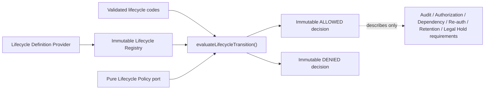

# AP-002A：Lifecycle Schema Foundation

狀態：**Accepted and Git Sealed**

## 目的與範圍

AP-002A 建立 framework-neutral、product-neutral 的 Lifecycle Domain/Application foundation，讓 owning Domain 未來能以版本化 Definition 明確描述狀態、合法 transition 與前置 Requirements，並得到不可變、可機器判讀的 Decision。

本 Package 不執行 lifecycle write，也不建立產品功能。沒有 Database、Migration、RLS、API、UI、Server Action、Archive、Restore、Delete、Recycle Bin、Dependency Protection、Retention、Re-authentication 或 Audit persistence integration。

## Clean Architecture

`lib/lifecycle/` 採下列固定依賴方向：

- `shared/`：branded Definition／State／Transition／Intent 與 canonical payload references。
- `domain/`：State、Transition、Requirements、Definition、Decision、validation、canonical serialization 與 core definition。
- `interfaces/`：Lifecycle Definition Provider 與 Lifecycle Policy ports；只有 interface。
- `application/`：Static Provider、immutable Registry 與 Evaluator orchestration。

Production source 禁止依賴 React、Next.js、Supabase、Database、Audit、Curriculum 或其他產品 Domain。Lifecycle foundation 不讀環境、不取得時間、不產生 ID、不呼叫網路、不寫資料，也不啟動 timer。

## State Model

Foundation definition version 固定為 `1`。State 是 runtime frozen 的 immutable object，欄位為：

- `id`
- `category`
- `version`
- `isTerminal`
- `isRestorable`
- `readonly`

Core definition 提供下列最小 vocabulary：

| State       | Category | Terminal | Restorable | Readonly |
| ----------- | -------- | -------- | ---------- | -------- |
| `DRAFT`     | WORKING  | No       | No         | No       |
| `PUBLISHED` | RELEASED | No       | No         | Yes      |
| `ARCHIVED`  | INACTIVE | No       | Yes        | Yes      |
| `TRASHED`   | REMOVAL  | No       | Yes        | Yes      |
| `DELETED`   | TERMINAL | Yes      | No         | Yes      |

這是 foundation vocabulary，不是所有 Aggregate 的完整狀態機。Organization、Account、Membership、Curriculum Version 與其他 owning Domain 必須由自己的 Definition Provider 定義相容但具 Domain 語意的狀態；不得把 Core definition 直接當成任意產品寫入授權。

## Transition Model

每個 Transition 必須明列 `transitionId`、`from`、`to`、`intent`、`requirements` 與 `version`。Core definition 只允許：

1. `DRAFT → PUBLISHED` (`PUBLISH`)
2. `PUBLISHED → ARCHIVED` (`ARCHIVE`)
3. `ARCHIVED → PUBLISHED` (`RESTORE`)
4. `ARCHIVED → TRASHED` (`TRASH`)
5. `TRASHED → ARCHIVED` (`RESTORE`)
6. `TRASHED → DELETED` (`DELETE`)

沒有 wildcard、implicit transition 或任意 jump。`DELETED` 為 terminal state，不得具有 outgoing transition。相同 from/to/intent route 即使使用不同 transition ID 也視為 duplicate，避免 ambiguous policy evaluation。

## Requirements Model

`LifecycleRequirements` 只描述 transition 在未來產品流程中必須完成的 safeguards：

- `auditRequired`
- `authorizationRequired`
- `dependencyCheckRequired`
- `reauthenticationRequired`
- `retentionRequired`
- `legalHoldRequired`

Evaluator 不執行 Requirements，也不把 `true` 解讀為已完成。未來 composition root 必須取得相應 verified receipt／decision，並在 AP-002C、AP-004 與 persistence architecture 完成後才可執行 business write。

## Decision Model

`LifecycleDecision` 是 frozen discriminated union：

- `ALLOWED`：包含完整 `currentState`、`targetState`、`transition` 與 `requirements`。
- `DENIED`：只包含 machine-readable `denialCode` 與 `reason`，不回傳自由文字或原始 input。

Foundation denial 涵蓋 invalid request、unknown definition/state/transition/intent、illegal transition、terminal state、unsupported version、policy deny 與 policy error。任何未辨識輸入或 Policy exception 一律 fail closed。

## Lifecycle Policy Port

`LifecyclePolicy` 是同步、純函式 interface。輸入只包含已驗證、不可變的 Definition、current/target State 與 Transition；輸出只能是 `ALLOW` 或受控 reason 的 `DENY`。

Policy 不修改 Resource、不查 Database、不執行 Dependency／Retention／Legal Hold、不寫 Audit，也不產生 side effect。Curriculum、Lesson、Worksheet、Assessment 等 owning Domain 必須在後續獨立 Package 提供自己的 policy implementation；AP-002A 不包含任何產品 business rule。

## Definition Provider 與 Registry

`LifecycleDefinitionProvider` 是 definition source port。`StaticLifecycleDefinitionProvider` 會在 construction 時驗證並複製輸入，保存 frozen snapshot。

`LifecycleRegistry` 只在 construction phase 原子註冊 provider definitions：

- 驗證每個 Definition。
- 以 `definitionId + version` 建立唯一索引。
- 查詢 Definition、State 與 Transition。
- 拒絕 duplicate definition。

Registry 沒有 register-after-construction、update、delete 或 dynamic mutation API。Provider 之後的外部 array 變動不會改變 Registry authority。

## Validation

所有 runtime input 先視為 `unknown`，再以 exact-key allowlist 與受控 code/schema 驗證。以下全部 fail closed：

- Unknown／duplicate State。
- Unknown／duplicate Transition 或 duplicate route。
- Unknown Intent。
- Transition 引用未註冊 State。
- Illegal current/target/intent mismatch。
- Terminal outgoing transition。
- Unsupported Definition／State／Transition version。
- Unknown field、accessor、symbol key、non-plain object。
- 缺少或非 boolean Requirement。
- 無效 Policy result 或 Policy exception。

Validator 會建立新的 frozen object graph，不保留 caller object reference，也不執行 getter。

## Canonical Serialization

`serializeLifecycleDefinition()` 只接受通過完整 validation 的 Definition，再以固定 object key ordering、Unicode NFC、finite number 與 plain-object規則產生 deterministic JSON。Array order 是 Definition contract 的一部分，因此 State／Transition 宣告順序會保留。

本 Package 不計算 hash、不保存 payload、不讀 Database，也不與 Audit hash chain 共用 implementation。若 serialization contract 改變，必須提升 Lifecycle Definition version，不能靜默改寫既有 version 語意。

## Security Boundary

- Definition／evaluation input 採 exact-key allowlist；不能夾帶 password、token、cookie、header、PII、教材內容、學生資料或任意 request payload。
- Decision 不回傳原始 input、自由文字、資料庫錯誤或 stack。
- Policy、Provider 與 Registry 不授權產品操作，也不取代 AP-004 Authorization、server guard 或 RLS。
- `auditRequired` 只描述門檻；AP-002B 尚無 persistence，任何 lifecycle write 仍維持關閉。
- `DELETE` intent 只是一個 transition vocabulary，不代表 hard delete、永久刪除資格或執行能力。

## Validation Coverage

- Core State 欄位、category、terminal/restorable/readonly 與 deep freeze。
- 六個顯式 Transition、Requirement 描述與禁止 Draft→Deleted jump。
- Duplicate／unknown／terminal／unsupported version／unknown field／accessor validation。
- Registry registration、lookup、snapshot、duplicate definition 與無 mutation API。
- ALLOWED／DENIED decision immutability。
- Evaluator validation → Registry → Policy → Decision integration。
- Illegal transition、unknown transition、terminal、invalid input、policy deny/error fail closed。
- Canonical serialization determinism 與 declaration-order behavior。
- Clean Architecture import boundary、interface-only ports、無循環依賴與無 runtime side effect。

## Deferred／Known Limitations

1. 沒有 Domain-specific Organization／Account／Membership／Curriculum lifecycle definition。
2. 沒有 lifecycle request、state version persistence、optimistic concurrency 或 dual-read／dual-write adapter。
3. 沒有 Audit persistence／receipt orchestration；AP-002B foundation 不等於 production Audit。
4. 沒有 Authorization、Dependency Protection、Retention、Legal Hold、Re-authentication 或 approval integration。
5. 沒有 Database、Migration、RLS、RPC、API、UI、Server Action、Event Bus、Queue 或 background job。
6. 沒有 Archive、Restore、Trash、Delete 或 Recycle Bin 產品功能；BF-003 仍不得開始。
7. `DELETED` 只代表 terminal vocabulary，不定義 physical deletion、anonymization 或 tombstone strategy。

## Future Integration Plan

1. 以已核准並 Git Sealed 的 AP-002A foundation 作為後續不可變基線。
2. AP-002C 建立 Dependency／Retention／Legal Hold decision 與 impact contract。
3. 以獨立 persistence Package 建立 additive canonical state、state version、RLS 與 legacy compatibility adapter；不修改歷史 Migration。
4. 將 AP-004 Authorization decision、AP-002B persisted Audit receipt、AP-002C dependency decision 與必要 re-auth/approval receipt 組成 transaction/outbox write boundary。
5. AP-004 Background Job/Event/Notification 完成前，不開不可逆 permanent deletion。
6. AP-002D/E/F 再分別建立 Organization Closing、Account Privacy/Deletion 與 Recycle Bin 產品流程。

本 Package 封板只代表 Lifecycle Domain/Application foundation 已成為核准基線，不代表任何產品 lifecycle 或 Database schema 已上線。
