# AP-002B：Immutable Audit Foundation

狀態：**Accepted and Git Sealed**

## 目的與範圍

AP-002B 建立 framework-neutral 的不可變稽核核心，供未來 Lifecycle、Identity、Authorization 與 Platform Governance write flow 產生一致的 Audit Event 與最小 Audit Receipt。本 Package 只有 Domain、Application 與 persistence ports；沒有資料表、Migration、Supabase adapter、API、UI、Server Action、Middleware 或產品生命週期寫入。

```mermaid
flowchart LR
    FutureWrite["Future lifecycle write"] --> Writer["AuditWriter"]
    Writer --> Validation["Fail-closed validation"]
    Validation --> Head["AuditRepository.getChainHead"]
    Head --> Canonical["Canonical serializer"]
    Canonical --> Hash["AuditHashChain port"]
    Hash --> Event["Frozen AuditEvent"]
    Event --> Append["Atomic append + expected previous hash"]
    Append --> Receipt["Minimal frozen AuditReceipt"]
```

## Clean Architecture

`lib/audit/` 的依賴方向如下：

- `shared/`：branded identifier、timestamp、hash 與 canonical payload references。
- `domain/`：Audit Event、Receipt、metadata allowlist、validation、canonical serialization 與 machine-readable error。
- `interfaces/`：Clock、Event ID、Hash Chain 與 Repository ports，全部只有 interface。
- `application/`：`AuditWriter` orchestration；不直接操作資料庫或 framework。

Production source 禁止依賴 React、Next.js、Supabase、Database、Authorization UI、Curriculum 或其他產品 Domain。時間、ID、hash 與 persistence 全部經 constructor injection；Domain 可獨立測試。

## Audit Event Model

每個 Event 是 frozen、append-only record，包含：

- `eventId`、`occurredAt` 與 event `version`；
- `actorType`、`actorId` 與 optional `actingRole`；
- `organizationId` 或明確 `platformScope`，兩者不得形成模糊 scope；
- `resourceType`、`resourceId`、`action`、`result` 與 `reason`；
- `correlationId`、`requestId`、`source` 與 optional `policyVersion`；
- allowlisted `metadata`；
- `previousHash` 與 `currentHash`。

`AuditWriteCommand` 由 `unknown` 進入 validation boundary。未列入契約的欄位、未知 actor/result、非法識別碼、scope 矛盾、非法 action／resource code、非 canonical timestamp、錯誤版本或 hash 一律 fail closed。

平台級事件使用 `platform` chain；租戶事件使用 `organization:<organizationId>` chain。這是完整性分區，不代表 Platform actor 自動具有跨租戶權限。

## Metadata Policy

Metadata 採固定 allowlist：approval/case reference、dependency decision、failure class、impact count、operation class、policy version、purpose code、redaction status 與 lifecycle state before/after。非計數值只能是受控 reference/code，不接受 email、任意自由文字或巢狀 payload。

禁止寫入 Secret、Token、Password、Credential、完整 PII、完整學生作答、教材正文或任意 request body。`reason` 是 machine-readable code；若未來需要限制性 reason text，必須另經 privacy、retention 與 redaction review，不能塞入 metadata。

## Canonical Serialization

Canonical serializer 在 hash 前執行：

- Object key 逐層排序；Array 順序保留。
- String 使用 Unicode NFC。
- `-0` 正規化為 `0`；拒絕 `NaN`、Infinity。
- 只接受 null、boolean、finite number、string、Array 與 plain object。
- 拒絕 `undefined`、function、bigint、symbol key、accessor、Date/custom prototype 與循環引用。

因此相同 Event material 產生完全相同 canonical payload；serializer 不執行 getter，也不讀環境、網路或檔案。Canonical 規則若變更，必須提升 Event／serialization version，不得靜默覆寫歷史算法。

## Hash Chain Contract

`AuditHashChain` 目前只有 `calculateHash(canonicalPayload)` port，不包含加密演算法或外部 Storage concrete implementation。未來 infrastructure adapter 必須採核准的 cryptographic digest、記錄 algorithm/version，並以測試向量驗證跨 runtime 一致性。

Writer 會把 `previousHash` 納入 hash material。Repository append 必須同時收到 `expectedPreviousHash`，並在單一原子操作中比較 chain head 後追加；若 head 已變更必須拒絕，caller 不得收到 receipt。這項 compare-and-set 契約防止並行寫入形成未被察覺的 chain fork。

Hash chain 提供 tamper-evidence，不等於完整防竄改儲存。真正的不可修改／不可刪除仍必須由後續 Database grants、FORCE RLS、append-only policy、retention controls、backup 與外部 archive共同實現。

## Repository Contract

`AuditRepository` 只有：

1. `getChainHead(chain)`；
2. `append(event, { chain, expectedPreviousHash })`。

沒有 update、delete、upsert 或 concrete adapter。Repository 回傳的 head 仍被視為不可信 runtime data，Writer 會重新驗證 chain identity、hash、event reference、timestamp 與 version。

## Audit Writer 與 Receipt

Writer 的固定順序為：validate command → resolve chain → validate current head → validate injected ID/time → canonical serialize → calculate/validate hash → freeze event → atomic append → create receipt。

`AuditReceipt` 只包含 chain ID、event ID、occurredAt、current hash、correlation ID 與 version，不含 actor、reason、resource details 或 metadata，也不提供可修改 Event。Append 失敗、chain conflict、invalid provider output 或任何 validation failure 都不回傳 Receipt。

未來 Lifecycle Write 必須在 transaction/outbox architecture 中定義「business write 與 audit append」的原子一致性。本 Package 尚未提供該 database transaction，不能被解讀為 BF-003 或其他 write flow 已解除阻擋。

## Security Boundary

- Event 與 Receipt 為 readonly 且 runtime frozen；metadata 亦 frozen。
- Root fields 與 metadata 都採 allowlist copy，不保留額外輸入。
- Clock、ID generator、Hash Chain 與 Repository 的輸出均須驗證。
- Event ID、Actor、Organization、Resource、Request 與 Correlation reference 不接受 email 等直接 PII 格式。
- AI Agent 不是 audit actor authority；actor authenticity 必須由未來 trusted server composition root 提供。
- 此模組不授權任何產品操作，也不繞過 Authorization、RLS、Dependency Protection、Retention 或 Legal Hold。

## Validation Coverage

- 合法 Organization／Platform event 與 scope exclusivity。
- 缺少或偽造 actor、scope、resource、action、metadata、timestamp、hash、version 與 chain head。
- Hash determinism、previous-hash chaining 與 atomic append expectation。
- Receipt minimization、event/metadata/receipt immutability 與 append failure。
- Canonical key ordering、Unicode、number、array、cycle、accessor 與 unsupported value。
- Clean Architecture import boundary、interface-only ports、無循環依賴及無 runtime side effect。

## Deferred／Known Limitations

1. 沒有 Audit table、Migration、RLS、grant、trigger、RPC 或 Supabase repository。
2. 沒有 production cryptographic hash adapter、keyed signing、external archive、warehouse 或 independent verification job。
3. 沒有 business-data transaction/outbox、retry、queue、event bus 或 ordering coordinator。
4. 沒有 retention、legal hold、export、redaction workflow、audit viewer 或 Platform Admin Console。
5. 沒有 trusted actor/session adapter；shape validation不證明 actor具備權限。
6. 沒有接入 Curriculum、Lesson、Identity、Authorization denial或任何 lifecycle write。
7. BF-003、AP-002A／C／F及永久刪除仍被後續架構與資料庫門檻阻擋。

本 Package 封板後只代表 immutable Audit Domain/Application foundation 成為核准基線，不代表 production Audit 已上線。
