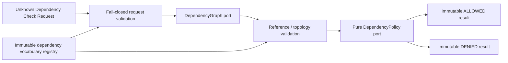

# AP-002C：Dependency Protection Foundation

狀態：**Accepted and Git Sealed**

## 目的與範圍

AP-002C 建立 framework-neutral、product-neutral 的 Dependency Protection Domain/Application foundation，讓後續 owning Domain 能在 lifecycle transition 前取得依賴圖、驗證其完整性，並由純函式 Policy 產生不可變、可機器判讀的 Dependency Check Result。

本 Package 不執行 lifecycle write，也不建立產品功能。沒有 Database、Migration、RLS、API、UI、Server Action、Archive、Restore、Delete、Recycle Bin、Audit、Retention、Legal Hold、Authorization integration 或產品 Business Rule。

## Clean Architecture

`lib/dependency/` 採固定依賴方向：

- `shared/`：branded Resource Type／Resource ID／Dependency Type／Transition 與 canonical payload references。
- `domain/`：Definition、Reference、Request、Evaluation、Result、validation 與 canonical serialization。
- `interfaces/`：Dependency Graph 與 Dependency Policy ports；只有 interface。
- `application/`：construction-only Registry 與 Evaluator orchestration。

Production source 禁止依賴 React、Next.js、Supabase、Database、Audit、Authorization、Lifecycle、Curriculum 或其他產品 Domain。Foundation 不讀環境、不取得時間、不產生 ID、不呼叫網路、不寫資料，也不啟動 timer。

## Dependency Vocabulary 與 Registry

Dependency Definition version 固定為 `1`，由三組非空、唯一、受控大寫代碼組成：

- `resourceTypes`
- `dependencyTypes`
- `transitions`

`DependencyRegistry` 只在 construction 時驗證並複製 Definition，之後只提供 frozen snapshot 與查詢；沒有 runtime register、update 或 delete。Resource、Dependency 與 Transition 的產品語意須由未來 composition root 提供，Foundation 不內建 Curriculum、Lesson、Student 等產品型別。

## Dependency Reference

每個 `DependencyReference` 是 runtime frozen 的不可變 directed edge，欄位為：

- `resourceType`
- `resourceId`
- `relatedResourceType`
- `relatedResourceId`
- `dependencyType`
- `direction`：`OUTBOUND` 表示 resource 指向 related resource；`INBOUND` 表示 related resource 指向 resource。
- `version`
- `readonly`

`readonly` 只描述 graph adapter 提供的依賴屬性，不直接等於 blocking decision。是否阻擋 transition 必須由 owning Domain 的 Dependency Policy 決定。

Resource ID 只允許最長 128 字元的非空技術識別碼字元集；它不是教材內容、學生資料、Email、Password、Token、Cookie 或 PII 容器。

## Dependency Check Request 與 Result

Request 只接受 exact-key allowlist：

- `resourceType`
- `resourceId`
- `requestedTransition`
- `version`

Result 是 frozen discriminated union：

- `ALLOWED`：回傳經完整驗證、排序且 frozen 的 `dependencies`，以及 dependency count、readonly dependency count、validation 與 policy decision 組成的 `evaluation`。
- `DENIED`：只回傳 machine-readable `denialCode` 與 `reason`，不回傳未驗證 graph、原始 input、自由文字或內部錯誤。

Denied 類別涵蓋 invalid request、unknown resource/dependency/transition、duplicate、cycle、unsupported version、graph error、policy deny 與 policy error。任何非預期 exception 都 fail closed。

## Dependency Graph Port

`DependencyGraph.findDependencies()` 是 async interface，輸入只接受 validated request，輸出仍視為 `unknown[]` 並由 Domain validator重新驗證。這讓未來 infrastructure adapter 可以使用資料庫或其他來源，但 AP-002C 本身沒有 concrete adapter、SQL、Supabase 或 persistence。

Graph lookup failure 不洩漏 provider error，Evaluator 只回傳 `GRAPH_ERROR / DEPENDENCY_GRAPH_LOOKUP_FAILED`。

## Dependency Policy Port

`DependencyPolicy` 是同步純函式 interface。輸入僅包含 validated/frozen Request 與 Dependencies，輸出只能是：

- `ALLOW`
- `DENY / DEPENDENCY_POLICY_DENIED`

Policy 不查 Database、不修改 Resource、不執行 Archive／Delete、不寫 Audit，也不能產生 side effect。Curriculum、Lesson、Worksheet、Assessment 等 owning Domain 的 blocking rule 必須由後續獨立 Package 提供。

## Evaluator

`evaluateDependencyProtection()` 固定依序執行：

1. 驗證 request 與 registry vocabulary。
2. 呼叫 Graph port 一次。
3. 驗證 Graph 回傳的所有 Reference 與拓撲。
4. 呼叫純 Dependency Policy 一次。
5. 建立 immutable ALLOWED／DENIED result。

Evaluator 不執行 Archive、Restore、Trash、Delete、Audit、Database write 或任何產品流程。ALLOWED 只代表目前 dependency policy 通過，不等於 lifecycle transition 已獲 Authorization、Audit、Retention、Legal Hold、Re-auth、Approval 或 persistence 保證。

## Validation

所有 runtime input 先視為 `unknown`，再以 exact-key allowlist、plain-object descriptor 與受控 code/version 驗證。以下全部 fail closed：

- Unknown Resource Type 或 Reference endpoint。
- Unknown Dependency Type。
- Unknown Transition。
- Unsupported version。
- Duplicate registry code。
- Duplicate directed Dependency Reference；同一 edge 即使以相反 endpoint + direction 表示仍視為 duplicate。
- Direct self-cycle 或 multi-edge indirect cycle。
- 與 request root 不相連的 graph fragment。
- Unknown field、symbol key、accessor、non-plain object、無效方向或無效 readonly flag。
- 超過 10,000 筆的單次 graph snapshot，以限制記憶體與 CPU 放大風險。
- Graph exception、非陣列回傳、Policy exception 或無效 Policy result。

有向循環以 normalized edge 建圖後執行非遞迴拓撲檢測；連通性則以 request resource 為 root 檢查整個回傳 snapshot，避免無關依賴被混入 decision，亦避免深層 graph 導致 call-stack 放大。

## Canonical Serialization

`serializeDependencySnapshot()` 只接受 `{ request, dependencies }` exact shape。它會重新驗證 request 與完整 graph、依 normalized directed edge 排序 dependencies、固定 object key ordering、正規化字串並拒絕非 finite number／cycle／accessor，產生 deterministic JSON。

本 Package 不計算 hash、不保存 payload，也不與 AP-002B Audit serializer 共用 implementation。Serializer contract 若改變，必須提升 Dependency Contract version，不能靜默改寫 version 1 語意。

## Security Boundary

- Request／Reference 只接受技術識別碼與受控代碼；禁止 Password、Token、Cookie、PII、HTTP payload、教材內容與學生資料。
- Graph／Policy output 均重新驗證；不能因 provider 被視為 infrastructure 就略過 trust boundary。
- Result 不含自由文字、raw provider error、stack、SQL 或未驗證 input。
- Foundation 不授權產品操作，也不取代 AP-004 Authorization、AP-002A Lifecycle、AP-002B persisted Audit、server guard 或 RLS。
- `ALLOWED` 不代表可以 hard delete 或 permanent delete。

## Validation Coverage

- Dependency Reference shape、direction、version、readonly 與 runtime freeze。
- Registry snapshot、排序、duplicate code 與無 runtime mutation API。
- Unknown Resource／Dependency／Transition／Field／Version fail closed。
- Duplicate normalized edge、direct／indirect cycle 與 disconnected fragment。
- Evaluator request → graph → policy → decision integration、single invocation 與 provider error handling。
- ALLOWED／DENIED result與 evaluation immutability。
- Canonical serialization determinism，不依賴 graph 回傳順序。
- Clean Architecture import boundary、interface-only ports、無 module cycle 與無 runtime side effect。

## Deferred／Known Limitations

1. 沒有 Curriculum、Lesson、Worksheet、Assessment 或其他 Domain-specific vocabulary／policy。
2. 沒有 Dependency Graph concrete adapter、Database query、recursive CTE、cache、pagination 或 consistency snapshot。
3. 沒有 impact count aggregation、human-readable explanation、Dependency inventory UI 或 export。
4. 沒有 AP-002B persistence receipt、AP-002A transition orchestration、Authorization、Retention、Legal Hold、Re-authentication 或 approval integration。
5. 沒有 transaction、optimistic concurrency、outbox、Event Bus、Queue 或 background job。
6. 沒有 Archive、Restore、Trash、Delete、Recycle Bin 或 permanent deletion 產品能力；BF-003 仍不得開始。
7. `readonly` 只是 edge metadata；Foundation 不內建「readonly 一律阻擋」等產品規則。

## Future Integration Plan

1. 以已核准並 Git Sealed 的 AP-002C foundation 作為後續不可變基線。
2. 由 owning Domain 建立版本化 resource/dependency/transition vocabulary 與純 Dependency Policy。
3. 以獨立 infrastructure Package 建立 tenant-safe Graph adapter、snapshot consistency、RLS 與 query budget；不修改歷史 Migration。
4. Composition root 組合 AP-004 trusted Authorization decision、AP-002A Lifecycle decision、AP-002C Dependency result、AP-002B persisted Audit receipt，以及 Retention／Legal Hold／Re-auth／Approval receipts。
5. 所有 write 必須在 transaction/outbox boundary 重驗 resource version 與 dependency snapshot，避免 check-to-write race。
6. AP-004 Background Job/Event/Notification 完成前，不開大型或不可逆 permanent deletion。
7. AP-002D／E／F 再分別建立 Organization Closing、Account Privacy／Deletion 與 Recycle Bin 產品流程。

本 Package 封板只代表 Dependency Protection Domain/Application foundation 已成為核准基線，不代表任何產品 dependency rule、lifecycle write 或 Database schema 已上線。
