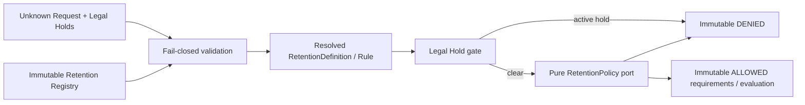

# AP-002D：Retention & Legal Hold Foundation

狀態：**Accepted and Git Sealed**

## 目的與範圍

AP-002D 建立 framework-neutral、product-neutral 的 Retention 與 Legal Hold Domain/Application foundation，讓後續 owning Domain 能以版本化 Retention Rule 描述最低保存要求、驗證套用於特定 Resource 的 Legal Hold，並由同步純函式 Policy 產生不可變、可機器判讀的 Retention Decision。

本 Package 不計算法定期限、不執行 lifecycle write，也不建立產品功能。沒有 Database、Migration、RLS、API、UI、Server Action、Purge、Archive、Restore、Delete、Recycle Bin、Audit persistence、產品 Retention Rule 或產品 Business Rule。

## Clean Architecture

`lib/retention/` 採固定依賴方向：

- `shared/`：branded Resource Type／Resource ID／Category／Transition／Hold ID／Reason 與 canonical payload references。
- `domain/`：Definition／Rule、Period、Metadata、Legal Hold、Request、Policy input/output、Decision、validation 與 canonical serialization。
- `interfaces/`：Retention Policy port；只有 interface。
- `application/`：construction-only Registry 與 Evaluator orchestration。

Production source 禁止依賴 React、Next.js、Supabase、Database、Audit、Authorization、Lifecycle、Dependency 或任何產品 Domain。Foundation 不讀環境、不取得時間、不產生 ID、不呼叫網路、不寫資料，也不啟動 timer。

## Retention Registry 與 Vocabulary

Retention contract version 固定為 `1`。Registry definition 由三部分組成：

- `retentionCategories`：caller 在 composition root 註冊的受控大寫代碼。
- `transitions`：caller 註冊的受控 transition 代碼。
- `definitions`：每個 Resource Type 恰好一個 Retention Definition。

`RetentionRegistry` 只在 construction 時驗證、排序、複製並凍結 snapshot。它沒有 runtime register、update 或 delete。Foundation 不內建 Business、Security、Education、Billing、Curriculum、Student 等產品 category 或 resource vocabulary，避免把尚未核准的政策寫死進 runtime。

## Retention Model

每個 `RetentionDefinition` 同時是版本化 `RetentionRule`，至少包含：

- `resourceType`
- `retentionCategory`
- `minimumRetentionPeriod`
- `legalHoldSupported`
- `version`
- `metadata`

`minimumRetentionPeriod` 使用 `{ amount, unit }`；unit 只允許 `DAYS`、`MONTHS`、`YEARS`，但 Foundation 不解讀 calendar anchor、不判斷期間是否已屆滿，也不宣稱任何法定天數。

Metadata 最多 16 筆，使用 `{ key, value }` 的受控 technical code；string value 只能是大寫代碼，number 只能是有界 safe integer，亦可使用 boolean。Metadata 禁止 Email、姓名、自由文字、案件內容、學生資料或任意 payload。Definition、Period、Metadata array 與 entries 均為 runtime frozen。

## Legal Hold Model

`LegalHoldReference` 包含：

- `holdId`
- `resourceType`
- `resourceId`
- `holdReason`
- `active`
- `version`

Hold ID 與 Resource ID 只接受有界 technical identifier；`holdReason` 只接受受控大寫 reason code，不保存自由文字或法律案件內容。所有 Hold 必須與 Request 的 Resource Type／ID 完全一致，Hold ID 不可重複，且 Rule 必須明確支援 Legal Hold。

若存在任何 active hold，Evaluator 在呼叫 Policy 前直接回傳 `LEGAL_HOLD_ACTIVE / LEGAL_HOLD_IS_ACTIVE`。Policy 不能 override active hold；這是 Foundation 的 fail-closed 安全邊界。

## Retention Request 與 Decision

`RetentionCheckRequest` 只接受 exact-key allowlist：

- `resourceType`
- `resourceId`
- `requestedTransition`
- `version`

`RetentionDecision` 是 frozen discriminated union：

- `ALLOWED`：只回傳 Definition-derived `requirements` 與 validation／hold count／policy decision `evaluation`。
- `DENIED`：只回傳 machine-readable `denialCode` 與 `reason`，不回傳原始 Request、Hold、Policy exception、自由文字或內部錯誤。

ALLOWED requirements 包含最低保存期間、Retention Category、safe metadata 與 Legal Hold check 狀態。它只表示本次 Foundation policy evaluation 通過，不表示最低期間已由 persistence time anchor 證明、不表示已通過 Authorization／Lifecycle／Dependency／Audit／Re-auth／Approval，也不授權任何 Archive、Delete 或 Purge。

## Retention Policy Port

`RetentionPolicy` 是同步純函式 interface。輸入只包含已驗證且 frozen 的 Request、Definition 與 Legal Hold references；輸出只能是：

- `ALLOW`
- `DENY / RETENTION_POLICY_DENIED`

Policy 不查 Database、不讀 Clock、不呼叫 Network、不寫 Audit、不修改 Resource，也不執行 lifecycle transition。未來產品 Policy 必須在取得 authoritative policy version、retention anchor、jurisdiction 與必要 receipts 後，由 composition root 建立；AP-002D 不預先定義產品規則。

## Retention Evaluator

`evaluateRetentionProtection()` 固定依序執行：

1. 驗證 evaluation envelope 與 Request。
2. 從 immutable Registry resolve Retention Definition／Rule。
3. 驗證 Rule、版本與受控 vocabulary。
4. 驗證所有 Legal Hold references。
5. 若有 active hold，立即 fail closed。
6. 呼叫純 Retention Policy 一次。
7. 建立 immutable ALLOWED／DENIED Decision。

Policy exception 或無效 Policy output 一律回傳 `POLICY_ERROR / RETENTION_POLICY_EVALUATION_FAILED`，不洩漏 exception、stack 或內部資訊。

## Validation

所有 runtime input 先視為 `unknown`，再以 exact-key allowlist、plain-object descriptor 與受控 code/version 驗證。以下全部 fail closed：

- Unknown Resource。
- Unknown Retention Category。
- Unknown Transition。
- Unsupported version。
- Duplicate Resource Definition／Category／Transition。
- Invalid minimum period、metadata、Rule 或 Policy output。
- Invalid、duplicate、cross-resource 或 unsupported Legal Hold。
- Rule 不支援 Legal Hold 卻收到 Hold。
- Unknown field、symbol key、accessor、non-plain object。
- PII-shaped Resource ID、自由文字 metadata／hold reason。
- 超過 1,000 個 Definition、1,000 個 Hold 或 16 筆 metadata 的有界限制。

Validator 建立新的 frozen object graph，不保留 caller object reference，也不執行 getter。

## Canonical Serialization

`serializeRetentionSnapshot()` 只接受 `{ definition, legalHolds, request }` exact shape。它會：

1. 重新驗證 Request。
2. 確認傳入 Rule 與 Registry canonical Rule 完全一致。
3. 重新驗證並依 Hold ID 排序 Legal Hold references。
4. 將 metadata 依 key 排序。
5. 固定 object key ordering、Unicode NFC、finite number 與 plain-object規則。

相同語意的 snapshot 永遠產生相同 JSON，不受輸入 object key、metadata 或 Hold 順序影響。本 Package 不計算 hash、不保存 payload，也不與 AP-002B Audit serializer 共用 implementation。Serializer contract 變更必須提升 Retention contract version。

## Security Boundary

- 只接受 technical identifiers、受控 code、bounded number 與 boolean。
- 禁止 Password、Token、Cookie、Header、HTTP payload、PII、教材內容與學生資料。
- Retention metadata 不是任意 JSON；自由文字與 object payload 一律拒絕。
- Hold reason 是 code，不保存 legal case detail。
- Policy input/output 均重新驗證；provider exception 一律 fail closed。
- Foundation 不授權產品操作，也不取代 AP-004 Authorization、AP-002A Lifecycle、AP-002B persisted Audit、AP-002C Dependency、server guard 或 RLS。
- `ALLOWED` 不代表可以 hard delete、permanent delete、purge 或 anonymize。

## Validation Coverage

- Retention Definition／Rule、Period、Metadata 與 runtime deep freeze。
- Legal Hold shape、resource match、support flag、duplicate、version 與 immutability。
- Registry snapshot、sorting、copy isolation、duplicate vocabulary 與無 mutation API。
- Unknown Resource／Category／Transition／Field／Version fail closed。
- Invalid period、unsafe metadata、PII-shaped identifier 與 invalid Policy output。
- Evaluator validation → rule resolution → legal hold → policy → decision flow。
- Active Hold 在 Policy 前拒絕、Policy deny／exception fail closed。
- ALLOWED／DENIED requirements、evaluation 與 Decision immutability。
- Canonical serialization determinism。
- Clean Architecture import boundary、interface-only Policy port、無循環依賴與無 runtime side effect。

## Deferred／Known Limitations

1. 沒有任何 jurisdiction、法定期限、Organization plan、Student、Billing、Curriculum 或其他產品 Rule。
2. 沒有 Clock、retention anchor、effective window、policy version persistence、calendar arithmetic 或 expiration scheduler。
3. 沒有 Legal Hold repository、apply／release workflow、reason detail vault、approval、re-auth 或通知。
4. 沒有 Audit persistence／receipt orchestration、Authorization、Lifecycle、Dependency 或 transaction/outbox integration。
5. 沒有 Database、Migration、RLS、RPC、API、UI、Server Action、Event Bus、Queue 或 background job。
6. 沒有 Purge、Archive、Restore、Trash、Delete、Recycle Bin、anonymization 或 Organization Closing 產品功能。
7. Policy purity 是 interface contract；未來 concrete implementation 仍須通過獨立 architecture／side-effect tests。
8. Inactive Hold 會保留於 snapshot 供判斷重現，但 Foundation 不管理 Hold history 或 release Audit。

## Future Integration Plan

1. 架構核准後以 AP-002D foundation 作為版本化 Retention／Legal Hold contract baseline。
2. 由 Governance／owning Domain 建立經法務核准的 Resource／Category／Transition vocabulary 與產品 Policy，不在 API 寫死期限。
3. 以獨立 persistence Package 建立 versioned retention policies、hold records、effective windows、FORCE RLS 與最小 grant；不修改歷史 Migration。
4. 建立 authoritative Policy Resolver、Clock／retention anchor 與 Legal Hold adapter，並以 snapshot/version 保證決策可重現。
5. Composition root 組合 AP-004 trusted Authorization、AP-002A Lifecycle、AP-002C Dependency、AP-002D Retention、AP-002B persisted Audit 及必要 Re-auth／Approval receipts。
6. 所有 write 在 transaction/outbox boundary 重驗 Resource version、Dependency snapshot、Retention policy version 與 active Hold，避免 check-to-write race。
7. AP-004 Background Job／Event／Notification Foundation 完成前，不開不可逆 permanent deletion、purge 或大型 anonymization。
8. Organization Closing、Account Privacy／Deletion 與 Recycle Bin 必須由後續獨立產品 Package 實作，不由本 Foundation 自動解鎖。

本 Package 完成只代表 Retention／Legal Hold Domain/Application foundation 可供架構審查，不代表任何產品保留規則、Legal Hold workflow、Database schema 或 lifecycle write 已上線。
