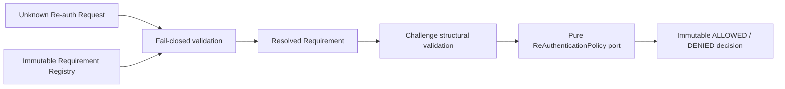

# AP-002E：Re-authentication Boundary Foundation

狀態：**Implementation Completed — Awaiting Architecture Review**

## 目的與範圍

AP-002E 建立 framework-neutral、product-neutral 的 Re-authentication Boundary foundation，讓後續高風險 lifecycle、platform case access、role mutation、export 與 permanent deletion flow 能以版本化 requirement 描述是否需要重新驗證、需要哪一類 challenge，並由同步純函式 Policy 產生不可變、可機器判讀的 decision。

本 Package 不實作 Login、MFA、OTP、Password verification、WebAuthn、Session refresh、API、UI、Database、Migration、RLS、產品 Rule 或任何 credential validation。它只描述 re-auth boundary contract。

## Clean Architecture

`lib/re-authentication/` 採固定依賴方向：

- `shared/`：branded Action Type、Challenge ID、Challenge Type 與 Metadata Code。
- `domain/`：Requirement、Challenge、Request、Policy input/output、Decision、validation 與 canonical serialization。
- `interfaces/`：Re-authentication Policy port；只有 interface。
- `application/`：construction-only Registry 與 Evaluator orchestration。

Production source 禁止依賴 React、Next.js、Supabase、Database、Audit、Authorization、Lifecycle、Dependency、Retention 或任何產品 Domain。Foundation 不讀 cookie、session、header、request、環境變數，不取得密碼、OTP、MFA secret 或 token，不呼叫網路，不寫資料，也不啟動 timer。

## Requirement Registry 與 Vocabulary

Re-authentication contract version 固定為 `1`。Registry definition 由三部分組成：

- `actionTypes`：caller 在 composition root 註冊的受控大寫 action 代碼。
- `challengeTypes`：caller 註冊的受控 challenge type 代碼。
- `requirements`：每個 Action Type 恰好一個 Requirement。

`ReAuthenticationRegistry` 只在 construction 時驗證、排序、複製並凍結 snapshot。它沒有 runtime register、update 或 delete。Foundation 不內建 Platform、Organization、Curriculum、Account、Export、Delete 等產品 action vocabulary，也不定義可用 credential method。

## Requirement Model

每個 `ReAuthenticationRequirement` 至少包含：

- `actionType`
- `riskLevel`
- `required`
- `challengeType`
- `version`
- `metadata`

Risk level 是受控 vocabulary：`LEVEL_0` 到 `LEVEL_4`。它描述未來 Policy 可用的風險分類，不代表 Foundation 會計算 freshness window 或要求 MFA。

Metadata 最多 16 筆，使用 `{ key, value }` 的受控 technical code；string value 只能是大寫代碼，number 只能是有界 safe integer，亦可使用 boolean。Metadata 禁止 Email、姓名、自由文字、HTTP payload、credential detail、學生資料或任意 JSON。Requirement 與 metadata array／entries 均為 runtime frozen。

## Challenge Model

`ReAuthenticationChallenge` 包含：

- `challengeId`
- `challengeType`
- `issuedAt`
- `expiresAt`
- `version`

Challenge ID 只接受有界 technical identifier。`issuedAt` 與 `expiresAt` 必須是 UTC ISO instant，且 `expiresAt` 必須晚於 `issuedAt`。Foundation 不使用 Clock，也不判斷現在是否過期；未來產品 adapter 必須提供 authoritative freshness／receipt／clock decision。

Challenge 只代表已由外部 trusted boundary 產生或傳入的結構化 reference，不保存 password、OTP code、MFA secret、WebAuthn assertion、token、cookie、header 或完整 HTTP payload。

## Request 與 Decision

`ReAuthenticationCheckRequest` 只接受 exact-key allowlist：

- `actionType`
- `challenge`（可選）
- `version`

`ReAuthenticationDecision` 是 frozen discriminated union：

- `ALLOWED`：回傳 `challengeRequired`、Definition-derived `requirements` 與 validation／challenge status／policy decision `evaluation`。
- `DENIED`：只回傳 machine-readable `denialCode` 與 `reason`，不回傳原始 request、challenge、policy exception、自由文字或內部錯誤。

`challengeRequired: true` 只表示下一層產品流程應要求 re-auth challenge，不表示高風險操作已可執行。真正 write flow 仍須通過 Authorization、Lifecycle、Dependency、Retention、Legal Hold、Audit、Approval、transaction consistency 與 RLS。

## Re-authentication Policy Port

`ReAuthenticationPolicy` 是同步純函式 interface。輸入只包含已驗證且 frozen 的 Request、Requirement 與可選 Challenge；輸出只能是：

- `ALLOW`
- `DENY / REAUTHENTICATION_POLICY_DENIED`

Policy 不查 Database、不讀 Clock、不呼叫 Network、不寫 Audit、不修改 Resource、不驗證 Credential，也不執行 lifecycle transition。未來產品 Policy 必須在取得 authoritative session freshness、credential receipt、policy version 與必要 approval context 後，由 composition root 建立；AP-002E 不預先定義產品規則。

## Evaluator

`evaluateReAuthentication()` 固定依序執行：

1. 驗證 Request 與 version。
2. 從 immutable Registry resolve Requirement。
3. 驗證 Action Type、Challenge Type、Risk Level、metadata 與受控 vocabulary。
4. 若提供 Challenge，驗證 challenge structure、version、type match 與 issued／expires ordering。
5. 呼叫純 Re-authentication Policy 一次。
6. 建立 immutable ALLOWED／DENIED Decision。

Policy exception 或無效 Policy output 一律回傳 `POLICY_ERROR / REAUTHENTICATION_POLICY_EVALUATION_FAILED`，不洩漏 exception、stack 或內部資訊。

## Validation

所有 runtime input 先視為 `unknown`，再以 exact-key allowlist、plain-object descriptor 與受控 code/version 驗證。以下全部 fail closed：

- Unknown Action。
- Unknown Challenge Type。
- Unsupported version。
- Duplicate Action、Challenge Type 或 Requirement。
- Invalid Requirement、Risk Level、metadata 或 Policy output。
- Invalid Challenge、wrong challenge type、invalid issued／expires ordering。
- Unknown field、symbol key、accessor、non-plain object。
- Credential-shaped payload，例如 OTP code、password、token、cookie、header 等額外欄位。
- 超過 1,000 個 Requirement 或 16 筆 metadata 的有界限制。

Validator 建立新的 frozen object graph，不保留 caller object reference，也不執行 getter。

## Canonical Serialization

`serializeReAuthenticationCanonical()` 固定 object key ordering 並排除 `undefined`。相同語意的 Requirement、Challenge、Request、Decision 或 Registry snapshot 永遠產生相同 JSON，不受輸入 object key 順序影響。

本 Package 不計算 hash、不保存 payload，也不與 AP-002B Audit serializer 共用 implementation。Serializer contract 變更必須提升 Re-authentication contract version。

## Security Boundary

- 只接受 technical identifiers、受控 code、bounded number、boolean 與 ISO instant。
- 禁止 Password、OTP Code、MFA Secret、Token、Cookie、Header、HTTP payload、PII、教材內容與學生資料。
- Challenge reference 不是 credential payload；Foundation 不驗證任何 credential。
- Policy input/output 均重新驗證；provider exception 一律 fail closed。
- Foundation 不授權產品操作，也不取代 AP-004 Authorization、AP-002A Lifecycle、AP-002B persisted Audit、AP-002C Dependency、AP-002D Retention／Legal Hold、server guard 或 RLS。
- `ALLOWED` 或 `challengeRequired: false` 不代表可以 hard delete、permanent delete、purge、role mutate、export 或 perform break-glass access。

## Validation Coverage

- Requirement、Risk Level、Metadata 與 runtime deep freeze。
- Challenge ID、type、issued／expires ordering、version 與 immutability。
- Registry snapshot、sorting、copy isolation、duplicate vocabulary 與無 mutation API。
- Unknown Action／Challenge Type／Field／Version fail closed。
- Invalid metadata、credential-shaped payload 與 invalid Policy output。
- Evaluator validation → requirement resolution → challenge validation → policy → decision flow。
- Missing required challenge returns machine-readable `challengeRequired` without validating credentials.
- Policy deny／exception fail closed。
- ALLOWED／DENIED requirements、evaluation 與 Decision immutability。
- Canonical serialization determinism。
- Clean Architecture import boundary、interface-only Policy port、無循環依賴與無 runtime side effect。

## Deferred／Known Limitations

1. 沒有 Login、Password verification、OAuth re-auth flow、MFA、OTP、WebAuthn、Session refresh 或 MFA enrollment。
2. 沒有 session freshness window、Clock、receipt repository、credential verifier、challenge issuer 或 challenge store。
3. 沒有 API、UI、Server Action、middleware、Route Guard、Notification、Event Bus、Queue 或 background job。
4. 沒有 Database、Migration、RLS、RPC、Supabase adapter、JWT 或 cookie/session integration。
5. 沒有產品 action vocabulary、Organization／Curriculum／Platform policy、re-auth UX 或 BF-003 integration。
6. Policy purity 是 interface contract；未來 concrete implementation 仍須通過獨立 architecture／side-effect tests。

## Future Integration Plan

1. 架構核准後以 AP-002E foundation 作為版本化 Re-authentication boundary contract baseline。
2. 由 AP-003B／AP-004 product authorization integration 指定哪些 permission/action 需要 re-auth、risk level、freshness policy 與 challenge type。
3. 以獨立 package 建立 authoritative re-auth receipt／challenge persistence、Clock、Credential verifier adapter、RLS 與最小 grant；不修改歷史 Migration。
4. Composition root 組合 AP-004 trusted Authorization、AP-002A Lifecycle、AP-002C Dependency、AP-002D Retention／Legal Hold、AP-002B persisted Audit 及必要 approval receipts。
5. 所有 high-risk write 在 transaction/outbox boundary 重驗 Resource version、Authorization context、fresh re-auth receipt、Dependency snapshot、Retention policy version 與 active Legal Hold。
6. AP-004 Background Job／Event／Notification Foundation 完成前，不開不可逆 permanent deletion、production break-glass 或大型 anonymization。
7. Account Privacy／Deletion、Organization Closing、Recycle Bin 與 BF-003 必須由後續獨立產品 Package 實作，不由本 Foundation 自動解鎖。

本 Package 完成只代表 Re-authentication Boundary Domain/Application foundation 可供架構審查，不代表任何 Login、MFA、credential verification、Database schema 或 lifecycle write 已上線。
