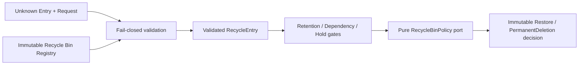

# AP-002F：Recycle Bin Foundation

狀態：**Implementation Completed — Awaiting Architecture Review**

## 目的與範圍

AP-002F 建立 framework-neutral、product-neutral 的 Recycle Bin Foundation，描述 reversible deletion、restore request 與 permanent deletion eligibility 的不可變 decision boundary。它只提供 entry、request、decision、policy port、validation、evaluator 與 canonical serialization。

本 Package 不實作實際 restore、delete、soft delete、storage deletion、database persistence、API、UI、background job、notification、queue、scheduler 或任何產品規則。

## Clean Architecture

`lib/recycle-bin/` 採固定依賴方向：

- `shared/`：branded Recycle ID、Resource Type／ID、Organization ID、Actor ID、Transition 與 reference identifiers。
- `domain/`：Entry、Request、Purge Eligibility、Policy input/output、Decision、validation 與 canonical serialization。
- `interfaces/`：Recycle Bin Policy port；只有 interface。
- `application/`：construction-only Registry 與 Evaluator orchestration。

Production source 禁止依賴 React、Next.js、Supabase、Database、Audit、Authorization、Lifecycle、Dependency、Retention、Re-authentication 或任何產品 Domain。Foundation 不讀環境、不取得時間、不產生 ID、不呼叫網路、不寫資料，也不啟動 timer。

## Recycle Bin Registry 與 Vocabulary

Recycle Bin contract version 固定為 `1`。Registry definition 由兩部分組成：

- `resourceTypes`：caller 在 composition root 註冊的受控大寫 resource type 代碼。
- `transitions`：caller 註冊的受控 transition 代碼。

`RecycleBinRegistry` 只在 construction 時驗證、排序、複製並凍結 snapshot。它沒有 runtime register、update 或 delete。Foundation 不內建 Curriculum、Lesson、Worksheet、Assessment、Student 或其他產品 resource vocabulary。

## Entry Model

`RecycleEntry` 至少包含：

- `recycleId`
- `resourceType`
- `resourceId`
- `organizationId`
- `deletedAt`
- `deletedBy`
- `lifecycleState`
- `retentionReference`
- `dependencyReference`
- `legalHoldReference`
- `restoreEligible`
- `permanentDeleteEligible`
- `metadata`
- `version`

Lifecycle state 是受控 vocabulary：`TRASHED`、`RESTORING`、`PURGE_ELIGIBLE`、`PURGED`。它是 technical state，不是產品 lifecycle state machine。

Metadata 最多 16 筆，使用 `{ key, value }` 的受控 technical code；string value 只能是大寫代碼，number 只能是有界 safe integer，亦可使用 boolean。Metadata 禁止 Email、姓名、自由文字、HTTP payload、教材內容、學生資料或任意 JSON。Entry 與 metadata array／entries 均為 runtime frozen。

## Restore Request

`RestoreRequest` 包含：

- `resourceType`
- `resourceId`
- `requestedBy`
- `version`

Restore evaluator 只確認 request 與 entry 指向同一 resource，並依 `restoreEligible` 與 Policy 產生 immutable decision。它不還原資料、不檢查名稱唯一性、不查父層、不寫 Audit。

## Purge Eligibility 與 Permanent Deletion

`PurgeEligibility` 包含：

- `eligible`
- `blockedReasons`
- `evaluation`

Permanent deletion evaluator 只使用 entry 上的 reference flags 建立 foundation-level eligibility：

- `permanentDeleteEligible` 必須為 true。
- `retentionUntil` 必須等於 `deletedAt`，代表 caller 已提供「retention clear」的 technical reference。
- `dependencyReference` 必須為 `NONE`。
- `legalHoldReference` 必須為 `NONE`。

這些不是產品 policy，也不代表實際期限、dependency graph 或 legal hold repository 已被查詢。未來產品 adapter 必須把 AP-002C／D 的 authoritative receipts 轉成這些 reference。

`PermanentDeletionDecision` 只表示 foundation policy 是否允許下一層繼續；它不執行 purge、hard delete、file deletion、storage deletion 或 background job。

## Policy Port

`RecycleBinPolicy` 是同步純函式 interface。輸入只包含已驗證且 frozen 的 Entry 與 Request；輸出只能是：

- `ALLOW`
- `DENY / RECYCLE_BIN_POLICY_DENIED`

Policy 不查 Database、不讀 Clock、不呼叫 Network、不寫 Audit、不修改 Resource，也不執行 restore、delete 或 purge。未來產品 Policy 必須在取得 authoritative Authorization、Lifecycle、Dependency、Retention、Legal Hold、Re-auth、Approval 與 Audit receipts 後，由 composition root 建立；AP-002F 不預先定義產品規則。

## Evaluator

`evaluateRestore()` 固定依序執行：

1. 驗證 Entry 與 Restore Request。
2. 驗證 resource match。
3. 驗證 `restoreEligible`。
4. 呼叫純 Recycle Bin Policy 一次。
5. 建立 immutable Restore Decision。

`evaluatePermanentDeletion()` 固定依序執行：

1. 驗證 Entry 與 Permanent Deletion Request。
2. 驗證 resource match 與 transition vocabulary。
3. 建立 retention／dependency／legal hold eligibility。
4. 呼叫純 Recycle Bin Policy 一次。
5. 建立 immutable Permanent Deletion Decision。

Policy exception 或無效 Policy output 一律回傳 `POLICY_ERROR / RECYCLE_BIN_POLICY_EVALUATION_FAILED`，不洩漏 exception、stack 或內部資訊。

## Validation

所有 runtime input 先視為 `unknown`，再以 exact-key allowlist、plain-object descriptor 與受控 code/version 驗證。以下全部 fail closed：

- Unknown Resource。
- Unknown Transition。
- Unsupported version。
- Duplicate Resource Type 或 Transition。
- Invalid Entry、Lifecycle State、Restore Request 或 Permanent Deletion Request。
- Invalid Policy output。
- Unknown field、symbol key、accessor、non-plain object。
- Credential-shaped 或 payload-shaped extra field，例如 token、cookie、header、password、HTTP body。
- 超過 1,000 個 vocabulary item 或 16 筆 metadata 的有界限制。

Validator 建立新的 frozen object graph，不保留 caller object reference，也不執行 getter。

## Canonical Serialization

`serializeRecycleBinCanonical()` 固定 object key ordering 並排除 `undefined`。相同語意的 Entry、Request、Decision、PurgeEligibility 或 Registry snapshot 永遠產生相同 JSON，不受輸入 object key 順序影響。

本 Package 不計算 hash、不保存 payload，也不與 AP-002B Audit serializer 共用 implementation。Serializer contract 變更必須提升 Recycle Bin contract version。

## Security Boundary

- 只接受 technical identifiers、受控 code、bounded number、boolean 與 ISO instant。
- 禁止 Password、Token、Cookie、Header、HTTP payload、PII、教材內容與學生資料。
- Entry reference 不是 dependency／retention／hold payload；Foundation 不查任何 repository。
- Policy input/output 均重新驗證；provider exception 一律 fail closed。
- Foundation 不授權產品操作，也不取代 AP-004 Authorization、AP-002A Lifecycle、AP-002B persisted Audit、AP-002C Dependency、AP-002D Retention／Legal Hold、AP-002E Re-authentication、server guard 或 RLS。
- `allowed: true` 不代表可以 actual restore、hard delete、permanent delete、storage purge 或 file deletion。

## Validation Coverage

- Entry、metadata、restore request、permanent deletion request 與 runtime freeze。
- Registry snapshot、sorting、copy isolation、duplicate vocabulary 與無 mutation API。
- Unknown Resource／Transition／Field／Version fail closed。
- Invalid lifecycle state、invalid request、invalid policy output 與 payload-shaped extra fields。
- Restore evaluator validation → policy → decision flow。
- Permanent deletion evaluator validation → retention／dependency／hold gates → policy → decision flow。
- Policy deny／exception fail closed。
- ALLOWED／DENIED decision immutability。
- Canonical serialization determinism。
- Clean Architecture import boundary、interface-only Policy port、無循環依賴與無 runtime side effect。

## Deferred／Known Limitations

1. 沒有 Database、Migration、RLS、RPC、Supabase adapter、Repository 或 persistence。
2. 沒有 API、UI、Server Action、middleware、Route Guard、Notification、Event Bus、Queue、Scheduler 或 background job。
3. 沒有 actual restore、soft delete、hard delete、storage deletion、file deletion、physical purge 或 trash UI。
4. 沒有產品 resource vocabulary、Curriculum／Lesson／Worksheet／Assessment policy、Dependency adapter、Retention adapter、Legal Hold adapter、Re-auth adapter 或 Audit writer integration。
5. `retentionUntil === deletedAt` 與 `reference === NONE` 只是 foundation-level technical gate，不是產品期限、dependency 或 hold truth。
6. Policy purity 是 interface contract；未來 concrete implementation 仍須通過獨立 architecture／side-effect tests。

## Future Integration Plan

1. 架構核准後以 AP-002F foundation 作為版本化 Recycle Bin decision contract baseline。
2. 由 owning Domain 建立經核准的 Resource／Transition vocabulary 與產品 Policy，不在 API 寫死刪除規則。
3. 以獨立 persistence Package 建立 recycle bin entries、restore deadlines、restore conflict checks、FORCE RLS 與最小 grant；不修改歷史 Migration。
4. Composition root 組合 AP-004 trusted Authorization、AP-002A Lifecycle、AP-002C Dependency、AP-002D Retention／Legal Hold、AP-002E Re-authentication、AP-002B persisted Audit 及必要 approval receipts。
5. 所有 write 在 transaction/outbox boundary 重驗 Resource version、Dependency snapshot、Retention policy version、Legal Hold status、fresh Re-auth receipt 與 Audit append receipt。
6. AP-004 Background Job／Event／Notification Foundation 完成前，不開不可逆 permanent deletion、production purge 或大型 anonymization。
7. BF-003、Curriculum Delete／Archive、Account Privacy／Deletion 與 Organization Closing 必須由後續獨立產品 Package 實作，不由本 Foundation 自動解鎖。

本 Package 完成只代表 Recycle Bin Domain/Application foundation 可供架構審查，不代表任何產品回收桶、還原、永久刪除、Database schema 或 lifecycle write 已上線。
