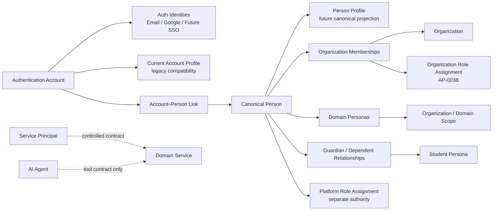

# AP-003A：Identity Domain Model

狀態：**Accepted — Architecture Approved**
範圍：Architecture／Product／Security／Privacy／Migration Design only
不代表：Identity runtime、Person／Persona table、Migration、RLS、RPC、API、UI、Invite、RBAC 或 Permission Engine 已實作

## 1. 目的與非目標

AP-003A 建立 Authentication Account、Auth Identity、Person、Profile、Organization Membership、Domain Persona、Platform Role Assignment、Service Principal、Guardian Relationship 與 Account Link 的穩定概念邊界。它必須支援多機構、多教育身份、未登入學生／家長、受控帳號連結，以及不破壞歷史的帳號刪除治理。

本 Package 不定義完整 Role／Permission catalog、Scope policy、Permission Matrix 或 RBAC runtime；上述內容由 AP-003B 負責。本文件也不改變 Sprint 1～8 的既有 authority。

## 2. 現況盤點

### 2.1 Auth 與 Profile

- Supabase Auth 是目前 Authentication Account authority，支援 Email／Password、Google OAuth、PKCE callback、recovery 與 cookie session。
- `profiles.id` 是 UUID primary key，等於 `auth.users.id`，並以 `ON DELETE CASCADE` 連接 Auth Account。
- `profiles` 現有九個欄位：`id`、`display_name`、`avatar_url`、`phone`、`locale`、`timezone`、`onboarding_completed`、`created_at`、`updated_at`。
- Profile API 從已驗證 session 取得 `user.id`，不接受 client 指定 identity。現有程式因此把 Profile key 當成 Account key 使用，但沒有把 Profile 當成 Organization 授權證據。
- Google 與 Email／Password 都由 Supabase Auth 管理；應用層沒有 Auth Identity metadata、identity linking 或 merge workflow。

### 2.2 Membership 與 Workspace Preference

- `organization_members.user_id` 連接 `auth.users.id ON DELETE CASCADE`；`id` 只是 Membership row identity。
- 角色直接存在 `organization_members.role`，目前可用 `organization_owner`、`organization_admin`、`teacher`、`reviewer`，另有未開放的保留值。
- Membership 狀態為 `active`、`invited`、`suspended`、`removed`；但 `user_id` 必填，因此尚不能表示「先邀請、尚無 Account」的人。
- `user_preferences.user_id` 連接 Auth Account；`active_organization_id` 是工作區偏好。RPC 會重新驗證 active Membership，偏好本身不授權。
- owner/admin 的寫入及 teacher/reviewer 的唯讀同時由 server data layer、RPC 與 RLS 驗證，不只依賴 UI。
- last-owner protection、active organization fallback 與 soft-deleted organization 排除已存在。

### 2.3 缺口與風險

- 尚無 canonical Person、Persona、Guardian Relationship、Account Link、Platform Role Assignment 或 Service Principal 模型。
- 學生／家長保留角色仍要求 Account，無法支援 Managed Student 或未登入 Guardian。
- 同一人在多機構的角色可由多筆 Membership 表示，但同一機構多 Persona／多角色尚無正式模型。
- 目前沒有 `profile_id`／`membership_id` 被誤當 Auth authority；主要問題是名稱 `user_id` 同時承載 Account reference 與日常「使用者」語意。
- 同 Email 不會在應用層自動合併，這是安全的預設；也尚無偵測一人多帳號或受控 merge 能力。
- `profiles` 與 `organization_members` 對 `auth.users` 的 cascade 是未來 account hard-delete blocker。AP-003A 不修改歷史 Migration；在 forward-only identity cutover 完成前，不得啟用 Auth Account 永久刪除。
- 沒有發現必須修改歷史 Migration、破壞 OAuth、降低 RLS 或更換 Profile primary key 才能完成本設計的衝突。

## 3. 核心術語與 authority

| 概念                     | 定義／Authority                                                           | 可以承載                                                                               | 不得承載                                                                                     |
| ------------------------ | ------------------------------------------------------------------------- | -------------------------------------------------------------------------------------- | -------------------------------------------------------------------------------------------- |
| Authentication Account   | 可登入的認證主體；目前由 Supabase `auth.users` 擁有                       | session、credential、recovery、MFA hook、Auth Identity                                 | Organization role、Persona、學生歷程、Platform permission                                    |
| Auth Identity            | Account 的登入方式；provider authority 優先                               | Email／Password、Google、未來 SSO/Magic Link                                           | Person 真實身份結論、Organization membership                                                 |
| Person                   | 真實世界中的人；未來 Identity Domain authority                            | canonical identity、account links、merge alias、privacy state                          | session、permission、tenant asset ownership                                                  |
| Profile                  | 個人層級顯示與體驗資料                                                    | display name、avatar、locale、timezone、accessibility、personal UI preferences         | Organization／Platform role、mastery、employment、guardian relation、entitlement、permission |
| Organization Membership  | Person／Account 與單一 Organization 的關係；Organization Domain authority | membership status、joined/invited dates、未來 branch scope、role assignment link       | Person 本體、登入方式、Platform role                                                         |
| Domain Persona           | Person 在教育流程中的身份；由對應 Domain 管理                             | Teacher、Reviewer、Student、Parent/Guardian、Organization Staff 的狀態與業務 reference | 登入 credential、直接 permission                                                             |
| Platform Role Assignment | EduCraft AI 平台治理授權；Governance／Permission authority                | 平台角色、狀態、有效期、核准與 scope                                                   | Organization Membership role、日常跨租戶內容瀏覽權                                           |
| Service Principal        | 非真人系統主體；由 Platform Security 管理                                 | purpose、owner、capability、scope、rotation、audit identity                            | 真人 refresh token、預設 Platform Admin、AI 自主治理權                                       |
| Guardian Relationship    | Guardian Persona 與 Student Persona 間已驗證的多對多關係                  | 法律／聯絡／報告／同意範圍與有效期                                                     | 共用帳號、推導全部學生資料權限                                                               |
| Account Link             | Account 與 canonical Person 的受控連結                                    | proof、status、有效期、merge reference                                                 | 單靠 Email 的自動合併、權限繼承                                                              |

`user_preferences` 歸屬 **Workspace Preference Domain**，不是 Profile authority。`active_organization_id` 只記錄使用者偏好的工作 context；每次使用仍需重新驗證 Organization 與 Membership 狀態。

## 4. 關係模型

此圖是概念契約，不表示圖中 future entity 已存在。

### 必須支援的案例

1. 一位 Person 在 A 機構有 owner Membership role 與 Teacher Persona，在 B 學校有 Teacher Persona，並以 Parent Persona 連到自己的孩子；只需一個 Account。
2. Managed Student 先有 Person 與 Student Persona，但沒有 Account；Enrollment、Learning History 與 Assessment 仍以穩定 Persona reference 保存。
3. 機構先建立 Guardian Person／Persona 與待驗證關係，之後才用安全邀請連接 Account。
4. Google 與 Email／Password 經重新驗證後可連至同一 Account，不建立第二個 Person。
5. Platform Support 人員同時可在私人 context 作為家長；Platform workspace 與 Parent workspace 使用不同 authority，不能在同一請求混用。

## 5. Account 與 Person 決策

### 5.1 方案比較

| 方案                               | 優點                                           | 主要問題                                                     | 決策     |
| ---------------------------------- | ---------------------------------------------- | ------------------------------------------------------------ | -------- |
| A. 永遠一 Account 對一 Person      | 最簡單、查詢少                                 | 不支援 managed identity、受控合併、多 Account、未來 SSO 衝突 | 不採用   |
| B. Account 與 Person 任意多對多    | 彈性最大                                       | 權限歧義、SoD 容易繞過、merge 與 UI 複雜、RLS 困難           | 不採用   |
| C. 預設一對一，受控 linking／merge | 保留正常路徑，支援 managed identity 與例外治理 | 需要 merge review、alias 與 conflict policy                  | **推薦** |

### 5.2 C 的不變量

- 一個 Account 同一時間只能有一個 active canonical Person link。
- 一個 Person 可在受控情境連接多個 Account，但所有 Account 合計仍代表同一 Person，且 SoD 以 Person 判斷。
- Person 可以沒有 Account；Account 第一次建立時預設產生一個 Person。
- 使用者不能任意指定 Person ID 或自行合併。
- Email 只可作為可驗證的登入／聯絡屬性，不能成為 Person 永久識別或自動 merge 依據。
- Merge 保留來源 Person ID 為 alias／redirect；歷史 reference 不被重寫成無法追蹤的單一 ID。
- Merge review 必須處理 Auth Identities、Membership、Persona、Ownership、Guardian Relationship、Audit actor reference、重複 email 與衝突資產。

## 6. Membership、Persona 與 Role 邊界

| 問題                            | Membership   | Persona    | Role Assignment（AP-003B） |
| ------------------------------- | ------------ | ---------- | -------------------------- |
| 這個人是否屬於此 Organization？ | 是           | 否         | 否                         |
| 這個人在教育情境中是誰？        | 只提供 scope | 是         | 否                         |
| 可以做什麼？                    | 不直接回答   | 不直接授權 | 是                         |
| 停用後是否刪除歷史？            | 否           | 否         | 否                         |

模型評估：

- A「一 Membership 一 Role」只適合作為現有相容模型，不足以表示 Owner + Teacher + Parent。
- B「一 Membership 多 Role Assignment」是 AP-003B 應採用的授權方向。
- C「Persona 直接綁 Role」會把業務身份與權限耦合，不採用。
- D「Persona 與 Role 分開」是 AP-003A 推薦邊界；AP-003B 再定義 Persona、Role、Scope 的 policy relation。

現有 `organization_members.role` 在 cutover 前仍是 authority；AP-003A 不改變任何既有 owner/admin/teacher/reviewer 行為。

## 7. Persona 模型

### 7.1 共通原則

- Persona 有穩定 ID、persona type、owning Domain、可選 Organization scope、狀態與有效期間。
- Persona 可以在沒有 Account 時存在；Person 是連結核心。
- Persona 不直接授權，必須再有有效 Membership、Role／Scope policy 與資源關係。
- Persona 停用、封存或合併不刪除 Teaching／Learning／Review 歷史。
- 同一 Person 可在同一 Organization 同時持有多個 Persona。

### 7.2 Student

Managed Student 由 Organization 建立 Person + Student Persona，不需 Account；Linked Student 只新增安全 Account Link，不建立新 Persona、不複製歷史。退班、Persona suspension 與 Account suspension 是不同操作。家長帳號不得替學生提交作答。

### 7.3 Parent／Guardian

Guardian Relationship 是多對多、可驗證、具時效與欄位級範圍的關係，至少預留 `relationship_type`、`legal_guardian_status`、`learning_report_access`、`communication_access`、`consent_authority`、`emergency_contact`、`valid_from/to`、`verification_status`。Teacher 不得自行把未驗證關係升為法律監護；同一學生可有多名 Guardian，同一 Guardian 可連多名學生。

### 7.4 Teacher／Reviewer

Teacher Persona 負責教學、班級、Lesson、Teaching History 與受指派 Student scope；Reviewer Persona 負責 Knowledge／Curriculum／Question／Content review，不必有班級或 Teacher Persona。離職時停用 Membership、封存 Teacher Persona並保留教學歷史與機構資產；Reviewer 撤銷前需轉派未完成工作，已完成決策保留 tombstone actor reference。

## 8. Platform Role 與 Service Principal 邊界

- Platform Role Assignment 永遠與 Organization Membership 分開，需具狀態、有效期、指派者、核准者、理由、scope、re-auth requirement 與 Audit contract。
- Platform Support 不自動成為任何 Organization member；跨租戶 access 依 AP-002 的 CASE-scoped contract，完整 Role／Policy 由 AP-003B 定義。
- Platform 與 Organization workspace 必須使用不同 authority context；未來 elevated access 需明確 banner、case、組織、剩餘時間與 exit 操作。
- Service Principal 代表 integration、worker 或 internal service；不得使用真人 Account 或 refresh token，不自動取得 Platform Admin，必須有 owner、purpose、capability、scope、rotation、expiration 與 audit identity。
- AI Agent 不是 Service Principal，也不是管理角色；它只能透過受控 Tool／Domain Service contract 執行已授權的有限操作。

## 9. Identity lifecycle

| 主體／狀態                                                      | Authority 與允許轉換                       | 可逆性與登入／授權影響                                        | 歷史、Audit 與 assurance                                              |
| --------------------------------------------------------------- | ------------------------------------------ | ------------------------------------------------------------- | --------------------------------------------------------------------- |
| Account：INVITED → ACTIVE                                       | Identity；完成驗證後啟用                   | 可撤回邀請；ACTIVE 才可建立正常 session                       | 啟用、撤回要 Audit；視風險要求驗證                                    |
| Account：ACTIVE ↔ SUSPENDED                                     | Platform Identity／受控 Governance         | suspend 可逆；立即停止新 session 並撤銷有效 access            | 保留 Person／資產／歷史；需理由與 Audit，高風險需 re-auth             |
| Account：ACTIVE → PENDING_DELETION → ANONYMIZED／DELETED        | Person request + Platform privacy workflow | 等待期可取消；匿名化／刪除可能不可逆                          | retention／hold／owner dependency；最終操作需雙人核准、re-auth、Audit |
| Person：ACTIVE → MERGED                                         | Identity merge review                      | merge 不逆向拆分，alias 可解析至 canonical Person             | 不重寫歷史 ID；雙人核准、re-auth、完整 Audit                          |
| Person：ACTIVE → ANONYMIZED                                     | Privacy workflow                           | PII redaction 不可逆，opaque reference 保留                   | 受 retention／hold 控制；Audit 只留最小資訊                           |
| Person：DECEASED／UNAVAILABLE                                   | **不列為初始 canonical state**             | 法律與地區語意未明；未來以受限 eligibility/status reason 擴充 | 需 Privacy／legal policy 批准後再引入                                 |
| Profile：ACTIVE ↔ ARCHIVED；→ REDACTED                          | Person + Privacy policy                    | archive 可逆；redaction 通常不可逆                            | 不影響 Membership authority；變更要最小 Audit                         |
| Membership：INVITED → ACTIVE ↔ SUSPENDED → ARCHIVED／REMOVED    | Organization；受 last-owner protection     | suspend/archive 可恢復；removed 不刪 Account／Person          | Role access 立即失效；owner 操作與離開需 Audit／re-auth               |
| Persona：PROVISIONAL → ACTIVE ↔ SUSPENDED → ARCHIVED；→ MERGED  | Persona owning Domain                      | 不影響 Account 登入；停止對應 workspace／scope                | 歷史保留；merge 需 conflict review、Audit                             |
| Auth Identity：ACTIVE → UNLINKED／REVOKED／COMPROMISED          | Identity provider + Platform Identity      | unlink/revoke 可重新連結；compromised 立即阻擋                | 不刪 Person；高風險 unlink/link 需 re-auth、Audit                     |
| Platform Role：PROPOSED → ACTIVE ↔ SUSPENDED → REVOKED／EXPIRED | Platform Governance                        | 只影響 Platform authority；不能影響私人 Persona               | 雙人核准、fresh re-auth、完整 Audit；AP-003B 詳定                     |

### 9.1 Transition rules

- Account `INVITED → ACTIVE` 由本人完成驗證；`ACTIVE ↔ SUSPENDED` 由 Platform Identity 或安全事件流程執行，恢復前需重新評估 session／credential；`PENDING_DELETION → ACTIVE` 只在 grace period可取消；`ANONYMIZED／DELETED` 不可恢復為原 Person。
- Person只有 Identity/Privacy authority可建立 merge或 anonymization request；Person本人可提出資料請求，但不能自行選 canonical target。MERGED與ANONYMIZED是終止狀態，不授予登入或權限。
- Profile由本人編輯；Platform只能在合法 Privacy/安全目的下 archive/redact，redact前需 policy與 Audit。Profile狀態不改變 Account登入或 Membership。
- Membership由 Organization authority轉換；本人可離開但受 last-owner阻擋。`SUSPENDED/ARCHIVED → ACTIVE`需重新驗證 Organization、Account與Persona狀態；REMOVED不自動恢復，需新受控關係。
- Persona由 owning Domain轉換；Person可提出更正，不能自行把 PROVISIONAL升為已驗證 Persona。MERGED不可逆，來源 reference保留。
- Auth Identity由本人與 provider/Platform Identity共同控制；unlink最後一個可登入方法需替代 recovery proof；COMPROMISED立即撤銷 session，恢復只能建立新 verified state。
- Platform Role由 Platform Governance發起與核准；ACTIVE與restore需雙人核准及fresh re-auth，SUSPENDED可逆，REVOKED／EXPIRED不原地重啟而建立新 assignment。其授權細節由AP-003B決定。

所有 lifecycle transition都保留 before/after、actor／approver reference、reason code、policy version與 correlation reference。對登入或 authority有影響的 transition必須撤銷/刷新 projection；在 AP-002B前不得開放新的 mutation。

## 10. 刪除、匿名化與 tombstone

Account deletion 不等於 Person deletion；Person anonymization 不等於刪除業務紀錄。禁止因 Account delete cascade 刪除 Curriculum、Teaching／Learning History、Assessment、Review Decision、Audit Event 或 Organization-owned content。

### 10.1 可匿名化／移除

- Profile display name 可換成中性標籤；avatar object、phone、非必要 locale／preference 可依政策移除。
- Auth provider credential、recovery metadata 與 active session 由 Auth authority 撤銷。
- 未再需要的聯絡 email、provider display metadata 可依合法請求與 retention redaction。

### 10.2 必須保留的最小資料

- 不可反推 PII 的 tombstone Person reference、merge alias／redirect 與 lifecycle result。
- Organization asset ownership、Teaching／Learning／Assessment／Review 歷史的 actor reference。
- 法律、付款、安全與 append-only Audit 所需最小紀錄，以及所用 policy version。

### 10.3 由政策決定

Retention duration、legal hold、未成年資料、security logs、billing records、Auth identity metadata 與 irreversible deletion eligibility 均由 AP-002 Retention／Privacy contract 決定；AP-003A 不宣稱法定期限。

### 10.4 Account hard delete safety policy

目前 Account hard delete 必須保持關閉。這是正式安全政策，不是 Bug，也不能以手動刪除 `auth.users`、Service Role、cascade 或直接 SQL 繞過。至少完成下列八項門檻後，才能重新進行可行性審查：

1. Person／Account linking foundation 已成為可驗證的 canonical identity path。
2. 完成 Auth Account、Profile、Membership、Preference、Storage、Persona 與未來 Domain 的 FK dependency inventory。
3. 建立不洩漏 PII、可保留歷史 actor reference 的 tombstone actor strategy。
4. AP-002B Immutable Audit Foundation 已能記錄申請、決策、執行與失敗。
5. Retention／Legal Hold 能阻擋不合格刪除並保存 policy version。
6. Ownership reassignment 能處理 last owner、Organization asset與未完成工作。
7. Identity anonymization workflow 能分離可移除 PII、保留資料與不可逆操作。
8. AP-004 Background deletion job architecture 能執行 inventory、checkpoint、重試、取消邊界與不可逆清理。

即使八項門檻完成，permanent deletion仍需 dependency re-check、合法核准、fresh assurance與 forward-only Migration；Account deletion不得 cascade刪除 Organization-owned content、Teaching／Learning History、Assessment、Review Decision或Audit。

## 11. Data ownership

| 資料                                  | Authority／控制權                              | 邊界                                                        |
| ------------------------------------- | ---------------------------------------------- | ----------------------------------------------------------- |
| Authentication Account／Auth Identity | Platform Identity + Auth provider              | Person 可管理自身登入方式；Organization 不得管理 credential |
| Person／Profile                       | Identity authority；Person 控制個人資料        | Platform 依政策處理；Organization 只看業務所需 projection   |
| Membership                            | Organization Domain                            | Person 可查看／依規則離開；last owner 不可直接離開          |
| Teacher／Reviewer Persona             | 對應 Organization／Domain                      | Person 可查看、更正個資；歷史與機構資產保留                 |
| Student Persona                       | Learning／Organization relationship authority  | 個資與學習權利依 Privacy policy；不得跨機構推導             |
| Guardian Relationship                 | Organization 驗證，Guardian 管理同意／通知偏好 | Teacher 不得任意建立已驗證法律關係                          |
| Platform Role Assignment              | Platform Governance                            | Organization 不可查看完整平台權限細節                       |

## 12. API／Service contract（design only）

所有 contract 都先驗證 session，從 `auth.uid()` 解析 Account，再由 server 解析 Person、Membership與 Persona；client傳入的 identity／Organization ID只作目標，不是 authority。對外 response使用安全 projection，不回傳 provider subject、link proof、其他 Organization graph或 internal merge detail。

| Contract                                | 建議 request／response                                                                                            | 安全與公開性                                                                                                   |
| --------------------------------------- | ----------------------------------------------------------------------------------------------------------------- | -------------------------------------------------------------------------------------------------------------- |
| `GET /api/identity/me`                  | 回傳目前 Account的最小 Profile、canonical Person reference狀態、login method summary與 active workspace reference | 可公開給已登入本人；不回完整 provider metadata或跨租戶 Person graph                                            |
| `GET /api/identity/personas`            | 回傳目前 Account可用且經 Membership/relationship驗證的 Persona workspace projection                               | 可公開給本人；預設依 active Organization，不能成為全域 Person directory                                        |
| `POST /api/identity/link-account`       | 接受 opaque challenge／provider flow reference；回傳 pending／linked／review-required                             | 不接受任意 target Account/Person ID；必須 re-auth雙方與 idempotency                                            |
| `POST /api/identity/merge-review`       | 建立 conflict review request與安全 impact summary reference                                                       | **不作一般公開 generic merge endpoint**；使用者只能送出 review，Platform workflow才可決定 merge                |
| `GET /api/guardians/relationships`      | 回傳本人已驗證／pending relationship的最小學生與 scope projection                                                 | 不能查任意 Person/Student ID；遮罩其他 Guardian與未成年 PII                                                    |
| `POST /api/students/[id]/claim-account` | attachment要求評估的概念入口                                                                                      | **不建議直接公開**；路徑 ID有枚舉風險，建議改為 `POST /api/student-account-claims` + 一次性 opaque claim token |

Service sequence：Auth → Account lifecycle → identity projection → relationship／Organization scope → AP-003B policy（future）→ Domain invariant → RLS → AP-002B Audit obligation。Link／merge／claim必須有 idempotency key、correlation reference與原子／可恢復結果；未知結果不能自動重試成多筆 link。

安全錯誤 allowlist：`IDENTITY_NOT_FOUND`、`ACCOUNT_NOT_LINKED`、`PERSON_CONFLICT`、`LINK_REQUIRES_REAUTH`、`LINK_ALREADY_EXISTS`、`LINK_CONFLICT`、`PERSONA_INACTIVE`、`MEMBERSHIP_INACTIVE`、`GUARDIAN_RELATIONSHIP_UNVERIFIED`、`STUDENT_ALREADY_LINKED`、`MERGE_REQUIRES_PLATFORM_REVIEW`。未驗證或跨租戶 caller應使用一致的 not-available response，避免揭露 Account／Person／Student／relationship是否存在。

## 13. AP-003B handoff

### 可直接依賴的 Identity contracts

- `auth.uid()` 只識別 Account，不等於 Person、Membership、Persona 或 Role。
- Person 是 canonical 人員 identity；Account、Membership、Persona 都以受控 link 連接。
- Persona 不授權；Membership 不代表完整身份；Role／Permission 是獨立層。
- Platform Role Assignment 與 Organization Role Assignment 完全分離。
- active organization 是 workspace preference，不是 authority。
- Managed Student／Guardian 可以沒有 Account；scope policy 不能假設所有 Persona 都有 `auth.users`。
- SoD 必須以 canonical Person linkage 判斷，不能只看 Account ID。

### AP-003B 必須決定

- Role Model。
- Permission Naming Convention。
- Permission Catalog。
- Role Permission Sets。
- Scope Model。
- Policy Decision Contract。
- Permission Evaluation Pipeline。
- Organization Roles。
- Platform Roles。
- Persona 與 Role 關係。
- Re-authentication。
- Case-scoped Platform Access。
- Separation of Duties。
- Permission Matrix。
- Legacy `organization_members.role` 過渡策略。
- Migration Design。

AP-003B 必須遵守 AP-003A 已核准的 Account／Person／Profile／Membership／Persona邊界，不得重新合併這些 authority，也不得把 Person、Profile或 Persona直接當作 Permission。

### Curriculum Lifecycle／Deletion handoff（backlog only）

目前教材詳細頁沒有 Curriculum delete button、delete dialog、`deleteCurriculum()`、DELETE route、Curriculum DELETE grant／policy、Dependency Protection、Recycle Bin、Restore 或 permanent deletion workflow。結論是 **Delete Feature Not Implemented**，不是權限判斷把既有按鈕隱藏。現有 `archived` 只表示可由既有更新流程設定的封存狀態，不等於完整 Lifecycle、Trash、Restore 或 Delete 功能。

此能力不屬於 AP-003A，後續由下列 Package 分階段共同完成：

1. AP-003 family（由 AP-003B 承接 Role／Permission／Policy）：定義誰可以 archive、restore、trash、request delete，以及 Scope 與 re-auth。
2. AP-002B Immutable Audit Foundation：記錄教材封存、還原、移入回收桶、刪除申請及失敗結果。
3. AP-002A Lifecycle Schema Foundation：建立 canonical lifecycle fields、狀態與 transition contract。
4. AP-002C Dependency Protection：檢查 Curriculum Version、Chapter、Lesson 與未來 Teaching／Learning／Assessment 等下游資料。
5. AP-002F Recycle Bin：實作 Trash、Restore、restore deadline、parent/uniqueness revalidation 與 permanent deletion eligibility。
6. AP-004 Background Job Foundation：處理大型 inventory、非同步清理及未來不可逆 permanent deletion 工作。

在 AP-002B Audit 與 AP-002C Dependency Protection 完成前，不得開放 Curriculum permanent deletion；AP-004 完成前，不得執行大型或不可逆刪除工作。本 handoff 只記錄責任，不授權新增按鈕、API、service、RLS、grant、Migration、Recycle Bin、Audit writer或 hard delete，也不修改現有 Chapter／Lesson delete RPC。

### Blocking decisions／constraints

- Account hard delete 依本文件正式安全政策保持關閉，直到八項門檻與 legacy cascade FK 的 forward-only hardening全部完成。
- Account Linking、Person Merge、Student claim、Guardian verification 與 Platform role mutation 都不能在 AP-002B Audit writer 前開放。
- Platform high-risk mutation、不可逆匿名化與 permanent deletion 仍受 AP-004 background job／event／notification foundation 阻擋。
- 不修改 Sprint 1～8 Migration、Profile primary key 或 OAuth/session flow。

## 14. 本 Package 的完成邊界

AP-003A 已取得人工架構核准，但只交付架構與設計文件。沒有新增或修改程式、UI、測試、Migration、Database、RLS、RPC、API、OAuth 設定或 Production 環境。Person／Account Link／Persona／Guardian Relationship table、Account Linking／Merge、Student Claim、Parent Link UI 與完整 RBAC仍未實作；AP-003B、Curriculum Delete／Recycle Bin／Audit及 Sprint 9也尚未開始，必須由後續獨立指令啟動。
