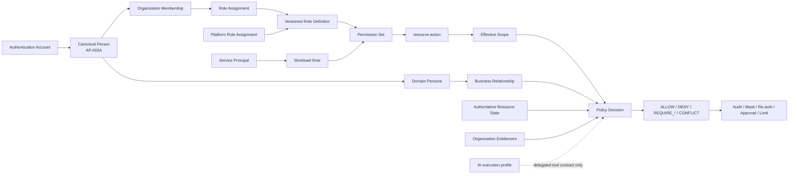
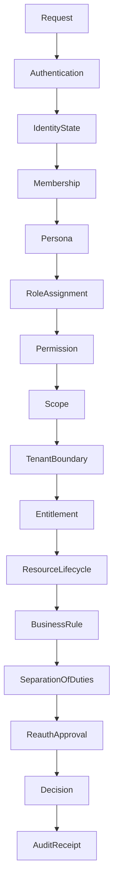

# AP-003B：Authorization Framework

狀態：**Proposed — Awaiting Architecture Approval**
範圍：Role Model、Permission Catalog、Resource Scope、Policy Decision、Security／Data／API Design only
不代表：Role／Permission table、Migration、RLS、API、UI、Middleware、JWT claim、Session 或 Policy Engine 已實作

## 1. 目的與非目標

AP-003B 在 AP-003A 的 Account、Person、Profile、Membership 與 Persona 邊界之上，建立 EduCraft AI 的正式 Authorization Model。它回答「哪個 Actor、在什麼 Scope、針對哪個 Resource、能執行什麼 Action，以及還需履行哪些義務」，但不改變現有 Sprint 1～8 runtime。

本 Package 只交付架構契約。它不建立 Production Code、Migration、Database Schema、RLS、RPC、API、UI、Server Action、Permission Middleware、JWT claim、Session、OAuth 或 AP-004 infrastructure。

## 2. 現況與相容邊界

- 目前 Organization role authority 仍是 `organization_members.role`：`organization_owner`、`organization_admin`、`teacher`、`reviewer`。
- Sprint 6～8 的 owner/admin 寫入、teacher/reviewer 唯讀同時由 server data layer、RPC 與 RLS 驗證；AP-003B 不降低或替換它們。
- 現有 `auth.uid()` 只識別 Authentication Account。它不等於 Person、Membership、Persona、Role 或 Permission。
- `user_preferences.active_organization_id` 只選擇 workspace context，不授權。
- Platform role、School、Campus、Class、Student、Parent、AI job 與 Service Principal runtime 尚未建立。
- AP-003B 只設計 additive cutover；不得修改 Sprint 1～8 Migration、既有 role constraint、last-owner protection 或 active organization fallback。

## 3. Authorization 關係模型



核心不等式：

- Identity ≠ Permission。
- Role ≠ Membership。
- Persona ≠ Role。
- Permission ≠ Business Rule。
- Scope ≠ active organization preference。
- Entitlement ≠ Permission。
- AI profile ≠ Account、Role Assignment 或 Service Principal。

## 4. Actor 與 Role 分類

Role 是版本化 Permission 集合，不是職稱或業務身份的全部。只有有效 Actor、有效 Assignment、有效 Scope 與通過 Policy Decision 時，Role 才產生權限。

### 4.1 Platform roles

| Role               | Purpose                                                                  | Scope                                         | Limit                                                    | Delegation                                    | Assignment rule                                                              |
| ------------------ | ------------------------------------------------------------------------ | --------------------------------------------- | -------------------------------------------------------- | --------------------------------------------- | ---------------------------------------------------------------------------- |
| Platform Owner     | 最高平台治理；產品顯示名稱對應 AP-002 的 `PLATFORM_SUPER_ADMIN` 相容角色 | PLATFORM                                      | 不作日常客服或跨租戶內容瀏覽；不可單人繞過 SoD           | 只可委派明確 Platform assignment              | 雙人核准、Level 4 re-auth、具期限／理由／Audit；不得自派                     |
| Platform Admin     | 平台營運、機構狀態與受控支援協調                                         | PLATFORM，必要時 CASE                         | 無永久全租戶內容存取；不可永久刪除或自派最高角色         | 可提出低風險 assignment，不能最終核准自身請求 | Platform Owner／核准流程指派；高風險需 second approver                       |
| Platform Support   | 處理具體客服與安全案件                                                   | CASE                                          | 只能看核准的 Organization／Resource／欄位，預設遮罩 PII  | 不可再委派                                    | 由案件核准建立短效 grant；到期自動失效                                       |
| Compliance Auditor | 唯讀查核 Audit、Retention 與合規證據                                     | PLATFORM 或明確 Organization audit projection | 不可變更業務資料、Role、Hold 或 Lifecycle                | 不可委派 mutation                             | 合規主管核准；export 另需 re-auth、理由與 Audit                              |
| Service Principal  | Platform actor class，不是人類管理角色                                   | 明確 capability scope                         | 不得登入 UI、持有人類 refresh token或自帶 Platform Admin | 只能透過受控 credential／job capability       | 由 Platform Security 建立 owner、purpose、expiry、rotation 與 audit identity |

### 4.2 Organization roles

| Role                 | Purpose                                  | Scope        | Limit                                                               | Delegation                                      | Assignment rule                                             |
| -------------------- | ---------------------------------------- | ------------ | ------------------------------------------------------------------- | ----------------------------------------------- | ----------------------------------------------------------- |
| Organization Owner   | 機構最高租戶責任、ownership 與高風險申請 | ORGANIZATION | 不可操作其他機構、直接 permanent delete或跳過 last-owner protection | 可授予非 owner roles；owner transfer 走原子流程 | 建立機構或 ownership transfer；Level 3 re-auth與 Audit      |
| Organization Admin   | 管理機構設定、成員及一般內容流程         | ORGANIZATION | 不可移除最後 owner、取得 Platform 權限或核准自身高風險請求          | 可依政策管理一般角色                            | Owner 或具 `role.assign` 者指派；不得自我升權               |
| School Principal     | 學校層教育與行政負責人                   | SCHOOL       | School resource 尚未實作，不得 fallback 成 Organization-wide 權限   | 可委派 School Administrator／Academic scope     | School scope 建立後，由 Organization Owner/Admin 受控指派   |
| School Administrator | 學校層行政、成員與課務協作               | SCHOOL       | 不具 Platform、Organization ownership 或學術核准的隱含權限          | 僅能委派 policy allowlist                       | Principal 或 Organization authority 指派，Scope 必填        |
| Campus Administrator | 管理單一分校營運與成員                   | CAMPUS       | Campus 尚未實作，不可跨 Campus 或升為 Organization Admin            | 只能在 Campus scope 內委派                      | Organization Owner/Admin 指派；Campus relationship 必須存在 |

### 4.3 Academic roles

| Role                | Purpose                          | Scope                                   | Limit                                          | Delegation                                 | Assignment rule                                                      |
| ------------------- | -------------------------------- | --------------------------------------- | ---------------------------------------------- | ------------------------------------------ | -------------------------------------------------------------------- |
| Curriculum Director | 統籌機構／學校課程架構與發布政策 | ORGANIZATION、SCHOOL 或 CAMPUS          | 不自動管理成員、帳務或 Platform 設定           | 可委派 Academic Supervisor／Reviewer       | Organization authority 指派；Scope 與 subject/grade constraints 可選 |
| Academic Supervisor | 管理指定學段、科目或課程品質     | GRADE、COURSE、CURRICULUM 或 ASSIGNED   | 不自動取得全機構內容與角色管理                 | 可分派 review／teaching tasks，不授予角色  | Curriculum Director／Admin 依 policy 指派                            |
| Teacher             | 備課、教學、作業與受指派學生工作 | CLASS、COURSE、CURRICULUM、ASSIGNED     | 不可看所有學生、管理角色或核准自己的高風險內容 | 可分派 Teaching Assistant 的工作，不可授權 | 有效 Membership + Teacher Persona + Assignment                       |
| Teaching Assistant  | 協助指定課程、班級與教材工作     | CLASS、COURSE、ASSIGNED                 | 不可發布、最終評分、變更角色或擴張學生範圍     | 不可再委派                                 | Teacher／Academic authority 分派；具期限和 supervisor                |
| Reviewer            | 依指派執行內容與品質審閱         | ASSIGNED、RESOURCE                      | 預設唯讀；不可審核自己建立且受 SoD 約束的內容  | 不可授權，只可轉回工作池                   | 有效 Reviewer Persona + review assignment                            |
| Content Editor      | 編輯指定教材、題目與說明         | CURRICULUM、LESSON、WORKSHEET、ASSIGNED | 不自動發布、核准、管理學生或查看學習資料       | 不可授予 Role，可轉派內容 task             | Academic authority 指派；Resource scope 必填                         |

### 4.4 Student and family roles

| Role     | Purpose                                      | Scope                 | Limit                                                        | Delegation                      | Assignment rule                                                 |
| -------- | -------------------------------------------- | --------------------- | ------------------------------------------------------------ | ------------------------------- | --------------------------------------------------------------- |
| Student  | 存取自己的課程、作業、作答與學習資料         | SELF、CLASS、ASSIGNED | 只能本人／Enrollment 授權資料；不可代替其他學生或管理內容    | 不可委派                        | 有效 Student Persona + Enrollment；Managed Student 可無 Account |
| Parent   | 查看已驗證 dependent 的允許報告與溝通資訊    | CHILD／DEPENDENT      | 不可僅憑 Student ID、不能代學生提交或看未授權敏感資料        | 不可轉授第三人                  | Parent Persona + verified relationship + consent scope          |
| Guardian | 執行已驗證法律／照護關係允許的同意與聯絡工作 | CHILD／DEPENDENT      | 權限只來自 relationship 欄位；不表示 Organization membership | 不可自行擴大 relationship scope | Guardian Persona + verified relationship + validity period      |

### 4.5 AI execution profiles

AI 名稱不是可指派給 Person 的 Role，也不是 Service Principal。它們是 Policy Engine 可辨識的受控 execution profile，永遠繼承 initiating Actor／job 的較小權限，且不能核准、發布或擴大 Scope。

| Profile      | Purpose                  | Scope                                    | Limit                                                      | Delegation | Activation rule                                           |
| ------------ | ------------------------ | ---------------------------------------- | ---------------------------------------------------------- | ---------- | --------------------------------------------------------- |
| AI Assistant | 草擬建議、摘要與教學輔助 | initiating request 的 RESOURCE／ASSIGNED | read-minimized；不得直接寫 canonical data                  | 不可委派   | 有效 human/service request + tool allowlist + `ai.assist` |
| AI Reviewer  | 提供非最終品質／風險建議 | 指定 review resource                     | 不得成為最終 reviewer、approve或publish                    | 不可委派   | Reviewer workflow 建立受控 job；輸出需人審                |
| AI Generator | 產生結構化草稿           | 指定 generation job                      | 只能寫入受控 draft boundary；不得發布、匯出或改 Permission | 不可委派   | `ai.generate` + entitlement + schema／quality policy      |

### 4.6 System workload roles

| Role                | Purpose                      | Scope                                 | Limit                                                    | Delegation                       | Assignment rule                                             |
| ------------------- | ---------------------------- | ------------------------------------- | -------------------------------------------------------- | -------------------------------- | ----------------------------------------------------------- |
| Background Worker   | 執行已核准的非同步工作       | JOB／RESOURCE capability              | 不可接受任意 user/role/org authority；每 checkpoint 重驗 | 不可再委派                       | Service Principal + signed job capability + expiry          |
| Scheduler           | 依 policy 觸發到期／週期工作 | PLATFORM 或明確 Organization schedule | 不能自行決定業務結果或永久刪除                           | 只建立受控 job，不授權其他 Actor | Platform Security 管理；schedule allowlist與Audit           |
| Integration Service | 與核准外部系統交換最小資料   | INTEGRATION／RESOURCE                 | 不得全域 RLS bypass；憑證、欄位、方向與租戶均受限        | 不可轉授外部第三方               | Service Principal + integration contract + rotation／expiry |

## 5. Role assignment model

Role Assignment 至少需要 actor reference、role key、role definition version、scope type/id、status、valid from/to、assigned by、approved by、reason、delegation source與 permission set version。狀態為 `PROPOSED → ACTIVE ↔ SUSPENDED → REVOKED／EXPIRED`。

不變量：

1. Default deny；不存在 Assignment 不產生 Permission。
2. 同一 Person 的多 Account、Membership 或 Persona 不得繞過 SoD。
3. Persona 可作必要條件，但不直接授權。
4. Membership removed/suspended、Account suspended、Persona inactive 或 Scope parent inactive 時，Assignment 立即不生效。
5. Owner assignment／transfer 保留 last-owner protection並使用原子流程。
6. Platform assignment與 Organization assignment永遠分表／分 authority／分 workspace。
7. Temporary assignment必須有 `expires_at`；撤銷不得覆寫歷史。
8. 未實作的 SCHOOL／CAMPUS／CLASS scope 不得向上 fallback。

## 6. Permission model

Permission key 固定為 `resource.action`，全部小寫 snake_case resource與受控小寫 action。例如 `curriculum.read`、`organization.manage`、`worksheet.generate`。禁止 `isAdmin`、`isOwner`、`canEdit` 或其他 Boolean permission。

- Permission 是原子能力；Role 是 Permission set。
- Permission 不包含 Organization ID、Resource ID或商業方案；這些由 Scope／Entitlement決定。
- Action vocabulary、命名、deprecated策略與 224-key catalog 見 `docs/security/permission-catalog.md`。
- Breaking semantic change建立新 key，不重用舊 key；舊 key標記 deprecated、停止新 Assignment、保留讀取期並記錄 replacement。
- `delete` 只表示 Domain 已定義的受控刪除能力，不代表 hard delete；permanent delete使用獨立高風險 key與治理流程。

## 7. Resource scope model

Scope 使用 typed relation，而不是單一 `organization_id`。向下繼承只在 catalog 明確允許且 resource lineage可驗證時成立；不可從子層反向推導父層管理權。

| Resource     | Authority owner               | Visibility                                                       | Inheritance                                 | Isolation                          |
| ------------ | ----------------------------- | ---------------------------------------------------------------- | ------------------------------------------- | ---------------------------------- |
| Platform     | Platform Governance           | 受控 platform projection                                         | 不向租戶內容自動繼承                        | 與 Organization workspace 分離     |
| Organization | Organization Domain           | active member／受控 platform CASE                                | 可向明列的 Campus/School/Resource 繼承      | `organization_id` 強隔離           |
| Campus       | Organization Domain           | Campus assignment/member                                         | Organization grant僅在 permission允許時向下 | Campus不存在時 fail closed         |
| School       | Organization／Academic Domain | School assignment/member                                         | 可向 Grade/Class/Course明列繼承             | School不存在時 fail closed         |
| Grade        | Academic Domain               | Academic assignment                                              | 可限制 Class/Course/Curriculum              | 必須同 tenant與 lineage            |
| Class        | Teaching/Learning Domain      | assigned teacher、enrolled student、verified guardian projection | 不自動取得其他 Class                        | Enrollment／assignment雙重限制     |
| Course       | Teaching/Curriculum Domain    | assigned academic actors／learners                               | 可向指定 Lesson/Assessment                  | 不以名稱或 grade猜測關係           |
| Curriculum   | Curriculum Domain             | tenant member + role/resource grant                              | 可向自身 Version/Chapter/Lesson             | 不能跨 Curriculum 或 tenant        |
| Chapter      | Curriculum Domain             | 沿 Curriculum projection                                         | 僅向自身 Lesson                             | parent version／tenant驗證         |
| Lesson       | Curriculum Domain             | 沿 hierarchy或 explicit assignment                               | 無隱含 sibling access                       | hierarchy與version驗證             |
| Worksheet    | Assessment Domain             | creator、assigned editor/reviewer、recipient projection          | 只向自身 version/item                       | draft/released與tenant隔離         |
| Assessment   | Assessment Domain             | publisher、grader、assigned learner                              | 只向自身 attempt／response                  | version、assignment與learner隔離   |
| Student      | Learning/Identity Domain      | SELF、assigned class staff、verified dependent relationship      | 不向其他學生繼承                            | 不接受任意 student_id 作 authority |
| Guardian     | Identity/Learning Domain      | SELF或受控 Organization relationship projection                  | 只沿 verified relationship                  | 不暴露其他 guardian graph          |
| Report       | Analytics／owning Domain      | owner、assigned viewer、SELF／CHILD projection                   | 不等於底層原始資料存取                      | field masking與cohort threshold    |
| Audit Log    | Governance/Audit              | Organization auditor或Platform auditor projection                | 不沿一般 admin role自動繼承                 | append-only、scope與PII mask       |
| Notification | Communication Domain          | sender purpose、recipient self、support case                     | 不推導 underlying business data             | recipient/consent/channel隔離      |

正式 Scope types：`PLATFORM`、`ORGANIZATION`、`CAMPUS`、`SCHOOL`、`GRADE`、`CLASS`、`COURSE`、`RESOURCE`、`SELF`、`CHILD_DEPENDENT`、`ASSIGNED`、`CASE`、`JOB`、`INTEGRATION`。

## 8. Policy Decision contract

### 8.1 Canonical request

Policy input由 server組裝，不接受 client自稱 role、permission、membership、organization ownership：

```text
actor: account/person/service-principal reference
identityState: account/person lifecycle and assurance
memberships/personas/roleAssignments: server-resolved active projections
action: one catalog permission key
resource: type/id/organization/lineage/lifecycle/owner projection
requestedScope: typed scope and relation evidence
session: freshness/MFA/reauth receipt
entitlement: plan feature availability only
caseAccess: case/grant/expiry/masking when applicable
businessContext: assignment, enrollment, guardian relationship, SoD, hold
requestMetadata: correlation/request id, channel, purpose; no raw secret
```

### 8.2 Canonical response

```text
decision: ALLOW | DENY | CONFLICT | REQUIRE_REAUTH | REQUIRE_APPROVAL
reasonCode: stable allowlisted code
matchedPolicyVersions: identifiers only
effectiveScope: reduced scope, never broader than requested/assigned
conditions: time/resource/field constraints
obligations: audit, reason, mask, field-limit, read-only, second-approver, export-limit
expiresAt: decision/capability expiry when relevant
dataMasking: allowlisted projection profile
auditRequirement: none | sampled | required | high-risk
```

### 8.3 Evaluation flow



順序固定為 Authentication → Account lifecycle → session freshness → Platform/Organization context → Membership → Persona condition → Role Assignment → Permission → Scope relationship → tenant/ownership → Entitlement → resource lifecycle／retention／hold → Business Rule → SoD → re-auth／approval → final decision → Audit obligation。

### 8.4 Allow, Deny, Conflict and Fallback

- **ALLOW**：存在明確 active grant，Scope、tenant、business rule、entitlement與lifecycle全部通過；附帶 obligations後才可執行。
- **DENY**：任一 explicit deny、inactive identity/membership、tenant mismatch、缺少permission、非法scope、hold或resource state失敗。Deny優先於allow。
- **CONFLICT**：多個policy／assignment或SoD產生不可安全自動解決的矛盾；預設不執行，只有catalog明定時轉為`REQUIRE_APPROVAL`。
- **FALLBACK**：沒有匹配policy、資料缺失、未知role/key/scope/version、legacy mapping不完整時一律DENY。Legacy fallback只允許已明確列出的等價permission，不可用名稱猜測。
- **REQUIRE_REAUTH**／**REQUIRE_APPROVAL**不是允許；完成後必須建立新decision，不可沿用舊ALLOW。

## 9. Authorization principles

1. Least Privilege：只授予完成工作所需最小Permission、Scope、欄位與時間。
2. Default Deny：未知、缺失、過期與不一致全部拒絕。
3. Explicit Grant：Role／Assignment／Scope均需可追蹤來源。
4. No Implicit Owner：creator、created_by、Profile或active organization不自動成為owner grant。
5. Scope Isolation：每個decision驗證resource lineage，不能只比對URL ID。
6. Organization Isolation：tenant mismatch直接DENY；Platform CASE也需明確grant。
7. Auditability：高風險allow、deny、conflict與access必須產生allowlisted Audit obligation。
8. Revocation：Account、Membership、Persona、Assignment或CASE撤銷後新request立即失效；長工作checkpoint重驗。
9. Temporary Permission：臨時grant必須有expiresAt、purpose與不可再委派預設。
10. Delegation：delegate不能授予自己沒有的Permission或更大的Scope／期限。
11. Emergency Access：break-glass獨立於一般Role，需Level 4 re-auth、理由、最小scope、時限與事後審查。
12. AI Authorization：AI只能使用delegated tool contract，永遠不能提升initiating actor權限、核准或發布。

## 10. Responsibility layers

| Layer                   | Responsibility                                                  | Not authority for                   |
| ----------------------- | --------------------------------------------------------------- | ----------------------------------- |
| UI                      | 顯示可用操作、原因與access denied狀態                           | 不作安全邊界                        |
| API／Server Action      | Auth、schema validation、組裝policy request、執行obligations    | 不信任client role/org/scope         |
| Policy Decision Service | Role／Permission／Scope／condition的canonical decision          | 不修改Domain資料或取代Business Rule |
| Domain Service          | 重新驗證ownership、lifecycle、dependency與transaction invariant | 不繞過Policy或RLS                   |
| Database／RLS           | 最終row/tenant boundary與最小grant                              | 不承載所有跨Domain業務政策          |
| Audit（AP-002B）        | 保存高風險request／decision／result                             | 不授權或執行業務操作                |

## 11. Database and migration design（design only）

推薦混合版本化模型：Permission Catalog由版本化artifact定義並可materialize到DB供FK／Audit；Role definition與permission set版本化；Role Assignment、Scope binding、delegation、CASE、re-auth與approval保存runtime state。詳細候選schema、index、RLS、backfill與rollout見`docs/data/authorization-migration-design.md`。

Legacy cutover：

1. 建立catalog與role template version，不改legacy column。
2. 將四個現有role映射至等價standard role assignment shadow projection。
3. dual-read比對舊／新decision；差異fail closed並阻擋rollout。
4. AP-002B Audit可用後才允許新的assignment mutation。
5. feature-gated dual-write，再逐route切換canonical policy。
6. parity為零、RLS v2與rollback rehearsal通過後，才以forward-only migration收斂legacy write。

## 12. API design（design only）

- `GET /api/authorization/me`：回傳當前workspace可安全呈現的role/scope/capability摘要，不回完整internal policy graph。
- `POST /api/authorization/decisions`：**不建議作一般公開generic API**；只供server-internal contract或受控batch UI projection，避免resource enumeration與高頻oracle。
- `GET /api/organizations/[id]/role-assignments`：未來Organization authority查詢最小assignment projection。
- `POST /api/organizations/[id]/role-assignments`：未來受控assign；需idempotency、reason與必要re-auth。
- `PATCH /api/organizations/[id]/role-assignments/[assignmentId]`：suspend/revoke/change需business invariant、SoD與Audit。
- `POST /api/authorization/delegations`：建立不超過caller permission/scope/expiry的delegation。
- `POST /api/platform/case-access`：建立CASE request，不直接回傳跨租戶session。

每個contract順序：Authentication → input schema → server-resolved Actor → Policy Decision → Domain invariant → RLS → transaction → Audit obligation。Error code使用allowlist，跨租戶與不存在resource採一致not-available response。

## 13. Audit and event contract

AP-003B只定義事件，不建立Publisher、Outbox、Bus、Queue或Audit writer。Event Catalog新增role assignment、permission set、delegation、policy decision、CASE與emergency access事件；payload不得包含完整permission graph、PII、Token、JWT或resource內容。

`permission.denied`採security threshold/sampling，不將每個一般UI deny永久保存。高風險deny、跨租戶嘗試、SoD conflict、break-glass與assignment mutation必須Audit。AP-002B完成前，不開放新的Role／CASE／Delegation mutation。

## 14. AP-003A、AP-004 與 implementation

```text
AP-003A Identity authority
  ↓
AP-003B Authorization contract
  ↓
AP-002B Audit → AP-002A Lifecycle → AP-002C Dependency Protection
  ↓
AP-004 Job / Event / Notification delivery foundation
  ↓
separately approved runtime implementation packages
```

AP-003A提供Actor、Person、Membership與Persona邊界；AP-003B不重新定義Identity。AP-004提供長工作capability、事件交付、撤銷傳播與通知基礎，但不能取代Policy Decision。Role/Permission implementation仍需獨立Package與Migration授權。

## 15. Handoff and blockers

AP-003B Architecture Approval後可讓AP-002B引用stable Actor／Permission／Scope／decision contract，之後AP-002A/C才能安全建立lifecycle與dependency writes。以下仍保持關閉：

- Runtime RBAC、custom roles、Platform role mutation與CASE access。
- Curriculum delete／trash／restore與任何permanent deletion。
- Student／Guardian runtime、School／Campus／Class scope與AI job execution。
- Break-glass、irreversible anonymization及background deletion。

本Package沒有開始AP-004、AP-002B、AP-002A、AP-002C或Sprint 9。

## 16. Approval questions

1. 是否核准`resource.action`作唯一Permission key格式與受控action vocabulary？
2. 是否核准Platform Owner作`PLATFORM_SUPER_ADMIN`的產品顯示／相容名稱，而不建立第二個最高權限角色？
3. 是否核准AI Assistant／Reviewer／Generator只作execution profile，不可指派給Person？
4. 是否核准System roles只能指派給Service Principal，且以capability/expiry限制？
5. 是否核准未實作Scope一律fail closed，禁止向Organization fallback？
6. 是否核准混合版本化catalog、shadow mapping與dual-read／dual-write rollout？
