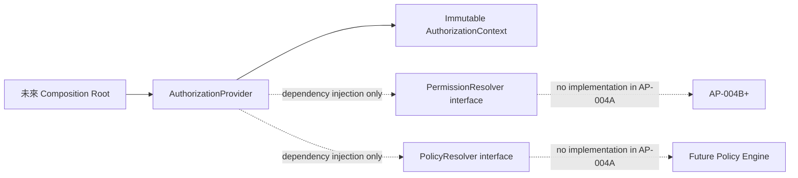

# AP-004A：Authorization Runtime Foundation

狀態：Accepted — Runtime Foundation Approved；Permission Enforcement Not Started

## 目的與範圍

AP-004A 將已核准的 AP-003B 授權語彙轉成可測試、與框架無關的 TypeScript 契約。它只建立 context、permission key、resource scope、decision/result/error、resolver interface 與 provider dependency-injection boundary。

本 Package 不建立 Permission Catalog runtime、Role Assignment、Policy Engine、Scope Resolver、Resource Guard、API／middleware enforcement、Audit writer、資料庫、Migration、RLS、UI、JWT、Session 或 OAuth 變更。現有 `organization_members.role` 與既有 Server／RLS 檢查仍是現行授權來源。

## Runtime 結構

```text
lib/authorization/
├── shared/          無框架 identifier 與 request metadata
├── domain/          context、permission、scope、decision、result、error
├── interfaces/      PermissionResolver／PolicyResolver ports
├── application/     AuthorizationProvider 與預設 context assembler
├── index.ts         公開 contract barrel
└── README.md        模組邊界與 dependency rules
```



`DefaultAuthorizationProvider.createContext()` 的 AP-004A 原始 contract 只複製並凍結 caller 已提供的 Identity、Membership、Persona、Role、Permission 與 Scope reference，不查資料、不解析角色、不呼叫 resolver，也不回傳 ALLOW／DENY。AP-004C-B 已以 non-breaking application-layer evolution 將此入口收斂為 trusted provider-issued context；歷史 Migration、Database 與 decision contracts 未變。resolver 仍透過 constructor injection 暴露為 ports。

## Decision 與 Reason

- `AuthorizationDecision` 只表示最終方向：`ALLOW` 或 `DENY`。
- `DecisionReason` 是 machine-readable 原因：`PERMISSION_MATCH`、`NOT_FOUND`、`OUT_OF_SCOPE`、`INSUFFICIENT_PERMISSION`、`EXPLICIT_DENY`、`SYSTEM_ERROR`。
- `DecisionResult` 是 discriminated union；ALLOW 必須使用 `PERMISSION_MATCH`，DENY 必須使用拒絕原因。
- 本層不產生使用者文案。UI／API 未來依穩定 reason code 映射安全訊息，避免內部政策細節外洩。

這項分離避免把 `NOT_FOUND` 或 `SYSTEM_ERROR` 誤當成允許／拒絕方向，同時保留指令要求的所有 machine-readable 狀態。

## Permission Key

`PermissionKey` 是 branded string，只能經 `parsePermissionKey()` 建立。格式固定為小寫 `resource.action`，每段允許小寫英數與底線，長度受限；`isAdmin`、`isOwner`、Boolean permission、缺少 action 或多段 magic string 皆不合法。

AP-004A 只驗證結構，不內建 AP-003B 的 224-key Catalog，也不判斷 key 是否已被 Catalog 核准。Catalog membership、version、deprecation 與 resolver 行為屬後續 Package。

## Resource Scope

本 Package 只建立以下 type vocabulary，不建立 inheritance、relationship 或 database resolver：

`PLATFORM`、`ORGANIZATION`、`CAMPUS`、`SCHOOL`、`GRADE`、`CLASS`、`COURSE`、`CURRICULUM`、`CHAPTER`、`LESSON`、`WORKSHEET`、`ASSESSMENT`、`STUDENT`、`GUARDIAN`、`REPORT`、`AUDIT`、`NOTIFICATION`。

`ResourceScope` 只攜帶 machine-readable type 與可選 reference。它不證明 tenant ownership、membership 或 permission。

## Import 與 Dependency 規則

允許方向：

```text
shared
  ↑
domain
  ↑
interfaces
  ↑
application
```

- `lib/authorization` 不得 import `app/`、`components/`、React、Next.js、Supabase 或產品 feature service。
- `domain` 不得 import `interfaces` 或 `application`；`interfaces` 不得 import `application`。
- Root `index.ts` 只作公開 contract barrel。
- Architecture test 靜態檢查禁止依賴、分層方向與循環依賴。

## Security Boundary

這個 foundation 不是安全 enforcement point。它沒有解析 client claims、沒有接受可信 client role／organization id、沒有查詢資料庫，也沒有取代現有 Server authorization 或 RLS。未來 API、Domain Service、RPC 與 RLS 的責任仍依 AP-003B：server canonical decision、domain invariant revalidation、database final tenant boundary、default deny。

## 後續 Gate

AP-004B 在取得獨立指令前不得開始。後續至少必須另行定義：

1. versioned Permission Catalog runtime 與 typo／deprecation gate；
2. identity／membership／persona／legacy role adapters；
3. permission resolution 與 policy evaluation；
4. scope relationship resolver；
5. Audit receipt integration；
6. shadow evaluation 與現行授權 parity；
7. API／middleware／resource enforcement rollout。

在上述項目完成前，不得把本 Package 宣稱為完整 RBAC、Policy Engine 或 runtime authorization enforcement。
