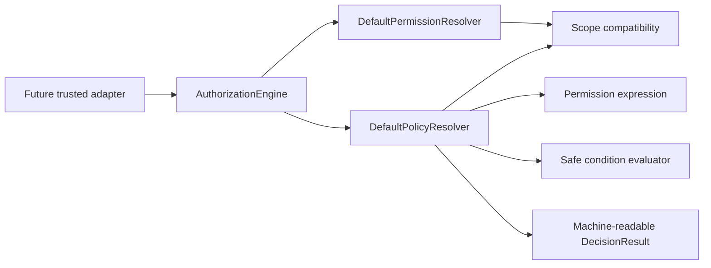

# AP-004B：Permission Resolver & Policy Engine

狀態：Accepted and Git Sealed — Production Enforcement Not Started

## Purpose

AP-004B implements the deterministic, framework-neutral authorization decision core defined by AP-003B and scaffolded by AP-004A. It evaluates only caller-supplied identity context, exact permission grants, resource scopes, immutable policies, relationship evidence, and safe condition attributes.

This package does not establish the production enforcement path. Existing Server checks and PostgreSQL RLS remain authoritative until a later approved integration package performs parity, shadow evaluation, audit integration, and controlled cutover.

## Non-goals

The runtime does not query Membership, Role, Persona, Database, Supabase, Session, JWT, Cookie, Header, OAuth, Entitlement, lifecycle state, billing, or product data. It does not provide Next.js middleware, API guards, Server Action guards, React hooks, UI guards, Audit persistence, RLS integration, or a runtime copy of the 224-key catalog.

Business invariants such as last-owner protection, subscription eligibility, publishing readiness, resource locking, assessment submission state, and grade eligibility remain outside this engine.

## Runtime structure

```text
lib/authorization/
├── shared/       identifiers and request metadata
├── domain/       context, permission expressions, scope, policy, conditions, decisions
├── interfaces/   PermissionResolver and PolicyResolver ports
└── application/  default resolvers, decision engine, context provider
```



## Permission matching rules

The canonical `PermissionKey` remains the exact two-segment lowercase `resource.action` form. AP-003B's 224-key catalog is unchanged.

Runtime policies use a separate branded `PermissionExpression`:

| Expression        | Meaning                                   |
| ----------------- | ----------------------------------------- |
| `curriculum.read` | Exact match only.                         |
| `curriculum.*`    | Any structurally valid curriculum action. |
| `*`               | Any structurally valid requested key.     |

Matching splits on the single permission boundary; it never uses `contains`, user-supplied regular expressions, or case folding. Therefore `curriculum.read` cannot match `curriculum.read_all`, and `curriculum.*` cannot match `curriculums.read`.

Wildcards are policy expressions only. They are not catalog keys and cannot appear in `AuthorizationContext.permissions`. A wildcard policy never manufactures a grant: the requested exact key must first be present in the caller-supplied context.

The package validates permission shape, not catalog membership. Until the approved Catalog adapter is implemented, an unknown but well-formed key is denied when it is absent from the exact context grants.

## Scope evaluation rules

The evaluator retains the 17 AP-004A vocabulary values:

`PLATFORM`, `ORGANIZATION`, `CAMPUS`, `SCHOOL`, `GRADE`, `CLASS`, `COURSE`, `CURRICULUM`, `CHAPTER`, `LESSON`, `WORKSHEET`, `ASSESSMENT`, `STUDENT`, `GUARDIAN`, `REPORT`, `AUDIT`, `NOTIFICATION`.

Required identifiers:

- `PLATFORM`: no tenant or resource identifier.
- `ORGANIZATION`: non-empty `organizationId`; optional `scopeId` must equal it.
- `CAMPUS` through `COURSE`: non-empty `organizationId` and `scopeId`.
- `CURRICULUM` through `NOTIFICATION`: non-empty `organizationId` and `resourceId`.

Exact same-type scopes require the same identifier. An Organization scope covers child resources only inside the same organization. Other parent scopes cover a child only when the caller supplies authoritative `lineage` evidence mapping that parent type to the granted identifier. Platform does not silently cover tenant resources.

Every tenant scope requires an active Membership reference in the supplied context. Organization mismatch, missing lineage, missing Membership, malformed scope, missing identifier, or an unknown scope type denies access.

AP-003B relationship concepts do not become duplicate ResourceScope values. `MEMBERSHIP`, `PERSON`, `PROFILE`, `PERSONA`, `OWN_RESOURCE`, and `MANAGED_RESOURCE` are explicit policy relationship constraints evaluated from supplied evidence. Missing or mismatched Person/Profile/Persona/ownership/management evidence denies access.

## Policy model

An immutable `AuthorizationPolicy` contains:

- stable `id`;
- exact `ALLOW` or `DENY` effect;
- runtime permission expression;
- resource scope expression and optional relationship constraint;
- integer priority;
- explicit enabled flag;
- optional pure condition tree;
- optional description.

Malformed IDs, effects, priorities, permission expressions, scope expressions, or condition structures fail closed. There is no implicit allow and no Boolean permission.

## Condition model

The condition language supports only `equals`, `notEquals`, `includes`, `exists`, `all`, and `any` over caller-provided primitive or primitive-array attributes. `includes` applies only to arrays and never performs substring matching. Composite expressions must be non-empty and nesting is bounded.

Unsupported operators, missing attributes, invalid values, excessive nesting, and malformed composites deny. The evaluator never executes JavaScript, `eval`, `Function`, SQL, network calls, filesystem reads, or dynamic code.

## Conflict resolution and ordering

Evaluation order is fixed:

1. validate context, requested permission, requested scope, and every policy;
2. require the exact permission in `AuthorizationContext.permissions`;
3. require a compatible granted scope and active tenant Membership where applicable;
4. filter enabled policies;
5. match permission expressions;
6. match policy scope and relationship evidence;
7. evaluate safe conditions;
8. select matching DENY before matching ALLOW;
9. fall back to DENY.

Explicit DENY always overrides ALLOW, regardless of priority. Priority is used only within the same effect to select deterministic evidence; ties use policy ID ascending. A conflict returns `CONFLICT_DENY_OVERRIDE` and the selected deny policy reference.

## Default deny and fail closed

An empty policy collection, no matching policy, missing exact grant, missing context, invalid permission, invalid scope, malformed policy, unsupported condition, scope mismatch, relationship mismatch, or known resolver failure never returns ALLOW.

Known `AuthorizationError` failures become `DENY / INTERNAL_RESOLUTION_ERROR`. Unexpected programming errors such as `TypeError` are deliberately rethrown so tests and observability can expose defects; they are not silently converted into a successful decision.

## Decision model

`DecisionResult` includes decision, machine-readable reason, requested permission/scope, optional matched permission/scope, optional policy ID, and an allowlisted evidence record. It does not copy resource attributes, tokens, credentials, PII, or internal stack traces.

New reason codes include:

- `ALLOWED_BY_POLICY`, `DENIED_BY_POLICY`, `CONFLICT_DENY_OVERRIDE`;
- `DEFAULT_DENY`, `NO_MATCHING_POLICY`, `POLICY_DISABLED`;
- `INVALID_PERMISSION`, `INVALID_SCOPE`, `INVALID_POLICY`;
- `MISSING_CONTEXT`, `SCOPE_MISMATCH`, `PERMISSION_MISMATCH`;
- `CONDITION_NOT_MET`, `UNSUPPORTED_CONDITION`;
- `INTERNAL_RESOLUTION_ERROR`.

AP-004A reason codes remain available for compatibility.

## Determinism and immutability

Resolvers do not read the clock, randomness, environment, mutable singleton, network, filesystem, cookie, session, or database. They copy before sorting, never mutate Context, policies, scopes, lineage, or condition attributes, and produce the same serialized decision for the same input.

## Security considerations

- Client-provided roles or organization IDs are not made authoritative by this package.
- A role name without an exact resolved permission denies.
- A forged organization scope cannot cross the active Membership and granted-scope boundary.
- Own/managed access requires explicit Person-linked evidence.
- Policy evidence exposes only effect and priority, not condition attributes or sensitive resource metadata.
- This engine is not a replacement for RLS. Database enforcement remains the final tenant boundary.

## Examples

An exact `curriculum.read` grant, Organization scope for `org-1`, matching active Membership, and enabled `ALLOW curriculum.*` policy can allow reading a curriculum in `org-1`.

The same inputs are denied when the curriculum belongs to `org-2`, the Membership is missing, the exact context grant is absent, or a matching DENY policy exists. A high-priority ALLOW cannot override that DENY.

## AP-004C integration boundary

AP-004B is architecture-approved and Git Sealed, but it does not authorize AP-004C automatically. A later independently approved package must supply trusted adapters for identity/membership/persona/role/catalog data, catalog version and deprecation checks, legacy parity and shadow evaluation, resource lineage acquisition, Audit receipts, and enforcement integration.

Until then, no API, middleware, Server Action, UI, Supabase, RLS, JWT, Session, or production authorization path may call this engine as its sole security boundary.
