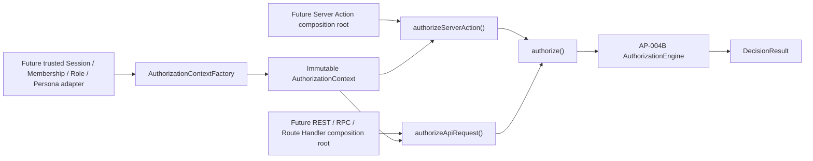

# AP-004C-A：Minimal Authorization Adapter

狀態：**Accepted and Git Sealed**

## 目的與範圍

AP-004C-A 在 AP-004A contracts 與 AP-004B pure decision engine 之上建立最小 Application Layer integration boundary。它提供唯一的 `authorize()` 入口、不可變 AuthorizationContext Factory，以及供未來 Server Action／API composition root 使用的 framework-neutral helper。AP-004C-B 已在 Git Seal 前將原始 caller-supplied context contract 收斂為 trusted provider contract；本文件需與 AP-004C-B 一併閱讀。

本 Package 沒有把授權接入任何產品流程。它不讀 Cookie、Header、Session、JWT、Supabase 或 Database，不建立 Route Handler、Server Action、middleware、React hook、RLS integration、Audit writer、Catalog adapter、Membership／Role／Persona query、resource lineage acquisition 或 business rule。

## Runtime 結構

```text
lib/authorization/
├── shared/
├── domain/
├── interfaces/
└── application/
    ├── adapter/
    │   ├── api-authorization.ts
    │   ├── authorization-request.ts
    │   └── server-action-authorization.ts
    ├── context/
    │   └── authorization-context-factory.ts
    ├── errors/
    │   └── application-authorization-errors.ts
    └── services/
        └── authorize.ts
```



圖中的 production composition root 尚未實作。AP-004C-B 已建立 framework-neutral provider interfaces 與 validation orchestrator；Application helper 不自行取得產品資料。

## `authorize()` canonical entry

`authorize()` 的產品 request 接收：

- requested Permission；
- requested Resource Scope；
- immutable Policies；
- optional Resource Attributes／relationship evidence。

AuthorizationContext 改由必要的 `AuthorizationContextProvider` dependency 取得，request 不得攜帶 context。

它只呼叫 AP-004B evaluator，回傳原始 machine-readable `DecisionResult`。預設 evaluator 是 `createAuthorizationEngine()`；測試或未來 composition root 可注入 `AuthorizationDecisionEvaluator`，但不能因此繞過產品現行的 server checks 或 RLS。

AP-004C-A 不複製 Permission／Scope／Policy 判斷。Application adapter 以架構測試確保只有 `services/authorize.ts` 可直接連到 engine，Server Action／API helper 必須經 `authorize()`。

## AuthorizationContext Factory

`AuthorizationContextFactory.create(provider)`：

1. 只接受 trusted provider，不接受 arbitrary object；
2. 驗證 provider-issued envelope 與 Identity、Membership、Persona、Role、exact Permission、Scope runtime shape；
3. 只複製 allowlisted 欄位並凍結 context 與其 record collections；
4. 對未簽發 envelope、缺少或不合法結構拋出 machine-readable error。

Factory 不讀 Session。AP-004C-B 的 provider orchestrator 只接受 trusted authority ports；production concrete adapter 仍需由未來 server-only composition root 取得並驗證 Session、Membership、Role、Persona、Catalog version 與 resource lineage。Client 傳入的 role、organization id 或 permission 不能直接成為權威。

既有 `DefaultAuthorizationProvider` 改為委派同一個 immutable Factory，保留 AP-004A public contract 並消除第二份 context cloning logic。

## Server Action helper

`authorizeServerAction()` 是 framework-neutral function，不含 `"use server"`、Next.js import 或產品 action。它：

1. 將 Identity provider 無結果分類為 `UnauthenticatedError`；
2. 將 malformed／inconsistent trusted source 分類為 `InvalidAuthorizationContextError`；
3. 呼叫 `authorize()`；
4. ALLOW 回傳 typed allow decision；DENY 拋出 `ForbiddenError`。

呼叫端未來仍需將錯誤映射為安全文案，並在 Domain Service、RPC 與 RLS 重驗必要不變量。

## API helper

`authorizeApiRequest()` 不建立 HTTP `Response`，也不綁定 REST status code。它回傳 discriminated result：

- `authorized: true` + allow decision；
- `authorized: false` + machine-readable error，DENY 時另帶 deny decision。

未來 Route Handler／RPC adapter 才負責安全的 HTTP／transport 映射；不得將 policy details、context、PII 或 stack trace直接回傳給 client。

## Error Model

所有 application error 繼承 `AuthorizationError`：

| Error                              | Code                            | 用途                |
| ---------------------------------- | ------------------------------- | ------------------- |
| `UnauthenticatedError`             | `UNAUTHENTICATED`               | context 缺失        |
| `InvalidAuthorizationContextError` | `INVALID_AUTHORIZATION_CONTEXT` | context 結構不合法  |
| `ForbiddenError`                   | `FORBIDDEN`                     | evaluator 回傳 DENY |

Error 只暴露穩定 code 與 DecisionReason，不保存 token、Session、SQL、policy condition attributes、resource payload 或 stack 的 transport representation。未知 programmer error 繼續向上拋出，不偽裝成成功或一般拒絕。

## Dependency 與 Security Boundary

依賴仍固定為：

```text
shared → domain → interfaces → application
```

- `lib/authorization` 禁止 import React、Next.js、`app/`、`components/`、Supabase 或產品 feature service。
- 沒有 Database、Migration、RLS、OAuth、Session、JWT、middleware、API route 或 UI 變更。
- `authorize()` 不是新的完整安全邊界；目前產品既有 server authorization 與 PostgreSQL RLS 仍是 authority。
- AP-004C-A 不建立 Supabase adapter，不驗證 Catalog membership/version，也不取得 active Membership 或 resource ownership。
- 無 Audit runtime，因此不得用於高風險 production mutation、角色變更、刪除、CASE 或 break-glass。

## 驗證契約

- Unit：Factory validation／immutability、typed errors、Server Action／API allow/deny/missing/invalid context。
- Integration：`authorize()` 經既有 AP-004B engine 完成 real allow decision；injected evaluator 每次只呼叫一次。
- Architecture：禁止 framework／database／feature imports、保持 layer direction、無 circular dependency、Adapter 不得繞過 `authorize()`。
- Regression：Typecheck、Lint、完整 Unit／Integration、Build、Prettier、diff 與敏感資訊掃描。

## Deferred Gate

本 Package 完成不等於產品 enforcement 已啟用。以下仍需獨立核准：

1. trusted Session／Membership／Role／Persona／Catalog adapter；
2. resource lineage 與產品 business rule acquisition；
3. current authorization parity／shadow evaluation；
4. Audit receipt 與 AP-002B integration；
5. Server Action／Route Handler 實際接線；
6. middleware、UI permission、React hook、RLS integration；
7. Curriculum lifecycle／delete 或其他產品功能。

在上述 gate 完成前，不得把 AP-004C-A 宣稱為 Runtime RBAC rollout、API authorization deployment 或 Production permission cutover。
