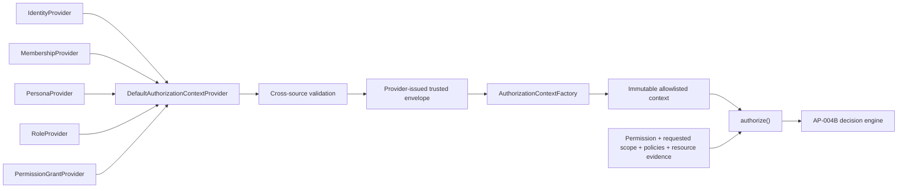

# AP-004C-B：Trusted Authorization Context Adapter

狀態：**Accepted and Git Sealed**

## 目的與安全邊界

AP-004C-B 將 AP-004C-A 的 application adapter 從 caller-supplied context 改為 provider-issued context。產品呼叫端只能描述 requested Permission、requested Scope、Policies 與 Resource Attributes；Identity、Membership、Persona、Role、exact Permission grant 與 grant Scope 必須由受信任的 authority ports 取得，不能夾帶在 authorization request 中。

本 Package 不建立 Session、Cookie、JWT、Supabase、Database、RLS、middleware、Route Handler、Server Action、React hook 或 UI integration。五個 authority port 只有 interface；production concrete adapter 留待獨立核准的 composition-root Package。

## Trusted Provider

`DefaultAuthorizationContextProvider` 是 application-level orchestrator。它只協調五個 authority ports，不查詢資料、不認識 Next.js，也不直接依賴 Supabase：

1. 先取得並驗證 Identity；缺少 Identity 回傳 machine-readable `UNAUTHENTICATED`。
2. 以已驗證 Identity 取得 Membership authority snapshot；缺少或不一致時 fail closed。
3. 由 Membership authority 決定 active Organization，caller 無法覆寫。
4. 以 Identity 與 active Organization 取得 Persona、Role 及 Permission grant snapshots。
5. 執行 cross-source consistency validation 後，簽發僅能由 Provider 模組建立的 trusted envelope。

Provider interface 是 DI boundary，不是密碼學 trust mechanism。未來 production composition root 必須只注入經核准的 server-owned adapter；不得讓 HTTP body、client component、產品 form 或任意 caller 選擇 provider implementation。

## Authority Ports

| Port                      | Authority output                                             | 本次 concrete implementation |
| ------------------------- | ------------------------------------------------------------ | ---------------------------- |
| `IdentityProvider`        | Account／Service Principal identity                          | 無                           |
| `MembershipProvider`      | Identity 綁定的 memberships 與 active Organization           | 無                           |
| `PersonaProvider`         | active Organization 範圍內的 personas                        | 無                           |
| `RoleProvider`            | active Organization 範圍內、帶 assignment reference 的 roles | 無                           |
| `PermissionGrantProvider` | exact Permission、Scope 及受信任 authority/version           | 無                           |

Authority outputs 仍被視為 runtime input，必須經驗證。TypeScript interface 不取代 runtime security validation。

## Context Validation

Validation layer 採 default deny，至少檢查：

- Identity id、type 及 optional Person reference 合法；
- Membership snapshot 的 identity 必須與 Identity 相同；
- active Organization 必須恰好存在一筆 active membership；
- Membership、Persona、Role、Permission grant identity／organization 必須一致；
- Membership、Persona、Role 與 grant identity 不可重複；
- Permission 必須是 exact `PermissionKey`，不接受 wildcard；
- Permission authority 必須標示 trusted，並具有 allowlisted type、id 與 version；
- grant Scope 必須是合法、非 PLATFORM、且屬於 active Organization；
- Permission／Scope grant 必須形成完整矩陣，避免既有分離集合模型把稀疏配對擴張成未授權的交叉組合；
- inactive Persona／Role 不進入 effective context；
- effective Membership 只保留 active Organization 那一筆，避免將其他 tenant 帶入決策。

AP-004C-B 不驗證產品 resource 是否真的存在，也不取得 resource lineage。requested Scope 仍由 caller 描述「目標資源」，但不能用來擴張 context 內的 effective grants；AP-004B 仍以 context scope 與 policy 做交集判斷。

## Factory 與 Immutable Envelope

`AuthorizationContextFactory.create()` 現在只接受 `AuthorizationContextProvider`，而非 arbitrary object。Factory 會拒絕未由 trusted provider 模組簽發的 structural envelope，再進行第二次 runtime shape validation與 allowlist copy。

輸出的 context 及 Identity、Membership、Persona、Role、Permission、Scope、metadata collections 全部 immutable。Provider 回傳的額外欄位不會被複製；caller request metadata 也不會進入 trusted context。

## Application Integration

- `AuthorizeRequest` 明確排除 `context`。
- `authorize()` 必須接收 `contextProvider` dependency，先建立 context 再呼叫 AP-004B evaluator。
- `authorizeServerAction()` 與 `authorizeApiRequest()` 必須走相同 `authorize()` 入口。
- 缺少 Identity、缺少 Membership、來源矛盾及偽造 envelope 都在 evaluator 前 fail closed。
- API helper 仍只回傳 framework-neutral result，不建立 HTTP response。
- Server Action helper 仍不是實際產品 action，不含 `"use server"`。

## Security Tests

新增測試證明以下輸入不會進入 decision engine：

- forged Identity type；
- forged Membership identity；
- forged active Organization；
- forged／wildcard Permission；
- untrusted Permission authority；
- forged cross-organization Scope；
- 可造成 permission-scope privilege widening 的稀疏 grant matrix；
- missing Identity；
- missing Membership；
- 結構正確但未由 trusted provider 簽發的 envelope。

Architecture tests 同時保證 source providers 只有 interfaces、公開 index 不再匯出 raw context assembler、`authorize()` request 不含 context，且 runtime 不 import React、Next.js、Supabase 或產品服務。

## Deferred／Known Limitations

1. 沒有 production Identity／Membership／Persona／Role／Grant concrete adapters。
2. 沒有 Session freshness、JWT、Cookie、MFA 或 re-auth receipt。
3. 沒有 Permission Catalog version authority、Role assignment DB 或 AP-003 migration。
4. 沒有 resource lineage acquisition、產品 business rule 或 lifecycle rule。
5. AP-002B foundation 已建立，但尚無 Audit persistence／產品 transaction integration、RLS integration 或 shadow evaluation。
6. PLATFORM／CASE／break-glass context 尚未開放；本 provider 要求 active Organization membership。
7. 沒有 middleware、產品 API、Server Action、React hook、UI permission 或 Production enforcement。

在 concrete trusted adapters、Audit、產品 parity、RLS 與 rollout gate 完成前，不得宣稱 runtime RBAC 已部署，也不得用於 Curriculum lifecycle、永久刪除或其他高風險 mutation。
