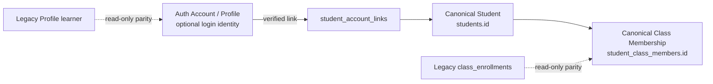

# LE-001 Learner & Enrollment Convergence — Phase 1–2

- Status: **LE-001 Phase 1–2 — DEVELOPMENT VERIFIED**
- Version: `le-001.v1`
- Date: 2026-08-18
- Scope: discrepancy/parity tooling and canonical Student↔Account link foundation only
- Production: not modified

## Purpose

LE-001 converges the existing learner split without replacing either side prematurely:

- target canonical learner authority: `students.id`
- target canonical class-enrollment authority: `student_class_members.id`
- legacy compatibility identity: `profiles.id`
- legacy compatibility enrollment: `class_enrollments.id`

A canonical Student can remain accountless. A login Account becomes a Student identity only through an explicit, organization-scoped, verified and effective link. Phase 1–2 does not switch Assignment, Submission, Analytics, Reporting, Teacher Dashboard, Guardian or Parent Portal consumers.



## Phase 1: read-only discrepancy and parity

`lib/learner-convergence/` provides a strict, framework-neutral analyzer. It accepts only a versioned, ID/status-only snapshot and produces an immutable report. It never writes learner or enrollment data and never establishes identity from a candidate match.

The controlled discrepancy vocabulary contains:

- `profile_without_canonical_student`
- `canonical_student_without_account_link`
- `managed_student_without_account`
- `ambiguous_account_student_match`
- `legacy_enrollment_without_canonical`
- `canonical_enrollment_without_legacy`
- `enrollment_status_mismatch`
- `cross_tenant_identity_mismatch`
- `orphan_assignment_recipient`
- `orphan_submission_owner`
- `orphan_learning_event`
- `orphan_mastery_record`
- `orphan_guardian_relationship`
- `parent_portal_legacy_identity_dependency`

The report exposes every required count independently, including cross-tenant and ambiguous-link blockers. `enrollment_parity_rate` is informational and cannot hide mismatch counts. Class overlap may surface operator-review candidates, but no name, email, birthday, grade, school or student number can create an authoritative link. A Student is counted as intentionally managed/accountless only when an authoritative snapshot explicitly supplies `managed_accountless`; absent that evidence, the mode defaults to `unspecified` and the analyzer reports a missing-link discrepancy instead of inferring intent.

### Enrollment status compatibility

| Legacy status | Canonical status | Result               |
| ------------- | ---------------- | -------------------- |
| `active`      | `active`         | deterministic        |
| `left`        | `left`           | deterministic        |
| `inactive`    | none             | explicit discrepancy |

Historical statuses are not rewritten. An unmapped `inactive` value fails parity rather than being silently converted.

### Snapshot boundary

`get_learner_convergence_snapshot()`:

- resolves `auth.uid()` and active organization on the server;
- permits only active Organization Owner/Admin;
- returns IDs, statuses and timestamps needed for parity;
- does not return email, birthday, address, credentials, token or content;
- does not write or backfill any record.

## Phase 2: canonical Student↔Account link

The additive migration creates:

- `student_account_links`
- `student_account_link_audit_events`
- `create_verified_student_account_link()`
- `revoke_student_account_link()`
- `resolve_canonical_student_for_authenticated_account()`
- `get_learner_convergence_snapshot()`

### Link lifecycle and provenance

Statuses are `pending`, `active`, `revoked` and `expired`. Link provenance is restricted to `manual_verified`, `account_claim`, `migration_verified` and `admin_verified`; `heuristic_auto_link` is deliberately absent.

The Phase 2 creation RPC accepts only `manual_verified` or `admin_verified`. Future account-claim and controlled migration flows require separately reviewed packages.

### Account reference decision

`account_id` references `auth.users.id` with `ON DELETE RESTRICT`.

This choice is temporary but deliberate:

- `profiles.id` is a display/profile compatibility record, not canonical Account authority;
- AP-003A Person/account-link tables are not implemented, so inventing a second account registry would create competing identity authority;
- ordinary authenticated users receive no access to `auth.users`;
- `RESTRICT` prevents Account deletion from cascading into Student or link history.

Consequently, Account hard deletion remains blocked until the approved tombstone/reassignment lifecycle exists. Suspension or loss of authentication immediately prevents self-resolution while canonical Student, enrollment and learning history remain intact.

### Constraints

- composite FK `(student_id, organization_id) → students(id, organization_id)`
- one active Account per canonical Student in an organization
- one active canonical Student per Account in an organization
- the same Account may have separately verified contexts in different organizations
- revoked and expired links remain historical rows
- link/account/audit references use `ON DELETE RESTRICT`
- no automatic historical backfill

### Trusted write boundary

Only fixed-search-path `SECURITY DEFINER` RPCs can create or revoke links. They derive actor and active organization from authenticated database context, require active Owner/Admin authority, validate both the Student and Account membership in the same organization, and write the link plus controlled audit event in one transaction.

The client cannot supply `organization_id`, verification status, actor ID or audit identity. Direct authenticated `INSERT`, `UPDATE` and `DELETE` remain revoked.

### Self resolver

`resolveCanonicalStudentForAuthenticatedAccount()` accepts no Student or organization input. The server resolves:

```text
authenticated Account
AND active Organization
AND active Organization Membership
AND one effective verified Account–Student link
```

Typed outcomes are `linked`, `no_link`, `ambiguous_link`, `revoked_link`, `expired_link`, `wrong_organization` and `inactive_context`. Unexpected database or schema failures remain service failures rather than being mislabeled as an expected identity outcome.

## RLS and grants

Both new tables use ENABLE RLS and FORCE RLS. Anonymous access is absent. An authenticated Account can select only its own effective active link in its active organization. Owner/Admin can inspect the minimal audit relation through the tenant policy; authoritative link mutation remains RPC-only. Teachers and guardians receive no link enumeration or management authority.

No grant exposes `auth.users`.

## Cutover gates and deferred work

Phase 1–2 explicitly does not:

- perform real historical link backfill;
- dual-write legacy and canonical enrollment;
- change any current consumer authority;
- migrate Assignment recipients or Submission owners;
- rewrite Learning Event, mastery, reporting, guardian or Parent Portal identity;
- remove `class_enrollments`, Profile-backed learner IDs or legacy data;
- implement Person merge, Student claim UI, course enrollment or Learning Passport.

Phase 3 requires a separate approval and must first prove zero cross-tenant mismatches, zero ambiguous links and zero unexplained ownership discrepancies using deterministic, reviewable evidence.

## Verification contract

- strict Zod snapshot and resolver-result validation
- immutable runtime result structures
- discrepancy, managed Student, ambiguity, orphan and cross-tenant tests
- explicit legacy-status compatibility tests
- server boundary and forged organization tests
- migration safety, constraints, RLS, grants, RPC and PII-minimization tests
- architecture import-boundary and circular-dependency tests

## Development migration record

The linked project reference was verified as `gqurnljrvwyhruhutvni` (`educrat-development`). Before application, local and remote history matched through `20260817134500`, the dry-run listed only `20260818120000_le001_create_student_account_links.sql`, and the migration contained no destructive or historical-rewrite statement. After application, local/remote history includes `20260818120000` and a second dry-run reports the remote database is up to date.

Linked Development verification confirms both new tables and all seven expected indexes, including both primary keys and the two active-link unique indexes. Function, policy, ENABLE/FORCE RLS, grants, restrictive foreign keys and trusted mutation boundaries were exercised against the real Development schema with transaction-only fixtures.

A live read-only check with the configured Development E2E account returned HTTP 200 from both trusted RPCs. The parity snapshot contained 0 eligible Profile Students, 8 canonical Students, 0 Account links, 0 legacy enrollments and 2 canonical enrollments; downstream legacy recipient/event/guardian collections were empty. Because the current Student schema has no authoritative managed/accountless marker, those records remain `unspecified` for analysis and are not assumed to be managed. The self resolver returned the expected typed `no_link` outcome. No link or learner row was written. Anonymous table and resolver calls both returned HTTP 401.

Final Development verification used a single rollback-safe SQL transaction. It proved Owner and Admin same-tenant create/revoke, active/revoked/expired self resolution, both active-link uniqueness constraints, one Account linked independently across two Organizations, composite-FK cross-tenant rejection, Teacher/anonymous/ordinary authenticated isolation, append-only tenant-scoped minimal audit, and restrictive Account deletion. The transaction created 51 controlled fixture and trigger-generated audit rows and rolled all 51 back; a separate post-rollback check found zero remaining verification rows. The subsequent live parity analyzer recheck reported 0 Account links and 0 cross-tenant mismatches, confirming historical Development learner data was not altered.
