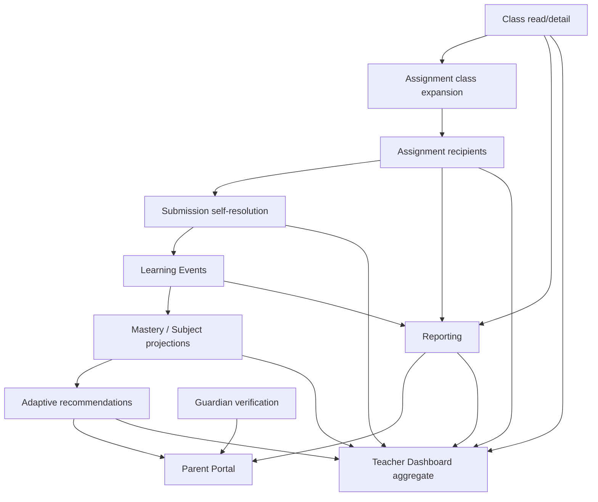

# LE-001 Phase 5 — Consumer Authority Cutover Planning & Readiness Gates

Status: **Consumer Authority Cutover Planning & Readiness Gates**

Runtime authority: **LEGACY UNCHANGED**

Dual-write: **NOT STARTED**

Consumer cutover: **NOT STARTED**

Legacy freeze: **NOT STARTED**

Destructive cleanup: **NOT AUTHORIZED**

Database migration: **NONE**

Production: **UNTOUCHED**

## Purpose and boundary

Phase 5 turns the read-only Phase 4 evidence into an executable rollout plan.
It defines typed readiness, dependency order, technical controls, least-privilege
snapshot contracts, fixtures, rollback, and future package boundaries. It does
not change any product response, authorization decision, learner identifier,
write path, RLS policy, schema, or runtime authority.

`students.id` remains the target canonical learner key and
`student_class_members.id` remains the target canonical enrollment authority.
Profile-backed learners and `class_enrollments` remain the current runtime
compatibility authority until a future consumer package passes its own gate.

## Current Development evidence

The linked Development project remains `educrat-development`
(`gqurnljrvwyhruhutvni`). Phase 4 observed eight canonical Students, zero active
verified Account links, zero legacy enrollments, two canonical enrollments, and
zero tenant mismatches. No consumer is parity-ready.

Phase 5 interprets the same evidence per consumer instead of treating Account
identity as universally required:

| Consumer                    | Phase 5 readiness  | Decisive blocker                                                                                                                                                                                          |
| --------------------------- | ------------------ | --------------------------------------------------------------------------------------------------------------------------------------------------------------------------------------------------------- |
| Class read/detail           | `BLOCKED_SECURITY` | Account link is not required for a roster, but the Teacher assigned-class minimal projection and canonical product-read tests do not exist; two canonical-only enrollments also lack comparison fixtures. |
| Teacher Dashboard           | `BLOCKED_IDENTITY` | The aggregate still spans Profile-keyed assignment/reporting populations with no authoritative compatibility mapping; its class population is separately gated.                                           |
| Reporting                   | `BLOCKED_IDENTITY` | Historical Profile keys do not yet have an authoritative compatibility key; full reporting also depends on assignments and learning events.                                                               |
| Assignment class expansion  | `NOT_READY`        | No consumer data fixture.                                                                                                                                                                                 |
| Assignment recipients       | `NOT_READY`        | No consumer data fixture.                                                                                                                                                                                 |
| Submission self-resolution  | `NOT_READY`        | No submission fixture and no verified Account link.                                                                                                                                                       |
| Learning Events             | `NOT_READY`        | No event fixture.                                                                                                                                                                                         |
| Mastery/Subject projections | `NOT_READY`        | No projection fixture or canonical event source.                                                                                                                                                          |
| Adaptive recommendations    | `NOT_READY`        | No recommendation fixture or canonical-safe upstream evidence.                                                                                                                                            |
| Guardian verification       | `NOT_READY`        | No canonical-child relationship fixture in the snapshot.                                                                                                                                                  |
| Parent Portal               | `NOT_READY`        | No canonical-child relationship fixture and upstream reports/recommendations are not ready.                                                                                                               |

`BLOCKED_SECURITY` for Class read/detail is a deliberate refinement of the
generic Phase 4 `BLOCKED_IDENTITY` result. A managed Student does not need an
Account to appear in a teacher roster. The consumer is still blocked because
the existing Owner/Admin snapshot must not be reused to broaden Teacher access.

## Typed readiness model

`lib/learner-convergence/cutover/` defines `le-001.cutover.v1` and these ordered
rollout states:

1. `NOT_READY`
2. `BLOCKED_IDENTITY`
3. `BLOCKED_DATA`
4. `BLOCKED_SECURITY`
5. `BLOCKED_STATUS_MAPPING`
6. `SHADOW_STABLE`
7. `DUAL_READ_READY`
8. `DUAL_WRITE_READY`
9. `CUTOVER_READY`
10. `CANONICAL_PRIMARY`
11. `LEGACY_FROZEN`

Blocked states are classifications, not progress levels. Shadow stability means
observation is reliable; it does not imply data parity or cutover safety.
`evaluateConsumerCutoverReadiness()` is pure and planning-only. It receives the
consumer, full Phase 4 counts, identity requirement/availability, security,
status mapping, dependency states, fallback, read tests, write strategy, and
rollout observations. It returns an immutable state, machine-readable blockers,
and explicit prerequisites. Runtime authorization does not import it.

## Global gates

A consumer cannot advance beyond `SHADOW_STABLE` unless all are true:

- tenant mismatch, ambiguous identity, unexpected orphan, and shadow error
  counts are zero;
- Account identity is authoritative only where the consumer actually needs
  login identity;
- every consumed status has a deterministic mapping;
- critical legacy-only and canonical-only references are zero or explicitly
  explained;
- the audience-specific least-privilege scope is verified;
- fallback is defined and tested;
- both legacy and canonical reads have regression and tenant-isolation tests;
- all dependency nodes are `CUTOVER_READY` or later.

Percentage parity never overrides a failed count. `NO_DATA` remains
`NOT_READY`. Invalid or negative evidence fails closed.

## Account-link and managed Student policy

| Consumer                    | Account link | Managed/accountless behavior                                                                                                        |
| --------------------------- | ------------ | ----------------------------------------------------------------------------------------------------------------------------------- |
| Class read/detail           | Not required | Included by canonical Student and active canonical enrollment.                                                                      |
| Teacher Dashboard           | Conditional  | Included in class/report populations; self-only data still requires authoritative compatibility.                                    |
| Reporting                   | Conditional  | Included when report evidence is keyed by canonical Student; historical Profile keys retain compatibility mapping.                  |
| Assignment class expansion  | Not required | Can receive an assignment without a login.                                                                                          |
| Assignment recipients       | Conditional  | Canonical recipient may be accountless; a link is needed only for later self-service.                                               |
| Submission self-resolution  | Required     | Must resolve Account → active organization → one verified link → canonical Student.                                                 |
| Learning Events             | Conditional  | Teacher/import-originated evidence may target an accountless Student; authenticated self-originated evidence needs a verified link. |
| Mastery/Subject projections | Not required | Built from canonical-safe events.                                                                                                   |
| Adaptive recommendations    | Not required | Built from canonical-safe evidence, not from login identity.                                                                        |
| Guardian verification       | Not required | Guardian-child relationship is separate authority and may target an accountless Student.                                            |
| Parent Portal               | Not required | Access depends on active verified guardian-child relationship, not the child's Account link.                                        |

No package may create an Account merely to make a learner cutover easier.

## Dependency graph and wave qualification

The proposed five-wave order is retained with two qualifications:

- Phase 5B switches only the Dashboard class learner population. Assignment,
  submission, analytics, reporting, and alert/recommendation populations remain
  on their own controls and upstream package gates.
- Phase 5C introduces canonical report keys and read compatibility only. A full
  canonical report cannot be declared ready until assignment and event sources
  are canonical-safe.

The package-order validator rejects missing, duplicate, unknown, or out-of-order
package dependencies. It is planning validation, not a deployment orchestrator.

## Consumer cutover plans

### Class read/detail

This is the first candidate because roster membership is learner authority, not
login identity. Canonical read includes active memberships and may show managed
Students. `left` remains historical/non-active and must not appear as active.
Teacher requests require an assigned-class projection; Owner/Admin may use a
tenant-admin projection. Empty canonical roster is a real empty state only after
legacy/canonical scope parity proves no unexplained legacy-only rows. The control
first runs legacy-primary with canonical shadow, then canonical-primary with
legacy fallback. Rollback changes the authority control; it never deletes rows.

### Teacher Dashboard

The Dashboard is not one atomic cutover. Its independent populations are:

| Population             | Canonical dependency                 |
| ---------------------- | ------------------------------------ |
| Class learners         | Class read/detail                    |
| Assignments            | Assignment recipients                |
| Submissions            | Submission self/ownership resolution |
| Analytics              | Mastery/Subject projections          |
| Reporting              | Reporting learner population         |
| Alerts/recommendations | Adaptive recommendations             |

Each population keeps a separate adapter and flag. The Dashboard aggregate is
canonical only after every included population is ready. No adapter may restore
organization-wide Student PII for a Teacher.

### Reporting

`students.id` is the future canonical report key. Existing Profile ID is a
legacy compatibility key, never overwritten. Learning events and published
historical outputs preserve their original key plus an additive/projected
canonical mapping. Mastery, subject, teacher-class summaries, and report cache
are rebuildable; immutable events and previously issued outputs are not.
Tenant is part of every key and resolver lookup. Phase 5C may cut only the
learner population/key adapter; full metrics wait for assignments and events.

### Assignment class expansion

Expansion reads active `student_class_members` for an active eligible class and
includes managed Students. `left` membership, archived/inactive class, wrong
tenant, and duplicate Student are rejected or excluded by explicit rules. The
preferred future write is one canonical recipient plus a compatibility
projection, not two unrelated writes. Rollback restores legacy expansion and
retains any additive canonical references.

### Assignment recipients

Transition is `legacy recipient → dual-reference compatibility → canonical
recipient → optional legacy compatibility field`. The future schema must add a
canonical Student reference while preserving historical Profile reference.
Dual-write is safe only after expansion parity, idempotent uniqueness,
transactional write, correlation/audit, and partial-failure rollback are proven.
Independent best-effort writes are forbidden.

### Submission self-resolution

Authenticated self-access resolves Account → active organization → one active
verified Student Account Link → active/eligible canonical Student → canonical
assignment recipient. Organization, recipient, and link must all match. Missing,
ambiguous, expired, revoked, cross-tenant, or legacy/canonical disagreement is a
denial. Legacy `student_id = auth.uid()` cannot silently grant access to another
canonical Student during fallback.

### Learning Events

Historical Profile learner IDs remain immutable and queryable. New schema work
must add/project a canonical Student reference and record mapping provenance.
During compatibility, reads resolve both keys within the same tenant. New events
become canonical-primary only after assignment/submission ownership is safe.
Zero-loss means no event is deleted, reassigned heuristically, or hidden because
it lacks a canonical mapping.

### Mastery and Subject projections

These are rebuildable projections. The preferred cutover is a deterministic
rebuild from canonical-safe Learning Events, comparison against the legacy
projection, then an authority switch. Incremental adaptation is allowed only
after rebuild equivalence is proven. Rollback selects the legacy projection; it
does not mutate source events.

### Adaptive recommendations

Adaptive cannot become canonical-primary before Learning Events and Mastery are
canonical-safe and assignment/submission ownership is compatible. Existing
recommendations retain their historical learner key. New recommendations use
canonical evidence and can retain a compatibility key during the rollback
window.

### Guardian verification and Parent Portal

Guardian-child relationship remains its own verified, consented, tenant-scoped,
revocable authority. It is never inferred from a Student Account Link, email,
name, birthday, school, grade, or student number. Guardian verification first
adds/validates the canonical child reference; Parent Portal then consumes only
the authorized child projection. Fallback may use the old reference only when it
maps to the exact same relationship and canonical Student. Revocation denies
both paths immediately.

## Least-privilege snapshot adapter contract

`LearnerCutoverSnapshotProvider` is interface-only and has four distinct
projections:

- Teacher: organization, assigned class, canonical Student ID/status, canonical
  enrollment ID/status;
- Student self: active organization, verified link reference/status, canonical
  Student ID/status, assignment-recipient references;
- Guardian: active relationship reference/status, verified/consent status,
  canonical child Student ID;
- Owner/Admin: tenant-scoped link and enrollment reference/status inventory.

The contract has no name, email, birthday, phone, address, school, raw Profile,
credential, token, or `auth.users` access. A future server adapter must create
trusted scope from authenticated context; no client organization, learner,
role, or audience claim is authoritative.

## Dual-read, dual-write, freeze, and rollback

Every consumer follows:

1. `LEGACY_ONLY` (current default);
2. `LEGACY_PRIMARY_CANONICAL_SHADOW` with aggregate parity diagnostics;
3. `CANONICAL_PRIMARY_LEGACY_FALLBACK` after all gates and runbook approval;
4. `CANONICAL_ONLY` only after the rollback window and explicit freeze approval.

The canonical read is never accepted merely because the legacy read fails.
Unexpected canonical failure while legacy-primary is diagnostic only. During
canonical-primary, fallback is allowed only for a classified compatibility case;
tenant/security/identity conflicts fail closed and must not fall back.

Dual-write is not authorized in Phase 5. Future write packages prefer a single
canonical transaction plus a deterministic compatibility projection. If a true
dual-reference write is necessary, both references, idempotency key, correlation
ID, audit receipt, and conditional old/new values share one transaction. Partial
success fails the operation and rolls back.

Legacy writes can freeze only when every relevant consumer is canonical-primary,
new writes are canonical, mismatches are zero/explained, compatibility and audit
are verified, and the rollback observation window is complete. Profile or
`class_enrollments` deletion is a separate, later authorization and is not a
freeze action.

## Code-owned technical controls

All eleven controls default to `LEGACY_ONLY`; they are technical rollout
controls, not product entitlements, organization settings, permissions, or
subscription features. Modes are `LEGACY_ONLY`,
`LEGACY_PRIMARY_CANONICAL_SHADOW`,
`CANONICAL_PRIMARY_LEGACY_FALLBACK`, and `CANONICAL_ONLY`. Phase 5 defines these
keys but no existing runtime consumer reads them.

## Minimum future Development fixtures

Future packages need isolated, non-Production fixtures for:

- one managed/accountless Student;
- one Student with an active verified Account link plus expired/revoked cases;
- one Teacher-owned class and one Owner/Admin-managed class;
- active and left canonical enrollment plus deterministic legacy enrollment;
- an assignment class target and a materialized recipient;
- a submission owned by the linked Account/Student;
- an immutable learning event and rebuildable projection;
- an active verified/consented guardian-child relationship plus revoked case;
- cross-tenant class, learner, link, recipient, event, and guardian negatives.

Fixtures must be transaction-rollback or precisely lifecycle-cleaned. They may
not use Service Role to bypass the product boundary or include real minor data.

## Future package breakdown

| Package   | Scope                                                            | Required predecessor |
| --------- | ---------------------------------------------------------------- | -------------------- |
| LE-001-5A | Class Roster Canonical Read Cutover                              | Phase 5 plan         |
| LE-001-5B | Teacher Dashboard class learner population only                  | 5A                   |
| LE-001-5C | Reporting learner-key/population compatibility                   | 5A                   |
| LE-001-5D | Assignment Class Expansion Cutover                               | 5A                   |
| LE-001-5E | Assignment Recipient Canonicalization                            | 5D                   |
| LE-001-5F | Submission Self-Resolution Cutover                               | 5E                   |
| LE-001-5G | Learning Event Canonicalization                                  | 5F                   |
| LE-001-5H | Mastery Projection Rebuild                                       | 5G                   |
| LE-001-5I | Adaptive Consumer Cutover                                        | 5H                   |
| LE-001-5J | Guardian verification then Parent Portal canonical child cutover | 5A, 5C, 5I           |

5B and 5C are deliberately scoped compatibility slices; their aggregate
consumers remain dependency-blocked until later upstream packages finish.

## Migration and security decision

Phase 5 requires no Migration and does not modify migration history. Future
schema prerequisites belong to the implementing package: dual-reference
Assignment recipients, additive canonical Learning Event references, historical
mapping provenance, and canonical guardian child references must each be
reviewed independently.

The plan does not broaden Teacher, Student, or Guardian access; expose Account
links to ordinary clients; trust client organization/learner IDs; query
`auth.users`; bypass FORCE RLS; fabricate links; rewrite history; or modify
Guardian authorization. Rollback is always a code-owned authority switch and
compatibility adapter, never destructive deletion.

## Recommended first real package

After Phase 5 is sealed, recommend exactly **LE-001-5A — Class Roster Canonical
Read Cutover**. It has the lowest login-identity risk and establishes the scoped
canonical learner population needed by later consumers. It must first implement
the Teacher assigned-class least-privilege adapter and Development parity
fixtures; this recommendation is not authorization to start it.
