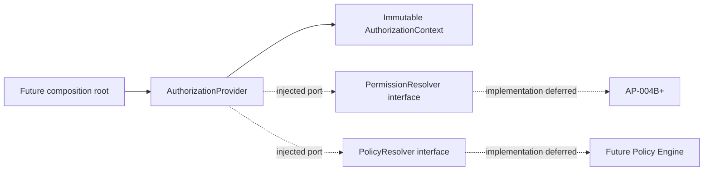
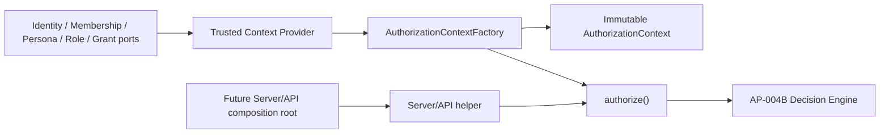
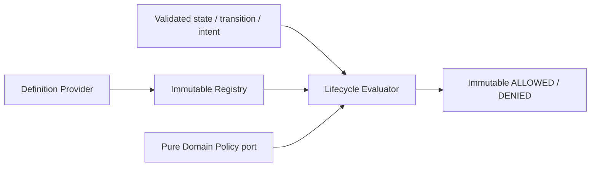
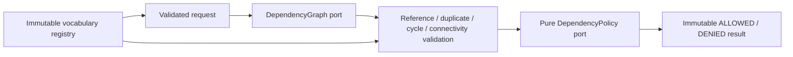
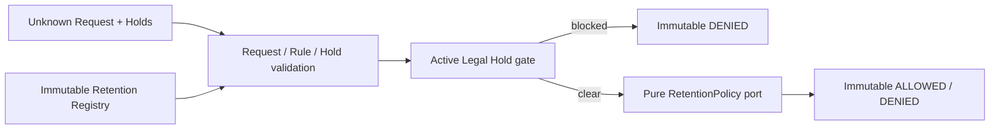
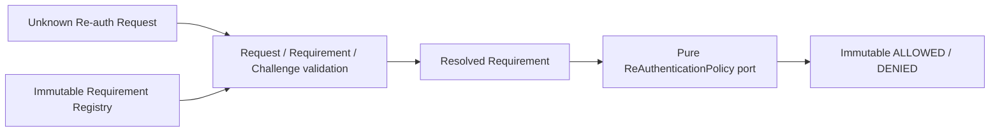
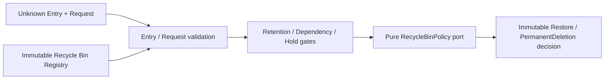

# 系統設計

文件版本：v1.0

## 現況架構

```text
瀏覽器
  └─ Next.js App Router
      ├─ Server Components：首頁、Dashboard、onboarding 與個人資料頁
      ├─ Client Components：Auth／Profile 表單、Avatar、Dialog、錯誤重試
      ├─ Route Handler：Auth、Profile 與 Avatar 的伺服器端驗證
      ├─ 共用 UI：Button、Input、Select、Card、Dialog、Alert、Spinner
      └─ 測試：Vitest / Testing Library / Playwright
```

目前已建立 Supabase SSR client、Next.js 16 Proxy、環境驗證、`profiles`、首次 onboarding、個人資料 API、私有 Avatar Storage、organization multi-tenancy、教材核心結構、章課編輯器與資料庫健康檢查。AI provider、背景工作、題庫、試卷、匯出、金流與正式監控尚未整合。

AR-001 正式採用 `Education Knowledge Graph → Curriculum Reference → Curriculum → Version → Chapter → Lesson` 的單向依賴。`publishers` 只存在於 server legacy compatibility boundary；UI 使用 `CurriculumReferenceDisplay`，未來 AI 只能使用 Knowledge Graph 與中性 reference context。完整決策見 `docs/architecture/adr-003-reference-abstraction.md`。

AP-002 Amendment 以 ADR-007 區分 Authentication Account、Person Profile、Organization Membership、Domain Persona 與 Platform Role Assignment，並為 Platform、Identity、Permission、Organization、Membership、Knowledge、Curriculum、Teaching、Assessment、Learning、AI、Analytics、Communication、Billing、Governance/Audit 指定 authority。這是 conceptual contract；目前 `auth.users`、`profiles`、`organization_members` 仍是 Sprint 1～8 相容模型，不能宣稱 Persona、Platform Role、完整 RBAC 或 Identity Framework 已實作。

### Supabase SSR 邊界

- `lib/supabase/client.ts`：Client Components 使用 publishable key 的 browser client。
- `lib/supabase/server.ts`：Server Components、Server Actions 與 Route Handlers 使用 request cookies 建立獨立 client。
- `lib/supabase/proxy.ts`：透過 Next.js 16 `proxy.ts` 同步 refresh cookie，並以 `auth.getClaims()` 驗證 token。
- `lib/env/public.ts`：驗證瀏覽器可用的 Supabase URL 與 Publishable Key。
- `lib/env/server.ts`：server-only 私密設定邊界；Sprint 3 不使用 Service Role。
- `/api/health/database`：呼叫不讀取資料的 `database_health()` RPC；未設定或不可用時回傳不含內部錯誤的 503。

Proxy 只負責 session cookie 更新，不作為最終授權層。後續受保護頁仍必須在伺服器端驗證 claims／user，資料存取仍受 RLS 限制。

### Auth 流程

- Email 登入／註冊、忘記密碼與更新密碼由 Route Handler 接收 JSON，先限制大小、驗證 Content-Type 與 Zod schema，再呼叫 Supabase Auth。
- Google OAuth 由伺服器建立 PKCE URL，瀏覽器只接收經 schema 驗證的外部 redirect URL。
- `/auth/callback` 只接受有長度限制的 code，以及 `/dashboard`、`/reset-password` 兩個白名單目的地，避免 open redirect。
- Dashboard 在 Server Component 以 `getClaims()` 與 `getUser()` 重新驗證；未登入者導向登入頁。
- 登入與註冊頁在伺服器確認使用者已登入時導向 Dashboard。
- Provider 錯誤透過 allowlist 映射為可理解訊息，未知內部錯誤不直接回傳。

### Rate limit

Auth endpoint 使用 `RateLimiter` 介面，目前由 hashed client address 搭配 in-memory fixed window 實作。這只提供本機與單一 process 的基礎防護；staging／production 必須替換為所有 instance 共用、具原子操作與監控的持久化 provider。前端狀態或 Supabase 自身 rate limit 不能取代應用層防護。

### Profile 與 onboarding 流程

- Dashboard 與個人資料頁在 Server Component 重新驗證使用者，未建立 profile 或 `onboarding_completed = false` 時導向 `/onboarding`。
- `PUT /api/profile` 只從 verified session 取得 user id，不接受 client 指定 id；JSON 經 Zod 驗證後，以分離的 insert／update 維持欄位級最小 grant。
- Avatar route 先限制 multipart 大小，再比對 MIME 與 JPEG／PNG／WebP 實際檔頭；檔名與 Storage 路徑由伺服器產生。
- `avatars` bucket 保持 private，物件只能位於 `auth.uid()` 對應的第一層資料夾；顯示時建立短效 signed URL。
- Avatar API 不使用 Service Role，資料列與物件操作都經 authenticated client 及 RLS。

### Organization 多租戶流程

- `organizations` 是補習班／教育機構的 tenant boundary；`organization_members` 保存使用者角色與 membership 狀態。
- active organization 放在獨立的 `user_preferences`，不加入既有 `profiles`。這避免身分／個人資料與租戶 context 耦合，也能在 Sprint 7 延伸 active branch，或日後增加裝置／session 偏好。
- `create_organization_with_owner()` 使用 fixed `search_path` 的 `SECURITY DEFINER`，只從 `auth.uid()` 取得建立者。它在單一 transaction 中建立 organization、active owner membership 與 preference；任一步驟失敗會全部 rollback。
- `switch_active_organization()` 不信任前端角色，會重新確認 active membership、organization status 與 soft-delete 狀態。
- `lib/organization/service.ts` 集中 current context、list、create、update、switch 與 role guard；Route Handler 只處理不可信輸入與安全錯誤回應。
- 一般 client 沒有 organization insert、membership write 或 preference write 權限；UI 的唯讀／可編輯狀態不能取代 server check 與 RLS。

### 導向優先順序

受保護工作區採單一優先規則：未登入導向 `/login?notice=authentication_required`；Profile 未完成導向 `/onboarding`；Profile 已完成但無 active organization 導向 `/onboarding/organization`；兩者皆完成才顯示 Dashboard 或 Organization Settings。Auth callback、登入／註冊與密碼重設不套用 organization guard，避免 redirect loop 或中斷 PKCE。

### Curriculum Foundation

- `subjects`、`grades`、`publishers` 是資料庫管理的共用參照資料；只有具有有效 active organization 的 authenticated 使用者可讀，client 無寫入權限。
- `curriculums` 直接帶 `organization_id`；`curriculum_versions`、`chapters`、`lessons` 沿關聯回查教材 tenant。所有 RLS 以 `get_active_organization_id()` 與 active membership 雙重限制。
- `create_curriculum_with_initial_version()` 是 fixed-search-path 的 `SECURITY DEFINER`。它只從 `auth.uid()` 與 active organization context 取得 owner，要求 owner/admin，並在同一 transaction 建立教材及版本 1。
- `lib/curriculum/service.ts` 是唯一教材資料存取層，集中 list/detail/create/update、參照資料組合、active organization 篩選與領域錯誤；頁面和 Route Handler 不直接查表。
- `GET／POST /api/curriculums` 與 `GET／PATCH /api/curriculums/[id]` 僅接受 Zod 驗證的 JSON。沒有 DELETE endpoint、table DELETE grant 或 policy。
- Server Components 處理列表、詳細及權限畫面；`CurriculumForm` 只負責互動，owner/admin 權限仍由 server data layer 與 RLS 驗證。

### Curriculum Reference Compatibility

- `lib/curriculum/reference-display.ts` 是 legacy anti-corruption layer；原始 source name/code 在 server 轉為中性 `displayName`。
- 新 UI 使用 `reference` 與 `curriculumReferenceId`，不使用 Publisher Domain。
- 舊 API request `publisherId` 仍可解析；舊 response 的 `publisher_id`／`publisher` 形狀保留，但 display value 已中性化。
- `publishers`、`publisher_id`、`p_publisher_id` 與歷史 Migration 均不修改。新 table、FK、backfill、dual-write 與 RPC v2 只存在於待核准的 Migration Design。
- `knowledge_sources` 未來屬 admin provenance boundary，不得進入一般 UI 或 AI 回應。

### Curriculum Editor

- Sprint 8 沿用 `curriculum_versions`、`chapters`、`lessons`，只為章增加編輯狀態、為課增加教學備註；版本 1 唯讀，不建立版本 2。
- 八個 fixed-search-path RPC 集中 chapter／lesson create、update、delete、reorder。RPC 只使用 `auth.uid()` 與 active organization context，要求 owner/admin，逐次驗證 version 1 與完整 hierarchy ownership，並撤銷 public／anon／service_role execute。
- `lib/curriculum/service.ts` 仍是唯一資料層；Route Handler、Server Component 與 client editor 不直接操作資料表。排序必須提交完整、不重複、同父層 ID，資料庫鎖定父層後以兩階段更新維持 unique order。
- Editor 以三次批次查詢取得教材、版本、章與課，不逐節點查詢。Tree 分頁顯示章節，只有展開章節才 render 課次；拖曳之外保留可聚焦的上下移動按鈕與方向鍵展開／收合。
- AI-ready reserve 只在 Lesson 保存 nullable 1–5 級 `difficulty` 與受限 `keywords` 陣列。它們位於 version-owned、tenant-scoped hierarchy 中，未來 Engine 可直接取用；Prompt、Embedding、provider／model、generation provenance 與 review workflow 必須使用後續獨立模型，不得塞入這兩個欄位。

### 後續 Sprint 銜接

- 新版 Roadmap 的 Sprint 7 改為 Curriculum Foundation；原先規劃的 branch Sprint 尚未執行，active branch 仍只保留架構延伸點。
- 成員邀請與細緻 RBAC 必須透過後續明確 Sprint 增加受控 RPC，不可放寬目前的 direct membership write deny。
- 章、課編輯已由 Sprint 8 開放；版本 2、版本發布稽核、還原與跨版本複製仍需後續 Sprint 明確定義。
- Organization Logo 若實作，需建立獨立 private bucket、organization path 與 Storage RLS，不得共用個人 Avatar bucket。

## 長期系統邊界

```text
Web / Future Mobile Clients
  → Next.js Application Boundary
      ├─ Auth and Organization
      ├─ Curriculum and Provenance
      ├─ Worksheet and Question Core
      ├─ Subject Engine Registry
      ├─ AI Job Orchestration
      ├─ Quality Review Pipeline
      ├─ Export Services
      └─ Billing and Administration
  → Supabase
      ├─ PostgreSQL + RLS
      ├─ Auth
      └─ Private Storage
  → Server-only Providers
      ├─ OpenAI
      ├─ Payment provider
      ├─ Error monitoring
      └─ Email / notifications
```

此圖是模組邊界，不代表所有模組已實作。新增外部 provider 前必須由對應 Sprint 定義安全、錯誤、重試與測試策略。

## 模組責任

| 模組                 | 責任                                   | 不負責           |
| -------------------- | -------------------------------------- | ---------------- |
| Auth / Organizations | Session、機構、分校、成員與權限        | 教材內容規則     |
| Curriculum           | 課綱、知識點、單元、進度參考與來源     | 保存出版社全文   |
| Worksheet Core       | 教材規格、題目、版本、編輯與狀態       | 自行呼叫模型     |
| Subject Engines      | 各科 blueprint、生成規則、驗證與難度   | 帳務與組織權限   |
| AI Jobs              | Provider、任務、Prompt、重試、成本紀錄 | 決定教材可匯出   |
| Quality Pipeline     | 結構、領域、安全、相似風險與教師確認   | 繞過失敗檢查     |
| Export               | 通過檢查的學生版、教師版、PDF、DOCX    | 修正教材內容     |
| Billing / Admin      | 訂閱、額度、客服、稽核與旗標           | 信任前端付款結果 |

## 關鍵資料流

### 寫入資料

1. Route Handler 或 Server Action 接收 `unknown` 輸入。
2. 伺服器端 schema 驗證、正規化並確認 session 與 organization scope。
3. Repository 只執行已授權操作；資料庫 RLS 提供第二道隔離。
4. 高風險或商務操作寫入 audit log，敏感值必須遮蔽。

### 生成與匯出

1. 教材規格先結構化保存，再建立具冪等性的 AI job。
2. AI provider 只在伺服器端執行，回應先視為不可信任資料。
3. 回應通過 schema、科目規則與品質檢查後才可成為教材草稿。
4. 教師修改產生可追溯版本；發布版本不可原地覆寫。
5. 只有品質狀態允許且教師已確認的版本可建立 export record。

## 邊界與安全

- 瀏覽器只能存取明確標記為公開的設定；Service Role 與 OpenAI 金鑰不得進入 client bundle。
- Route Handler 將 request body 視為 `unknown`，通過 Zod 後才可使用。
- 未來 AI provider 僅能由伺服器端呼叫，回應需通過 schema 後才能持久化或顯示。
- 未來所有教材匯出流程需依賴品質檢查通過狀態，不允許由前端自行繞過。
- UI 權限只改善體驗；所有授權必須在伺服器與 RLS 再次執行。
- 多租戶資料一律帶有 organization scope，不接受 client 提供的 organization id 作為唯一授權依據。
- 外部 webhook 必須驗證簽章並具備冪等性。
- Log、追蹤與錯誤訊息不得包含密碼、token、完整個資、AI Key 或 Service Role Key。

## 架構決策

### AP-002 Platform Governance（Accepted Architecture — Not Implemented）

AP-002 已核准四層治理契約，但尚未實作：

```text
Platform Layer
  → Organization Layer
    → Workspace Layer
      → Data / AI Layer
```

Platform role 與 Organization Membership 必須完全分離。Platform Console 未來使用 `/platform/*`、獨立 authorization context、case-scoped access、遮罩 DTO、fresh re-auth 與 append-only Audit；不得將 Platform Admin 加入每個 Organization，也不得用 Service Role 作一般管理者 session。Organization Workspace 繼續使用 active organization、membership 與既有 RLS。

Organization、Account、Membership、Curriculum 階層採顯式 state machine。Lifecycle transition 不提供任意 status update，而是經 `request → dependency/retention decision → approval → transaction/job → audit`。AI Agent 不是治理角色，不能發起、核准或執行管理權限。

AP-002 推薦 Hybrid data design：Domain/typed companion 保存 canonical current state；共用 lifecycle/deletion requests、Retention、Hold、Recycle Bin workflow 與 Audit。永久刪除由 Platform Super Admin 核准、一次性 background capability 執行，Organization Owner 只能提出申請。完整契約見 `docs/architecture/ap-002-platform-governance.md`。

現有 Sprint 8 Chapter/Lesson delete RPC 保留相容，但不得延伸到有 Teaching/Learning dependency 的未來資料。Lifecycle v2 切換完成後，應以新的 forward-only Migration 撤銷 authenticated execute；不修改歷史 Migration，也不直接 cascade delete 教材或歷程。

Domain ownership、allowed/forbidden dependency、RACI 與 published contract 見 ADR-007。產品能力與 North Star 見 `docs/product/capability-map.md`；future Domain Events 見 `docs/architecture/event-catalog.md`。事件文件不表示 Event Bus、Queue、Outbox、Consumer 或 replay infrastructure 已存在。Foundation 執行順序已完成 AP-003A Identity Domain → AP-003B Role/Permission/Policy → AP-002B Audit → AP-002A Lifecycle Schema → AP-002C Dependency Protection → AP-002D Retention & Legal Hold Foundation → AP-002E Re-authentication Boundary，現進入 AP-002F Recycle Bin Foundation 的架構審查；AP-004 Background Job/Event/Notification 與 Organization Closing、Account Privacy/Deletion、Platform Admin Console 等產品 Package 均未開始。AP-002 原始 roadmap 的 `AP-002D Organization Closing` 與後續 `AP-002E Account Privacy／Deletion` 識別碼已與 Foundation 指令衝突，因此相關產品 Package 識別碼必須另行核准，不得視為已啟動。

### AP-003A Identity Domain Boundary（Accepted — Not Implemented）

```text
Authentication Account ──▶ Auth Identities
          │
          ├───────────────▶ Legacy Account Profile
          └───────────────▶ Account–Person Link ──▶ Canonical Person
                                                        ├─▶ Organization Membership
                                                        ├─▶ Domain Personas
                                                        ├─▶ Guardian Relationships
                                                        └─▶ Platform Role Assignment boundary

Managed Person / Persona ── may exist without Authentication Account
```

AP-003A 推薦預設一 Account 對一 Person、例外使用受控 linking／merge；Email 不作 Person ID。Profile 只保存顯示與個人偏好，active organization 只屬 workspace preference；Persona、Membership 與 Role 分離，Managed Student／Guardian 可以沒有 Account。Platform Role Assignment 與 Organization Membership 完全分離，AI Agent 不能成為 Account、Service Principal 或管理角色。

Role、Permission、Scope、Policy Decision、re-auth、CASE access 與 Permission Matrix 由 AP-003B 定義。AP-003A 沒有新增 table、RLS、RPC、API 或 UI；Legacy `profiles.id = auth.users.id` 與 `organization_members.role` 在 additive cutover 前維持 authority，不修改 Sprint 1–8 Migration。現有 Account-linked cascade FK 使 hard delete 保持關閉，直到 forward-only identity／dependency治理完成。

### AP-003B Authorization Boundary（Accepted — Runtime Enforcement Not Implemented）

AP-003B 提案將授權拆成 Role Definition／Version、224 個 `resource.action` Permission Catalog、Assignment、Scope Binding、Policy Decision 與 obligations。現有 `organization_members.role` 仍是 runtime authority；提案沒有修改 middleware、JWT、Session、RLS、RPC、API、UI 或資料庫。

Canonical decision flow 為 `Request → Identity → Membership → Persona → Role → Permission → Scope → Business Rule → Decision → Audit`。API 在進入 Domain Service 前要求 server-side decision；Domain Service 重驗 lifecycle、dependency、ownership 與 separation-of-duties；RLS 仍是最終租戶隔離。未知 key/role/scope、資料不完整、tenant mismatch 或 policy conflict 一律 fail closed。

Role 分成人類 Platform／Organization／Academic／Student／Family templates、AI execution profiles 與 Service Principal workload roles。Platform Owner 是既有 `PLATFORM_SUPER_ADMIN` 的產品相容顯示，不創造第二個最高權限；AI profile 不可被指派給 Person，也不持有 Session 或管理權。Campus／School／Grade／Class／Course 等未來 scope 未建立前不得退化為全 Organization grant。

Database 只提出 versioned hybrid 與 additive rollout：Permission catalog 受版本化 artifact 管理，role/assignment/runtime grant 未來保存於 DB；先由 AP-002B 提供 Audit，再 shadow evaluation、必要時 dual-write、feature-flag cutover。詳細文件見 AP-003B、ADR-010～013、Authorization Security 與 Authorization Migration Design。

### AP-004A Authorization Runtime Foundation

AP-004A 依現有 modular-monolith 慣例在 `lib/authorization/` 建立 framework-neutral contracts；沒有新增資料庫、Migration、API、UI、middleware、RLS、JWT、Session 或 OAuth 行為。



AP-004A 原始 Provider contract 只負責組成不可變 context，不呼叫 resolver、不讀資料、不計算 ALLOW／DENY；AP-004C-B 已將 caller-supplied input 收斂為 trusted provider-issued input。`AuthorizationDecision` 只保存方向，`DecisionReason` 保存 `NOT_FOUND`、`OUT_OF_SCOPE`、`INSUFFICIENT_PERMISSION`、`EXPLICIT_DENY`、`SYSTEM_ERROR` 等機器可讀原因。`PermissionKey` 僅驗證 `resource.action` 結構，不內嵌 224-key Catalog。

依賴固定為 `shared → domain → interfaces → application`。授權模組禁止 import React、Next.js、`app/`、`components/`、Supabase 或產品 feature service，並由架構測試檢查 import boundary 與循環依賴。完整契約見 `docs/architecture/ap-004a-authorization-runtime-foundation.md`。

### AP-004B／AP-004C-A／AP-004C-B Authorization Application Boundary

AP-004B 已提供純函式 Permission、Scope、Policy 與 Decision Engine。AP-004C-A 在 `application/services` 建立唯一 `authorize()` 入口與 framework-neutral Server Action／API helper。AP-004C-B 移除 request 內的 caller-supplied context，新增 Identity、Membership、Persona、Role、Permission Grant authority ports、cross-source validation、provider-issued envelope 與 whitelist-copy Factory。既有 `DefaultAuthorizationProvider` 也只能委派 trusted Provider 與同一 Factory。



五個 authority port 目前只有 interface，沒有 production concrete adapter。AP-004C 不讀 Cookie、Session、JWT、Supabase 或 Database，不建立 Route Handler、Server Action、middleware、UI hook、Audit 或 RLS integration。Helper 名稱表示未來用途，不代表已接入任何產品流程；現有 server checks 與 RLS 仍是 authority。完整契約見 `docs/architecture/ap-004c-a-minimal-authorization-adapter.md` 與 `docs/architecture/ap-004c-b-trusted-authorization-context.md`。

### AP-002B Immutable Audit Foundation

AP-002B 在 `lib/audit/` 建立 framework-neutral Clean Architecture foundation：`shared → domain／interfaces → application`。`AuditWriter` 接收 unknown command，執行 allowlist validation、取得並驗證 platform／organization chain head、canonical serialization、hash 計算、immutable Event 建立與 atomic append，成功後只回傳最小 immutable Receipt。

```mermaid
flowchart LR
    Write["Future governed write"] --> Writer["AuditWriter"]
    Writer --> Validate["Fail-closed validation"]
    Validate --> Repository["AuditRepository port"]
    Repository --> Head["Validated chain head"]
    Head --> Serialize["Canonical serialization"]
    Serialize --> Hash["AuditHashChain port"]
    Hash --> Append["Append with expected previous hash"]
    Append --> Receipt["Minimal AuditReceipt"]
```



Repository、Hash Chain、Clock 與 Event ID generator 只有 interfaces；沒有 Supabase、Database、Next.js 或 cryptographic concrete adapter。Repository append 必須以 expected previous hash 做原子 compare-and-set，避免 concurrent chain fork。Hash chain只提供 tamper-evidence，不取代 append-only grants、FORCE RLS、Retention、Legal Hold、backup或外部 archive。

Metadata 僅接受不含自由文字／PII 的 allowlist codes與計數；Secret、Token、Password、完整學生作答、教材內容及任意 request payload均不得寫入。AP-002B尚未接入 Authorization、Curriculum或任何 Lifecycle write，也未解除BF-003、永久刪除或AP-002C／F產品流程的實作門檻。完整契約見 `docs/architecture/ap-002b-immutable-audit-foundation.md`。

### AP-002A Lifecycle Schema Foundation（Accepted and Git Sealed）

AP-002A 在 `lib/lifecycle/` 建立 framework-neutral lifecycle core：versioned State、explicit Transition、Requirements、immutable Decision、Definition Provider、construction-only Registry、pure Policy port、fail-closed Evaluator 與 canonical serializer。



Core definition 提供 Draft、Published、Archived、Trashed、Deleted 與六個顯式 transition；它是 product-neutral vocabulary，不是 Organization、Account、Membership 或 Curriculum 的完整業務狀態機。Requirements 只描述 Audit、Authorization、Dependency、Re-authentication、Retention、Legal Hold 門檻，Evaluator 不執行任何一項，也不寫 Audit／Database。

Lifecycle production source 維持 `shared → domain/interfaces → application`，禁止依賴 React、Next.js、Supabase、Database、Audit 或產品 Domain。AP-002A 沒有新增 Database schema、Migration、API、UI、Archive／Restore／Delete 或 Recycle Bin；任何 lifecycle write 仍受 Audit persistence、Authorization integration、AP-002C Dependency Protection、transaction/outbox 與後續產品 Package 阻擋。完整契約見 `docs/architecture/ap-002a-lifecycle-schema-foundation.md`。

### AP-002C Dependency Protection Foundation（Accepted and Git Sealed）

AP-002C 在 `lib/dependency/` 建立 framework-neutral dependency core：versioned vocabulary、immutable directed Reference、Request／Result、construction-only Registry、async Graph port、pure Policy port、fail-closed topology validation／Evaluator 與 canonical serializer。



Graph output仍視為不可信資料。Validator拒絕unknown resource/dependency/transition/version、unknown field、duplicate normalized edge、direct/indirect cycle與disconnected fragment；Evaluator對Graph／Policy exception一律fail closed。Canonical serializer依normalized directed edge排序，使相同snapshot不受provider回傳順序影響。

Dependency production source維持 `shared → domain/interfaces → application`，禁止依賴React、Next.js、Supabase、Database、Audit、Authorization、Lifecycle或產品Domain。AP-002C沒有concrete Graph adapter、產品Policy、Migration、API、UI或任何Archive／Restore／Delete write；ALLOWED只代表dependency policy通過，不代表整體lifecycle write可執行。完整契約見 `docs/architecture/ap-002c-dependency-protection-foundation.md`。

### AP-002D Retention & Legal Hold Foundation（Accepted and Git Sealed）

AP-002D 在 `lib/retention/` 建立 framework-neutral retention core：versioned Retention Definition／Rule、bounded Period、safe Metadata、Legal Hold Reference、Request／Decision、construction-only Registry、pure Policy port、fail-closed Evaluator 與 canonical serializer。



Evaluator 固定依序執行 validation → rule resolution → legal hold gate → policy → decision；active hold 不能被 Policy override。Retention Category、Resource 與 Transition vocabulary 由未來 composition root 提供，Foundation 不內建法定期限、jurisdiction、Organization plan、Student、Billing、Curriculum 或其他產品規則。ALLOWED 只代表 retention／hold policy 通過，不代表已完成期間證明、Authorization、Lifecycle、Dependency、Audit、Re-auth、Approval、transaction 或 write。

Retention production source維持 `shared → domain/interfaces → application`，禁止依賴React、Next.js、Supabase、Database、Audit、Authorization、Lifecycle、Dependency或產品Domain。AP-002D沒有Clock、Legal Hold repository、Database、Migration、RLS、API、UI、Purge、Archive／Restore／Delete或Organization Closing；完整契約見 `docs/architecture/ap-002d-retention-legal-hold-foundation.md`。

### AP-002E Re-authentication Boundary Foundation（Accepted and Git Sealed）

AP-002E 在 `lib/re-authentication/` 建立 framework-neutral re-authentication boundary core：versioned Requirement、Risk Level、safe Metadata、Challenge Reference、Request／Decision、construction-only Registry、pure Policy port、fail-closed Evaluator 與 canonical serializer。



Evaluator 固定依序執行 validation → requirement resolution → challenge validation → policy → decision；missing required challenge 只回傳 `challengeRequired`，不驗證任何 credential。Action Type、Challenge Type 與 Risk Level vocabulary 由未來 composition root 提供，Foundation 不內建 Login、MFA、OTP、Password、WebAuthn、Session、Platform、Curriculum、Account 或 Delete 產品規則。ALLOWED 只代表 re-auth boundary policy 通過，不代表已完成 Authorization、Lifecycle、Dependency、Retention、Legal Hold、Audit、Approval、transaction 或 write。

Re-authentication production source維持 `shared → domain/interfaces → application`，禁止依賴React、Next.js、Supabase、Database、Audit、Authorization、Lifecycle、Dependency、Retention或產品Domain。AP-002E沒有credential verifier、Clock、receipt repository、Database、Migration、RLS、API、UI、Login、MFA、OTP、Password verification、WebAuthn、Session refresh或產品re-auth flow；完整契約見 `docs/architecture/ap-002e-re-authentication-boundary.md`。

### AP-002F Recycle Bin Foundation（Awaiting Architecture Review）

AP-002F 在 `lib/recycle-bin/` 建立 framework-neutral recycle bin core：versioned Recycle Entry、Restore Request、Permanent Deletion Request、Purge Eligibility、Decision、construction-only Registry、pure Policy port、fail-closed Evaluator 與 canonical serializer。



Evaluator 固定依序執行 validation → recycle entry → retention/dependency/hold gates → policy → immutable decision；它不還原資料、不刪除資料、不寫 Audit、不查 DB。Resource 與 Transition vocabulary 由未來 composition root 提供，Foundation 不內建 Curriculum、Lesson、Worksheet、Assessment 或任何產品規則。ALLOWED 只代表 recycle bin foundation policy 通過，不代表已完成 Authorization、Lifecycle、Dependency、Retention、Legal Hold、Re-auth、Audit、Approval、transaction 或 write。

Recycle Bin production source維持 `shared → domain/interfaces → application`，禁止依賴React、Next.js、Supabase、Database、Audit、Authorization、Lifecycle、Dependency、Retention、Re-authentication或產品Domain。AP-002F沒有Repository、Database、Migration、RLS、API、UI、actual restore、actual delete、storage deletion、background job或產品recycle bin flow；完整契約見 `docs/architecture/ap-002f-recycle-bin-foundation.md`。

### BF-002 AI Generation Engine（Awaiting Product Review）

BF-002／BF-003 在 `lib/ai-generation/` 建立第一個可測試的 AI 教材生成 engine foundation。它包含 GenerationRequest／Context／Result／Metadata／Usage、`AIProvider` interface、OpenAI adapter boundary、固定 JSON Structured Output schema、Prompt Pipeline、Generation Pipeline、Output／Knowledge Mapping Validator、Copyright Safety Validator、Retry Decision 與 canonical serialization。

Generation Pipeline 固定順序為 `Input Validation → Prompt Build → Copyright Safety Validation → Provider Health → Provider Generate → Structured Validation → Knowledge Mapping Validation → Domain Result`。任何 invalid request、forbidden source vocabulary、provider unavailable、provider exception、invalid structured output 或 invalid knowledge mapping 均 fail closed 並回傳 machine-readable error。

BF-003 起，AI 產品 foundation 不再接收教材版本、出版社進度參考、冊次、Lesson Code 或 Unit Mapping；只根據學習階段、年級、科目、學習主題、知識點、能力指標、教學目標、教材用途、題數、難易度與是否附解析生成完全原創教材。OpenAI 目前只是 adapter boundary，不是 runtime integration。BF-002／BF-003 不匯入 OpenAI SDK、不建立 API key、不做 HTTP call、不串流、不重試、不保存 generation，也不接 UI、API、Server Action、Database、Supabase、RLS、Audit 或 Authorization product enforcement。完整契約見 `docs/product/bf-002-ai-generation-engine.md` 與 `docs/product/bf-003-original-curriculum-generation.md`。

### 既有決策

- 採模組化單體作為早期商用架構，以明確介面隔離領域；有實際規模需求前不拆微服務。
- UI 預設使用 Server Components；只有瀏覽器互動或狀態需求才使用 Client Components。
- 科目能力以 `SubjectEngine` 註冊介面擴充，不在頁面內散落科目判斷。
- AI、支付、通知與文件匯出皆使用 provider interface，測試使用 mock provider。
- 長時間工作透過 job abstraction 執行，介面應能在後續替換為外部 queue。
- 資料庫 Migration 是 schema 的唯一正式來源；不以 Dashboard 手動改表取代 Migration。

## 建議目錄責任

- `app/`：路由、頁面與伺服器端入口。
- `components/ui/`：不含領域邏輯的可重用元件。
- `components/forms/`：表單狀態與互動。
- `lib/validation/`：client/server 共用的 Zod schema。
- `lib/auth/`：session 與登入相關 server helpers。
- `lib/authorization/`：framework-neutral authorization context、trusted authority ports、validation、decision、scope、resolver、engine 與 application adapter；目前未接入產品 enforcement。
- `lib/audit/`：framework-neutral immutable Audit Event、Receipt、validation、canonical serializer、Writer 與 infrastructure ports；目前無 persistence 或產品 write integration。
- `lib/lifecycle/`：framework-neutral lifecycle State、Transition、Requirements、Definition Registry、Policy port、Evaluator 與 canonical serializer；目前無 persistence 或產品 write integration。
- `lib/dependency/`：framework-neutral Dependency Reference、Vocabulary Registry、Graph／Policy ports、topology validation、Evaluator 與 canonical serializer；目前無 concrete graph adapter或產品 write integration。
- `lib/retention/`：framework-neutral Retention Definition／Rule、Legal Hold、Registry、Policy port、validation、Evaluator 與 canonical serializer；目前無產品 rule、Clock、persistence 或 lifecycle write integration。
- `lib/re-authentication/`：framework-neutral Re-auth Requirement、Challenge Reference、Registry、Policy port、validation、Evaluator 與 canonical serializer；目前無 Login、MFA、credential verification、Session 或產品 write integration。
- `lib/recycle-bin/`：framework-neutral Recycle Entry、Restore／Permanent Deletion Decision、Purge Eligibility、Registry、Policy port、validation、Evaluator 與 canonical serializer；目前無 persistence、actual restore/delete 或產品 write integration。
- `lib/ai-generation/`：framework-neutral AI Provider interface、OpenAI adapter boundary、structured output、prompt／generation pipeline、validation、retry decision 與 usage foundation；目前無 SDK、HTTP、API key、persistence 或產品 integration。
- `lib/supabase/`：browser、server 與 middleware client。
- `lib/ai/`：AI provider、工作、Prompt 與 schema。
- `lib/exports/`：列印、PDF、DOCX provider。
- `modules/`：各科 Subject Engine 與領域驗證器。
- `supabase/`：Supabase CLI 設定、Migration、seed 與本機資料庫資源。
- `tests/database/`：Migration 安全契約與資料庫邊界測試。
- `docs/`：產品、安全、資料與版本決策。
- `tests/integration/`：服務與資料邊界測試。
- `tests/e2e/`：跨頁面關鍵流程。

目錄只在對應 Sprint 需要時建立，避免預先放置空模組造成誤解。

## 部署與環境原則

- Local、test、staging、production 必須使用獨立設定與資料。
- 正式資料不得作為本機 seed；測試資料不可含真實學生或教師個資。
- production migration 必須依手冊由獲授權人員執行，本專案代理不得自行執行。
- 正式部署前須具備健康檢查、錯誤監控、備份、復原及回滾流程。
